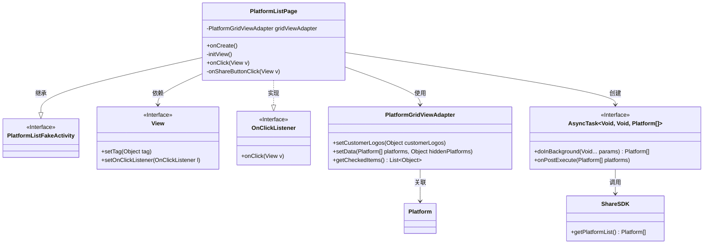
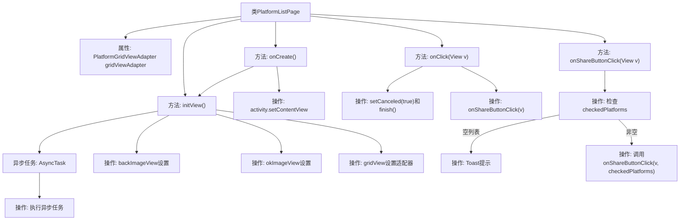

# 基础信息

|      |      |
|------|------|
| 名称 | PlatformListPage |
| 编码语言 | .java |
| 代码路径 | happycat/src/cn/sharesdk/onekeyshare/theme/skyblue/PlatformListPage.java |
| 包名 | cn.sharesdk.onekeyshare.theme.skyblue |
| 依赖项 | ['android.os.AsyncTask', 'android.view.View', 'android.widget.GridView', 'android.widget.Toast', 'java.util.List', 'cn.sharesdk.framework.Platform', 'cn.sharesdk.framework.ShareSDK', 'cn.sharesdk.onekeyshare.PlatformListFakeActivity', 'com.mob.tools.utils.R.getLayoutRes', 'com.mob.tools.utils.R.getStringRes'] |
| 概述说明 | PlatformListPage类继承PlatformListFakeActivity，实现点击事件处理。初始化视图包括返回和确认按钮，设置GridView适配器并异步加载平台数据。点击按钮处理取消和分享逻辑，分享时检查选中平台并锁定按钮防止重复点击。 |

# 说明

PlatformListPage类继承自PlatformListFakeActivity并实现View.OnClickListener接口，用于展示分享平台列表。在onCreate方法中设置布局并初始化视图。initView方法初始化返回和确认按钮，设置点击监听器，创建并配置GridView适配器，通过异步任务获取平台列表数据更新适配器。onClick方法处理按钮点击事件，取消操作或触发分享。onShareButtonClick方法验证选中平台后执行分享逻辑，未选中时提示用户。

# 类列表 Class Summary

| 名称   | 类型  | 说明 |
|-------|------|-------------|
| PlatformListPage | class | PlatformListPage类继承PlatformListFakeActivity，实现点击事件处理。初始化视图包括返回和确认按钮，设置GridView适配器异步加载平台数据。点击按钮处理取消和分享操作，分享时检查至少选中一个平台。 |

## 类 PlatformListPage

|      |      |
|------|------|
| 访问范围 | public |
| 类型 | class |
| 名称 | PlatformListPage |
| 说明 | PlatformListPage类继承PlatformListFakeActivity，实现点击事件处理。初始化视图包括返回和确认按钮，设置GridView适配器异步加载平台数据。点击按钮处理取消和分享操作，分享时检查至少选中一个平台。 |

### UML类图

这段代码展示了一个社交分享平台列表页面的实现，主要包含平台列表展示、按钮点击处理和异步加载平台数据等功能。PlatformListPage继承自PlatformListFakeActivity并实现了OnClickListener接口，通过PlatformGridViewAdapter管理平台数据显示，使用AsyncTask异步加载平台数据。类图中清晰地展示了类之间的继承、实现和依赖关系，包括与Android基础组件如View和OnClickListener的交互。

### 内部方法调用关系图

这段代码展示了一个平台列表页面类PlatformListPage的实现流程。主要功能包括初始化视图、处理用户点击事件、异步加载平台数据以及分享按钮的点击逻辑。通过继承PlatformListFakeActivity并实现OnClickListener接口，该类管理着网格视图适配器，处理返回和确定按钮的点击事件，并在用户选择平台后执行分享操作。异步任务用于获取平台列表数据，而分享按钮则通过状态锁定和输入验证来确保操作的正确性。

### 字段列表 Field List

| 名称  | 类型  | 说明 |
|-------|-------|------|
| gridViewAdapter | PlatformGridViewAdapter | 私有平台网格视图适配器实例。 |

### 方法列表

| 名称  | 类型  | 说明 |
|-------|-------|------|
| onCreate | void | 方法onCreate执行：调用父类onCreate，设置布局文件skyblue_share_platform_list，初始化视图initView。 |
| onClick | void | 点击事件处理：根据视图标签执行取消或分享操作。标签无效则退出。取消时标记并结束，确认时调用分享方法。 |
| initView | void | 初始化视图：设置返回和确认按钮的点击事件及标签；配置网格视图适配器并加载客户图标；异步获取平台列表并更新适配器数据。 |
| onShareButtonClick | void | 方法onShareButtonClick处理分享按钮点击：检查适配器非空且按钮未锁定，若无选中平台则提示，锁定按钮后调用重载方法。 |

