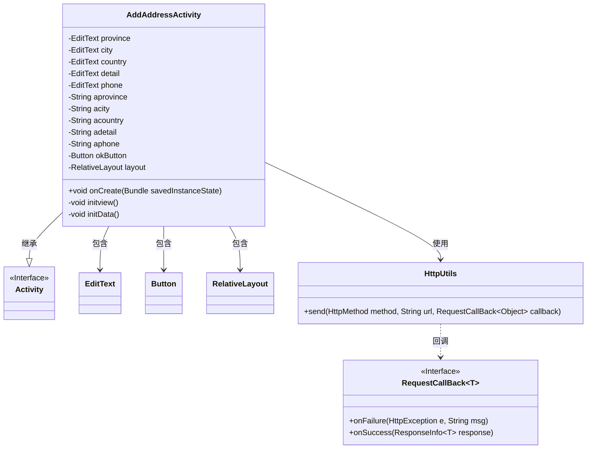
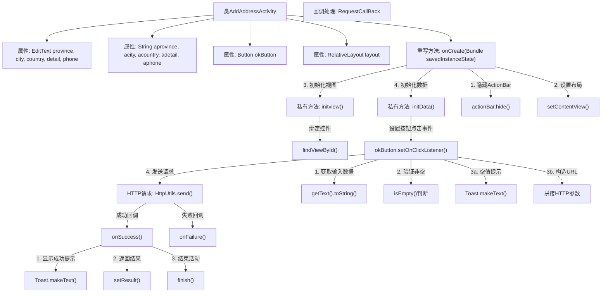

# 基础信息

|      |      |
|------|------|
| 名称 | AddAddressActivity |
| 编码语言 | .java |
| 代码路径 | happycat/src/com/happycat/AddAddressActivity.java |
| 包名 | com.happycat |
| 依赖项 | ['com.example.happucat.R', 'com.happycat.util.MyApplication', 'com.lidroid.xutils.HttpUtils', 'com.lidroid.xutils.exception.HttpException', 'com.lidroid.xutils.http.RequestParams', 'com.lidroid.xutils.http.ResponseInfo', 'com.lidroid.xutils.http.callback.RequestCallBack', 'com.lidroid.xutils.http.client.HttpRequest.HttpMethod', 'android.app.ActionBar', 'android.app.Activity', 'android.content.Intent', 'android.os.Bundle', 'android.util.Log', 'android.view.View', 'android.view.View.OnClickListener', 'android.widget.Button', 'android.widget.EditText', 'android.widget.ImageButton', 'android.widget.RelativeLayout', 'android.widget.Toast'] |
| 概述说明 | Android活动类AddAddressActivity，用于添加地址信息。包含省份、城市、区县、详细地址和电话的输入框，点击确认按钮后验证非空并提交至服务器，成功返回结果。 |

# 说明

该代码定义了一个名为AddAddressActivity的安卓活动类，用于添加地址信息。活动包含省份、城市、区县、详细地址和电话的输入框，以及一个确认按钮。初始化时隐藏了标题栏，并设置了布局视图。确认按钮点击事件会验证输入内容是否为空，若为空则提示用户，否则通过HTTP GET请求将地址数据发送到指定URL。请求成功后会显示添加成功提示并返回上一页面，失败则不做处理。代码中还包含注释掉的图片按钮相关代码。

# 类列表 Class Summary

| 名称   | 类型  | 说明 |
|-------|------|-------------|
| AddAddressActivity | class | Android活动类AddAddressActivity，用于添加地址信息，包含省份、城市、区县、详细地址和电话输入框，点击确认按钮后校验非空并通过HTTP GET请求提交数据，成功返回结果后关闭页面。 |

## 类 AddAddressActivity

|      |      |
|------|------|
| 访问范围 | public |
| 类型 | class |
| 名称 | AddAddressActivity |
| 说明 | Android活动类AddAddressActivity，用于添加地址信息，包含省份、城市、区县、详细地址和电话输入框，点击确认按钮后校验非空并通过HTTP GET请求提交数据，成功返回结果后关闭页面。 |

### UML类图

这段代码展示了一个Android的AddAddressActivity类，用于添加地址信息。该类继承自Activity，包含多个EditText用于输入省份、城市、区县、详细地址和电话，以及一个确认按钮。当用户点击按钮时，会验证输入是否为空，并通过HttpUtils发送GET请求到服务器。如果成功，会显示添加成功的提示并返回AddressActivity。类图清晰地展示了类之间的关系，包括继承、包含和使用依赖关系，以及回调接口的使用。

### 内部方法调用关系图

流程图描述：该流程图描述了AddAddressActivity的核心逻辑流程，从初始化界面元素开始，通过点击按钮触发数据验证和网络请求。首先隐藏标题栏并加载布局，然后初始化视图控件和数据监听。当用户提交时，会校验输入数据非空，通过后构造URL发起HTTP GET请求，根据请求结果分别处理成功（显示提示、返回结果并关闭页面）或失败情况。整个过程清晰展示了Android活动生命周期与异步网络请求的交互。

### 字段列表 Field List

| 名称  | 类型  | 说明 |
|-------|-------|------|
| aphone | String | 定义了五个字符串变量：省份、城市、国家、详细地址和电话号码。 |
| phone | EditText | 定义五个输入框变量：省、市、县、详细地址和电话。 |
| okButton | Button | 界面按钮组件okButton。 |
| layout | RelativeLayout | RelativeLayout是一种Android布局，允许子视图相对于彼此或父视图定位。 |

### 方法列表

| 名称  | 类型  | 说明 |
|-------|-------|------|
| initview | void | 初始化界面控件：获取省份、城市、区县、详细地址、电话输入框及确认按钮的实例。注释部分为未启用的图片按钮点击事件。 |
| onCreate | void | Android Activity的onCreate方法：隐藏标题栏、设置布局、初始化视图和数据。 |
| initData | void | 方法initData设置okButton点击事件，获取输入框内容并校验非空，若为空提示，否则拼接URL发送GET请求，成功返回后提示添加成功并跳转。 |

