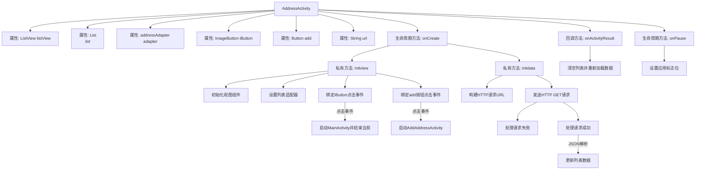

# 基础信息

|      |      |
|------|------|
| 名称 | AddressActivity |
| 编码语言 | .java |
| 代码路径 | happycat/src/com/happycat/AddressActivity.java |
| 包名 | com.happycat |
| 依赖项 | ['java.lang.reflect.Type', 'java.util.ArrayList', 'java.util.List', 'com.example.happucat.R', 'com.google.gson.Gson', 'com.google.gson.reflect.TypeToken', 'com.happycat.Bean.address', 'com.happycat.adapter.addressAdapter', 'com.happycat.util.ActivitiyUtils', 'com.happycat.util.MyApplication', 'com.lidroid.xutils.HttpUtils', 'com.lidroid.xutils.exception.HttpException', 'com.lidroid.xutils.http.ResponseInfo', 'com.lidroid.xutils.http.callback.RequestCallBack', 'com.lidroid.xutils.http.client.HttpRequest.HttpMethod', 'android.app.Activity', 'android.content.Intent', 'android.os.Bundle', 'android.util.Log', 'android.view.View', 'android.view.View.OnClickListener', 'android.view.Window', 'android.widget.Button', 'android.widget.ImageButton', 'android.widget.ListView'] |
| 概述说明 | AddressActivity是一个Android活动类，包含列表视图、适配器和按钮。初始化视图和数据，处理点击事件和网络请求，使用Gson解析JSON数据并更新列表。 |

# 说明

AddressActivity是一个Android活动类，用于管理地址列表界面。它包含一个ListView显示地址列表，使用自定义adapter适配数据。界面包含返回按钮和添加地址按钮，点击返回按钮跳转至MainActivity，添加按钮跳转至AddAddressActivity。通过HTTP请求从服务器获取地址数据，使用Gson解析JSON响应并更新列表。在onActivityResult中重新加载数据，onPause时设置全局标志位。

# 类列表 Class Summary

| 名称   | 类型  | 说明 |
|-------|------|-------------|
| AddressActivity | class | AddressActivity是一个安卓活动类，包含列表视图和按钮。初始化时加载地址数据，点击按钮跳转到其他活动。使用HTTP请求获取数据并用Gson解析，返回时刷新列表。 |


## 类 AddressActivity

|      |      |
|------|------|
| 访问范围 | public |
| 类型 | class |
| 名称 | AddressActivity |
| 说明 | AddressActivity是一个安卓活动类，包含列表视图和按钮。初始化时加载地址数据，点击按钮跳转到其他活动。使用HTTP请求获取数据并用Gson解析，返回时刷新列表。 |


### UML类图

```mermaid
classDiagram
    class AddressActivity {
        -ListView listView
        -List~address~ list
        -addressAdapter adapter
        -ImageButton iButton
        -Button add
        -String url
        +onCreate(Bundle savedInstanceState) void
        -initview() void
        -initdata() void
        +onActivityResult(int requestCode, int resultCode, Intent data) void
        +onPause() void
    }

    class addressAdapter {
        -List~address~ list
        -Context context
        +setList(List~address~ list) void
        +notifyDataSetChanged() void
    }

    class HttpUtils {
        +configCurrentHttpCacheExpiry(long expiry) void
        +send(HttpMethod method, String url, RequestCallBack~String~ callBack) void
    }

    class RequestCallBack~T~ {
        <<Interface>>
        +onFailure(HttpException e, String msg) void
        +onSuccess(ResponseInfo~T~ responseInfo) void
    }

    class Gson {
        +fromJson(String json, Type typeOfT) Object
    }

    class TypeToken~T~ {
        +getType() Type
    }

    AddressActivity --> addressAdapter : 使用
    AddressActivity --> HttpUtils : 使用
    HttpUtils --> RequestCallBack~String~ : 依赖
    AddressActivity --> Gson : 使用
    AddressActivity --> TypeToken~List~address~~ : 使用
```

这段代码展示了一个Android地址管理界面（AddressActivity）的类结构，主要功能包括：初始化视图组件（ListView、按钮等）、通过HTTP请求获取地址数据、使用Gson解析JSON响应、以及处理Activity生命周期事件。类图中包含核心组件如自定义适配器addressAdapter、网络工具HttpUtils、JSON解析器Gson，以及回调接口RequestCallBack，清晰地呈现了各模块间的协作关系。


### 内部方法调用关系图



该流程图展示了AddressActivity的核心结构和执行流程。Activity初始化时依次调用onCreate、initview和initdata方法，分别完成界面初始化、事件绑定和数据加载。包含两个主要按钮事件：iButton跳转至MainActivity，add按钮启动AddAddressActivity并等待返回结果。网络请求成功后通过Gson解析JSON数据并刷新列表，onActivityResult会触发数据重新加载。最后在onPause时设置应用标志位。整个流程体现了Android Activity的典型生命周期管理和异步数据处理机制。

### 字段列表 Field List

| 名称  | 类型  | 说明 |
|-------|-------|------|
| list=new ArrayList<address>() | List<address> | 创建存储address对象的ArrayList列表。 |
| add | Button | 按钮“add”用于添加功能。 |
| listView | ListView | 声明一个ListView控件变量listView。 |
| iButton | ImageButton | 定义了一个名为iButton的ImageButton控件。 |
| adapter | addressAdapter | addressAdapter适配器实例。 |
| url | String | 私有字符串变量url，用于存储网址。 |

### 方法列表

| 名称  | 类型  | 说明 |
|-------|-------|------|
| initview | void | 初始化视图方法：设置列表视图和适配器，图片按钮点击跳转至主活动，添加按钮点击跳转至添加地址活动。 |
| initdata | void | 初始化数据方法，通过HTTP GET请求获取地址列表，解析JSON数据并更新适配器。失败时无处理，成功时刷新列表。 |
| onCreate | void | Android Activity的onCreate方法：初始化无标题窗口，设置布局，初始化视图和数据。 |
| onActivityResult | void | 重写onActivityResult方法，清空列表并重新初始化数据。 |
| onPause | void | Android生命周期方法onPause中设置全局变量myflag为1。 |


