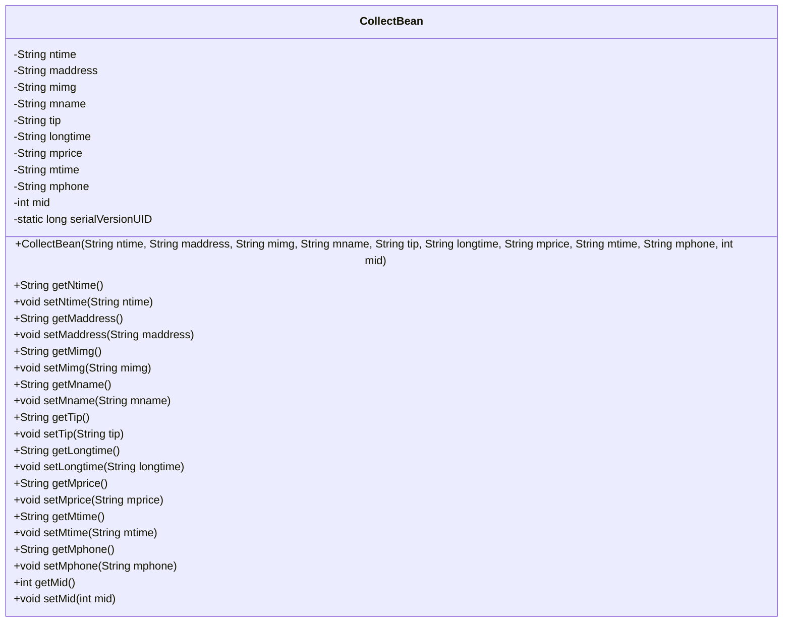
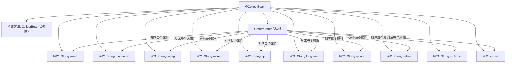

# 基础信息

|      |      |
|------|------|
| 名称 | CollectBean |
| 编码语言 | .java |
| 代码路径 | happycat/src/com/happycat/Bean/CollectBean.java |
| 包名 | com.happycat.Bean |
| 依赖项 | ['java.io.Serializable', 'android.R.integer'] |
| 概述说明 | CollectBean是可序列化类，包含时间、地址、图片、名称、提示、时长、价格、电话和ID等属性，提供getter和setter方法。 |

# 说明

CollectBean是一个实现了Serializable接口的Java类，用于存储收藏信息。包含以下字段：ntime（时间）、maddress（地址）、mimg（图片）、mname（名称）、tip（提示）、longtime（时长）、mprice（价格）、mtime（时间）、mphone（电话）、mid（ID）。提供了带参构造方法和各字段的getter与setter方法，支持序列化操作。

# 类列表 Class Summary

| 名称   | 类型  | 说明 |
|-------|------|-------------|
| CollectBean | class | CollectBean类实现Serializable接口，包含ntime、maddress、mimg、mname、tip、longtime、mprice、mtime、mphone和mid属性，提供构造方法和getter/setter。 |

## 类 CollectBean

|      |      |
|------|------|
| 访问范围 | public |
| 类型 | class |
| 名称 | CollectBean |
| 说明 | CollectBean类实现Serializable接口，包含ntime、maddress、mimg、mname、tip、longtime、mprice、mtime、mphone和mid属性，提供构造方法和getter/setter。 |

### UML类图

这段代码定义了一个名为`CollectBean`的Java类，实现了`Serializable`接口，表明其实例可被序列化。该类包含10个私有字段（如ntime、maddress等）及其对应的getter/setter方法，用于存储和操作收藏项的相关信息（如名称、地址、图片URL、价格等）。构造方法允许初始化所有字段，serialVersionUID用于版本控制。这是一个典型的数据封装类，常用于在应用程序各层间传输结构化数据。

### 内部方法调用关系图

该流程图展示了CollectBean类的完整结构，包含10个String/int类型的私有属性、1个全参数构造方法以及对应的Getter/Setter方法组。所有属性通过构造方法初始化，并通过独立的方法对进行访问和修改，符合JavaBean的设计规范。类实现了Serializable接口，支持序列化操作，serialVersionUID用于版本控制。

### 字段列表 Field List

| 名称  | 类型  | 说明 |
|-------|-------|------|
| tip | String | 私有字符串变量tip |
| longtime | String | 长时间字符串变量 |
| mphone | String | 私有字符串变量mphone，用于存储手机号信息。 |
| mid | int | 私有整型变量mid |
| mimg | String | 私有字符串变量mimg，用于存储图片相关数据。 |
| mprice | String | 私有字符串变量mprice，用于存储价格信息。 |
| serialVersionUID = 1L | long | 声明一个私有静态不可变的序列化版本ID，值为1L。 |
| mname | String | 私有字符串变量mname。 |
| mtime | String | 声明一个私有字符串变量mtime。 |
| maddress | String | 私有字符串变量maddress，用于存储地址信息。 |
| ntime | String | 私有字符串变量ntime，用于存储时间信息。 |

### 方法列表

| 名称  | 类型  | 说明 |
|-------|-------|------|
| getLongtime | String | 获取longtime字符串的方法。 |
| setLongtime | void | 这是一个Java方法，用于设置longtime字符串变量的值。方法名为setLongtime，接受一个String类型参数longtime，并将其赋值给当前对象的longtime属性。 |
| setMname | void | Java方法：设置成员变量mname的值。 |
| getNtime | String | 获取ntime字符串值的方法。 |
| setMprice | void | 这是一个Java方法，用于设置类成员变量mprice的值。方法接受一个字符串参数mprice，并将其赋值给当前对象的mprice属性。 |
| getMphone | String | 这是一个Java方法，返回字符串类型的mphone变量值。 |
| setMphone | void | 设置手机号的方法，将参数mphone赋值给类的成员变量mphone。 |
| getMid | int | 方法返回整型变量mid的值。 |
| setMid | void | 设置成员变量mid的值。 |
| setMaddress | void | Java方法：设置成员变量maddress的值。 |
| setMtime | void | Java方法：设置mtime字符串属性值。 |
| getMimg | String | 这是一个Java方法，返回字符串类型的mimg变量值。 |
| getTip | String | 获取tip字符串的方法。 |
| getMaddress | String | 方法getMaddress返回成员变量maddress的值。 |
| getMtime | String | 获取mtime值的字符串方法。 |
| setTip | void | 方法setTip接收字符串参数tip，将其赋值给当前对象的tip属性。 |
| getMname | String | 这是一个Java方法，返回字符串类型的成员变量mname的值。 |
| setNtime | void | 设置ntime字符串属性的方法。 |
| getMprice | String | 这是一个Java方法，返回字符串类型的成员变量mprice的值。 |
| setMimg | void | 设置成员变量mimg的方法，参数为字符串mimg。 |

