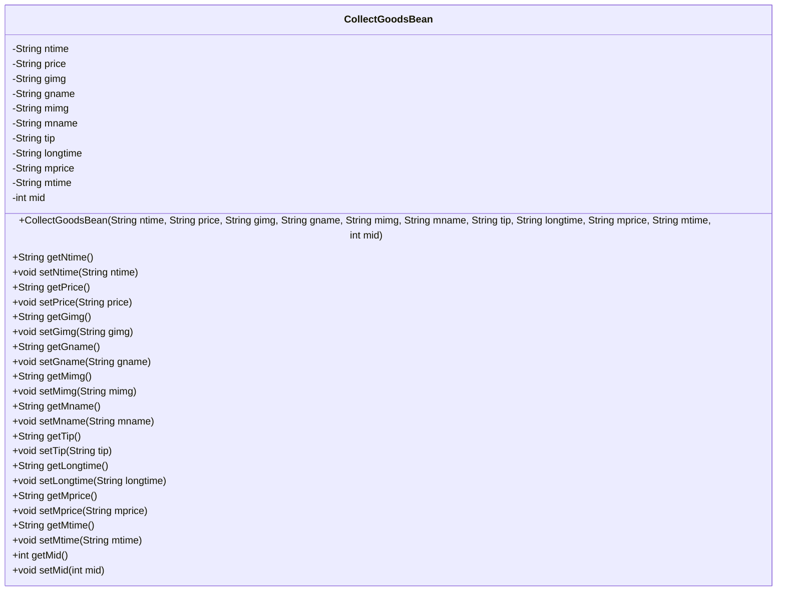
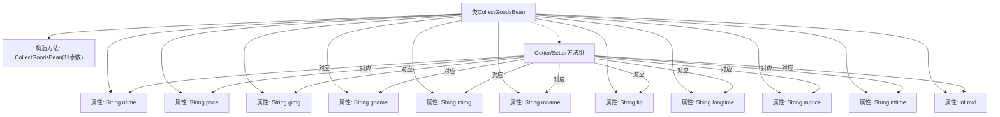

# 基础信息

|      |      |
|------|------|
| 名称 | CollectGoodsBean |
| 编码语言 | .java |
| 代码路径 | happycat/src/com/happycat/Bean/CollectGoodsBean.java |
| 包名 | com.happycat.Bean |
| 依赖项 | ['java.io.Serializable'] |
| 概述说明 | CollectGoodsBean是一个可序列化的Java类，包含商品和商家信息，如名称、图片、价格、时间等字段，提供getter和setter方法。 |

# 说明

CollectGoodsBean是一个实现了Serializable接口的Java类，用于存储商品收藏信息。类中包含多个私有字段：ntime、price、gimg、gname、mimg、mname、tip、longtime、mprice、mtime和mid，分别表示收藏时间、价格、商品图片、商品名称、商家图片、商家名称、提示信息、长期时间、商家价格、商家时间和商家ID。类提供了带参数的构造函数用于初始化所有字段，并为每个字段提供了对应的getter和setter方法，以便访问和修改这些属性。

# 类列表 Class Summary

| 名称   | 类型  | 说明 |
|-------|------|-------------|
| CollectGoodsBean | class | CollectGoodsBean是一个可序列化的Java类，包含商品和商家信息，如名称、图片、价格、时间等字段，并提供getter和setter方法。 |

## 类 CollectGoodsBean

|      |      |
|------|------|
| 访问范围 | public |
| 类型 | class |
| 名称 | CollectGoodsBean |
| 说明 | CollectGoodsBean是一个可序列化的Java类，包含商品和商家信息，如名称、图片、价格、时间等字段，并提供getter和setter方法。 |

### UML类图

这段代码定义了一个名为CollectGoodsBean的JavaBean类，实现了Serializable接口用于序列化。该类包含11个私有字段，分别表示商品收藏相关的各种属性（如时间、价格、图片、名称等），并为每个字段提供了对应的getter和setter方法。构造方法允许一次性初始化所有字段。这个类主要用于封装商品收藏信息，便于在系统中传递和处理数据。

### 内部方法调用关系图

该流程图展示了CollectGoodsBean类的完整结构，包含11个String/int类型的属性字段、1个全参数构造方法以及对应的12组Getter/Setter方法。类实现了Serializable接口，通过serialVersionUID支持序列化。所有属性都通过构造方法初始化，并通过独立的方法提供读写访问，构成标准的数据封装模式。这种结构常用于DTO或VO对象，适合存储商品收藏相关的多维度信息。

### 字段列表 Field List

| 名称  | 类型  | 说明 |
|-------|-------|------|
| longtime | String | 私有字符串变量longtime |
| gname | String | 私有字符串变量gname。 |
| mtime | String | 私有字符串变量mtime，用于存储时间信息。 |
| mprice | String | 私有字符串变量mprice，用于存储价格信息。 |
| mid | int | 私有整型变量mid |
| tip | String | 私有字符串变量tip。 |
| mname | String | 私有字符串变量mname |
| gimg | String | 私有字符串变量gimg，用于存储图像数据。 |
| price | String | 私有字符串类型变量price，用于存储价格信息。 |
| mimg | String | 私有字符串变量mimg。 |
| ntime | String | 私有字符串变量ntime，用于存储时间信息。 |
| serialVersionUID = 1L | long | 声明一个私有静态不可变的长整型序列化版本号，初始值为1L。 |

### 方法列表

| 名称  | 类型  | 说明 |
|-------|-------|------|
| setGimg | void | 这是一个Java方法，用于设置对象的gimg属性值。方法接受一个字符串参数gimg，并将其赋值给当前对象的同名属性。 |
| getLongtime | String | 获取longtime字符串的方法。 |
| getTip | String | 获取提示字符串的方法。 |
| setMimg | void | 设置成员图片的方法，将参数mimg赋值给对象的mimg属性。 |
| getGname | String | 获取gname的方法，返回字符串类型的gname值。 |
| getMimg | String | 这是一个Java方法，返回字符串类型的mimg变量值。 |
| getPrice | String | 获取价格的公共方法，返回字符串类型的价格值。 |
| getNtime | String | 获取ntime字符串值的方法。 |
| setNtime | void | 设置ntime字符串值的方法。 |
| setGname | void | 这是一个Java方法，用于设置类成员变量gname的值。方法接收一个字符串参数gname，并将其赋值给当前对象的gname属性。 |
| setTip | void | 设置提示信息的方法，将传入的字符串赋值给类的tip变量。 |
| getGimg | String | 方法getGimg返回字符串gimg的值。 |
| setMname | void | Java方法：设置成员变量mname的值。 |
| setPrice | void | 设置价格的方法，将输入字符串赋值给类变量price。 |
| getMname | String | 方法getMname返回成员变量mname的值。 |
| setLongtime | void | 方法setLongtime用于设置longtime属性的值，参数为字符串类型。 |
| getMprice | String | 方法getMprice返回字符串类型的成员变量mprice的值。 |
| setMprice | void | Java方法：设置mprice字符串属性值。 |
| getMtime | String | 获取mtime值的公开方法。 |
| setMtime | void | Java方法：设置mtime字符串属性。 |
| getMid | int | 方法返回整型变量mid的值。 |
| setMid | void | Java方法：设置成员变量mid的值。 |

