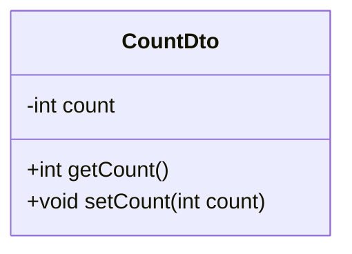
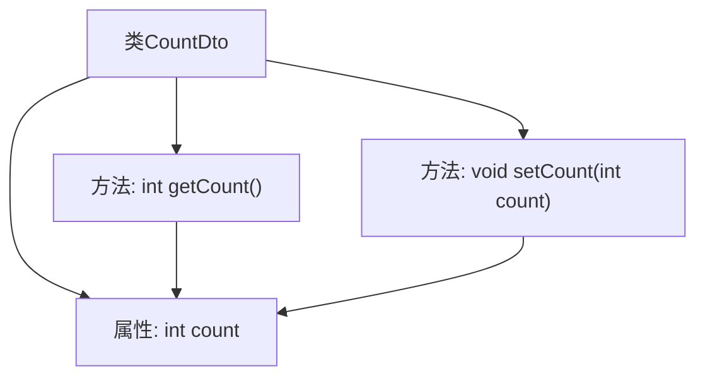

# 基础信息

|      |      |
|------|------|
| 名称 | CountDto |
| 编码语言 | .java |
| 代码路径 | happycat/src/com/happycat/Bean/CountDto.java |
| 包名 | com.happycat.Bean |
| 依赖项 | [] |
| 概述说明 | CountDto类包含整型变量count及其getter和setter方法。 |

# 说明

这是一个名为CountDto的简单Java类，用于封装计数数据。该类包含一个整型变量count，以及对应的getter和setter方法。getCount方法用于获取当前计数值，setCount方法用于设置新的计数值。这个类遵循了JavaBean的设计模式，通过私有字段和公共访问方法来实现数据封装。

# 类列表 Class Summary

| 名称   | 类型  | 说明 |
|-------|------|-------------|
| CountDto | class | CountDto类包含一个整型变量count及其getter和setter方法。 |

## 类 CountDto

|      |      |
|------|------|
| 访问范围 | public |
| 类型 | class |
| 名称 | CountDto |
| 说明 | CountDto类包含一个整型变量count及其getter和setter方法。 |

### UML类图

这段代码定义了一个简单的数据传输对象(Data Transfer Object)类CountDto，主要用于封装一个整型计数器。该类包含一个私有字段count，以及对应的公有getter和setter方法，遵循了Java Bean的编码规范。这种设计模式常用于在不同层之间传递数据，特别是在MVC架构中分离模型和视图时。类图清晰地展示了该类的结构，包括私有属性和公有方法，体现了良好的封装性。

### 内部方法调用关系图

该流程图展示了CountDto类的结构，包含一个私有整型属性count和两个公共方法：getCount()用于获取当前计数值，setCount()用于设置新值。箭头表示方法对属性的访问关系，getCount()读取count值，setCount()修改count值。这是一个典型的数据传输对象(DTO)设计，用于封装单一整型数据并提供标准访问接口。

### 字段列表 Field List

| 名称  | 类型  | 说明 |
|-------|-------|------|
| count | int | 声明一个整型变量count。 |

### 方法列表

| 名称  | 类型  | 说明 |
|-------|-------|------|
| getCount | int | 这是一个Java方法，返回私有变量count的当前值。 |
| setCount | void | 设置计数值的方法，将参数count赋值给类的count成员变量。 |

