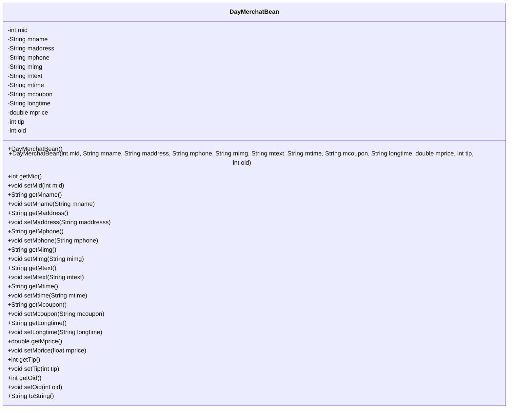

# 基础信息

|      |      |
|------|------|
| 名称 | DayMerchatBean |
| 编码语言 | .java |
| 代码路径 | happycat/src/com/happycat/Bean/DayMerchatBean.java |
| 包名 | com.happycat.Bean |
| 依赖项 | ['java.io.Serializable'] |
| 概述说明 | DayMerchatBean是一个可序列化的Java类，包含商家ID、名称、地址、电话、图片、描述、营业时间、优惠券、价格、小费、订单ID等属性，提供构造方法和getter/setter方法。 |

# 说明

这是一个名为DayMerchatBean的Java类，实现了Serializable接口，用于表示商户信息。类中包含12个私有字段：mid（商户ID）、mname（商户名称）、maddress（地址）、mphone（电话）、mimg（图片）、mtext（文本描述）、mtime（时间）、mcoupon（优惠券）、longtime（长时间）、mprice（价格）、tip（小费）、oid（订单ID）。为每个字段提供了getter和setter方法。类包含两个构造函数：一个无参构造函数和一个全参数构造函数。重写了toString方法以返回包含所有字段值的字符串表示。该类设计用于存储和传输商户相关数据。

# 类列表 Class Summary

| 名称   | 类型  | 说明 |
|-------|------|-------------|
| DayMerchatBean | class | DayMerchatBean是一个可序列化的Java类，包含商家ID、名称、地址、电话、图片、描述、营业时间、优惠券、营业时长、价格、小费和订单ID等属性，提供getter/setter方法和构造器。 |

## 类 DayMerchatBean

|      |      |
|------|------|
| 访问范围 | public |
| 类型 | class |
| 名称 | DayMerchatBean |
| 说明 | DayMerchatBean是一个可序列化的Java类，包含商家ID、名称、地址、电话、图片、描述、营业时间、优惠券、营业时长、价格、小费和订单ID等属性，提供getter/setter方法和构造器。 |

### UML类图

这段代码定义了一个名为DayMerchatBean的Java类，实现了Serializable接口，主要用于存储商家相关信息。该类包含12个私有字段，如商家ID(mid)、名称(mname)、地址(maddress)等，每个字段都有对应的getter和setter方法。提供了两个构造函数（默认构造和全参数构造）以及重写的toString方法。这是一个典型的数据传输对象(DTO)，用于在不同层之间传递商家数据，适合序列化操作。

### 内部方法调用关系图

```mermaid
graph TD
    A["类DayMerchatBean"]
    B["属性: int mid"]
    C["属性: String mname"]
    D["属性: String maddress"]
    E["属性: String mphone"]
    F["属性: String mimg"]
    G["属性: String mtext"]
    H["属性: String mtime"]
    I["属性: String mcoupon"]
    J["属性: String longtime"]
    K["属性: double mprice"]
    L["属性: int tip"]
    M["属性: int oid"]
    N["构造方法: DayMerchatBean()"]
    O["构造方法: DayMerchatBean(12参数)"]
    P["方法: toString()"]
    Q["getter/setter方法组"]

    A --> B
    A --> C
    A --> D
    A --> E
    A --> F
    A --> G
    A --> H
    A --> I
    A --> J
    A --> K
    A --> L
    A --> M
    A --> N
    A --> O
    A --> P
    A --> Q
```

该流程图展示了DayMerchatBean类的完整结构，包含12个私有属性字段、两个构造方法（无参构造和全参数构造）、一个重写的toString()方法，以及所有属性的getter/setter方法组。类实现了Serializable接口，表明其实例可序列化。属性命名以'm'为前缀，包含商家基本信息（名称、地址、电话）、业务信息（价格、优惠券）和关联ID等。流程图清晰呈现了Java Bean的标准设计模式，适合作为数据传输对象使用。

### 字段列表 Field List

| 名称  | 类型  | 说明 |
|-------|-------|------|
| mid | int | 私有整型变量mid |
| longtime | String | 私有字符串变量longtime |
| tip | int | 私有整型变量tip。 |
| oid | int | 私有整型变量oid |
| mcoupon | String | 私有字符串变量mcoupon |
| mimg | String | 私有字符串变量mimg，用于存储图片信息。 |
| mtext | String | 私有字符串变量mtext |
| mprice | double | 私有双精度浮点型变量mprice |
| maddress | String | 私有字符串变量，用于存储地址信息。 |
| mname | String | 私有字符串变量mname。 |
| mtime | String | 私有字符串变量mtime，用于存储时间信息。 |
| mphone | String | 私有字符串变量mphone，用于存储手机号信息。 |

### 方法列表

| 名称  | 类型  | 说明 |
|-------|-------|------|
| toString | String | MerchatBean的toString方法返回包含mid、mname、maddress等字段的字符串。 |
| setMphone | void | 设置手机号的方法，将参数mphone赋值给当前对象的mphone属性。 |
| setTip | void | 设置小费金额的方法，参数为整数类型tip，赋值给当前对象的tip属性。 |
| getMname | String | 这是一个Java方法，返回字符串类型的成员变量mname的值。 |
| getMid | int | 方法返回整型变量mid的值。 |
| getMcoupon | String | 获取mcoupon字符串值的方法。 |
| getMaddress | String | 这是一个Java方法，返回成员变量maddress的字符串值。方法名为getMaddress，无参数，直接返回私有变量maddress。 |
| getMimg | String | 这是一个Java方法，返回字符串类型的成员变量mimg的值。 |
| setMaddress | void | 这是一个Java方法，用于设置成员变量maddress的值。方法接收一个字符串参数maddresss，并将其赋值给当前对象的maddress属性。 |
| setMid | void | 设置成员变量mid的值。 |
| getMtime | String | 获取mtime值的字符串方法。 |
| setMcoupon | void | 设置成员变量mcoupon的值。 |
| getLongtime | String | 获取longtime字符串值的方法。 |
| setMimg | void | 这是一个Java方法，用于设置成员变量mimg的值。方法接收一个字符串参数mimg，并将其赋值给当前对象的mimg属性。 |
| getMtext | String | 这是一个Java方法，返回字符串类型的成员变量mtext。 |
| setMprice | void | 设置商品价格的方法，参数为浮点数mprice。 |
| setLongtime | void | 这是一个Java方法，用于设置字符串类型的longtime变量值。方法名为setLongtime，接受一个String参数longtime，并将其赋值给当前对象的同名成员变量。 |
| setMname | void | 这是一个Java方法，用于设置类成员变量mname的值。方法接收一个字符串参数mname，并将其赋值给当前对象的mname属性。 |
| setMtext | void | 这是一个Java方法，用于设置类成员变量mtext的值。方法接收一个字符串参数mtext，并将其赋值给当前对象的mtext属性。 |
| getOid | int | 获取对象标识符的方法，返回整型oid值。 |
| setOid | void | 这是一个Java方法，用于设置对象的oid属性。方法接受一个整数参数oid，并将其赋值给当前对象的oid成员变量。 |
| getMphone | String | 方法getMphone返回成员变量mphone的字符串值。 |
| setMtime | void | 定义方法setMtime，用于设置成员变量mtime的值。参数为字符串mtime。 |
| getMprice | double | 获取mprice值的公开方法，返回double类型。 |
| getTip | int | 方法返回tip变量的整数值。 |

