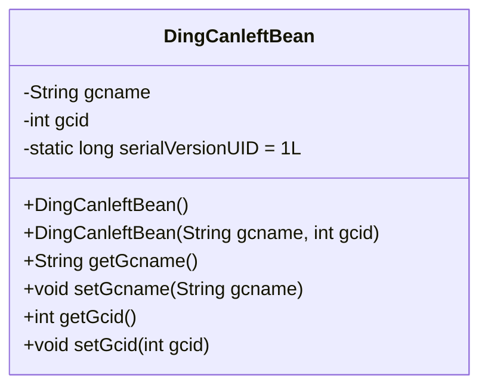
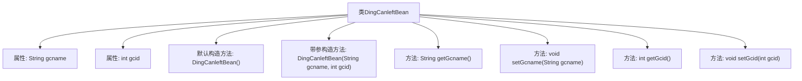

# 基础信息

|      |      |
|------|------|
| 名称 | DingCanleftBean |
| 编码语言 | .java |
| 代码路径 | happycat/src/com/happycat/Bean/DingCanleftBean.java |
| 包名 | com.happycat.Bean |
| 依赖项 | ['java.io.Serializable'] |
| 概述说明 | Java类DingCanleftBean实现Serializable，含gcname和gcid属性及getter/setter方法。 |

# 说明

DingCanleftBean是一个实现了Serializable接口的Java类，用于序列化操作。类中包含两个私有成员变量：字符串类型的gcname和整型的gcid。提供了无参构造方法和带参构造方法，分别用于初始化和设置成员变量。同时为每个成员变量提供了对应的getter和setter方法，用于获取和设置变量值。serialVersionUID用于版本控制，确保序列化兼容性。

# 类列表 Class Summary

| 名称   | 类型  | 说明 |
|-------|------|-------------|
| DingCanleftBean | class | Java类DingCanleftBean实现Serializable接口，包含gcname和gcid属性及对应getter/setter方法，支持序列化。 |

## 类 DingCanleftBean

|      |      |
|------|------|
| 访问范围 | public |
| 类型 | class |
| 名称 | DingCanleftBean |
| 说明 | Java类DingCanleftBean实现Serializable接口，包含gcname和gcid属性及对应getter/setter方法，支持序列化。 |

### UML类图

这段代码定义了一个名为DingCanleftBean的可序列化Java类，主要用于封装订餐相关的数据。该类包含两个私有属性：gcname(字符串类型)和gcid(整型)，以及对应的getter和setter方法。类实现了Serializable接口(通过<<Interface>>标记)，表明其实例可以被序列化，并包含一个默认构造函数和一个带参数的构造函数。serialVersionUID字段用于控制序列化版本兼容性。这个类典型用于数据传输对象(DTO)模式，在订餐系统中传递菜品分类信息。

### 内部方法调用关系图

该流程图展示了DingCanleftBean类的完整结构，包含两个私有属性(gcname和gcid)、一个默认构造方法、一个带参构造方法以及四个访问器方法(getter/setter)。类实现了Serializable接口并定义了serialVersionUID字段，表明这是一个可序列化的JavaBean。所有方法都围绕属性操作展开，带参构造方法直接初始化属性值，而默认构造方法留待后续初始化。这种结构是典型的数据传输对象(DTO)设计模式。

### 字段列表 Field List

| 名称  | 类型  | 说明 |
|-------|-------|------|
| serialVersionUID = 1L | long | 声明一个私有静态不可变的序列化版本ID，初始值为1L。 |
| gcid | int | 私有整型变量gcid。 |
| gcname | String | 私有字符串变量gcname。 |

### 方法列表

| 名称  | 类型  | 说明 |
|-------|-------|------|
| getGcname | String | 方法返回字符串类型变量gcname的值。 |
| setGcname | void | Java方法：设置字符串类型成员变量gcname的值。 |
| getGcid | int | 方法返回整型变量gcid的值。 |
| setGcid | void | Java方法：设置gcid值，参数为整型gcid。 |

