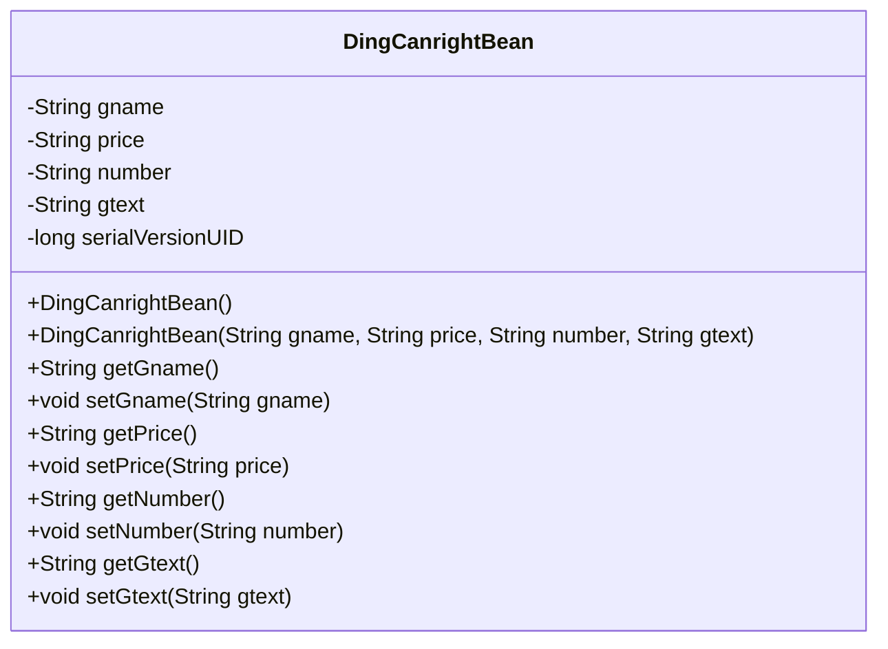

# 基础信息

|      |      |
|------|------|
| 名称 | DingCanrightBean |
| 编码语言 | .java |
| 代码路径 | happycat/src/com/happycat/Bean/DingCanrightBean.java |
| 包名 | com.happycat.Bean |
| 依赖项 | ['java.io.Serializable'] |
| 概述说明 | DingCanrightBean是可序列化类，包含gname、price、number、gtext属性和对应getter/setter方法。 |

# 说明

DingCanrightBean是一个实现了Serializable接口的Java类，用于存储订单相关信息。该类包含四个私有字符串属性：gname（商品名称）、price（价格）、number（数量）和gtext（商品描述）。提供了无参构造方法和带参构造方法，以及每个属性的getter和setter方法。serialVersionUID设置为1L以确保序列化兼容性。

# 类列表 Class Summary

| 名称   | 类型  | 说明 |
|-------|------|-------------|
| DingCanrightBean | class | DingCanrightBean是可序列化类，包含gname、price、number、gtext属性及对应getter/setter方法。 |

## 类 DingCanrightBean

|      |      |
|------|------|
| 访问范围 | public |
| 类型 | class |
| 名称 | DingCanrightBean |
| 说明 | DingCanrightBean是可序列化类，包含gname、price、number、gtext属性及对应getter/setter方法。 |

### UML类图

这段代码定义了一个名为DingCanrightBean的Java类，实现了Serializable接口，表明其实例可以被序列化。该类包含四个私有字符串属性（gname、price、number、gtext）和一个序列化版本号，提供了无参构造器和全参构造器，并为每个属性生成了对应的getter和setter方法。这是一个典型的数据传输对象（DTO），用于封装与订餐相关的菜品信息，包括名称、价格、数量和备注文本。

### 内部方法调用关系图

```mermaid
graph TD
    A["类DingCanrightBean"]
    B["属性: String gname"]
    C["属性: String price"]
    D["属性: String number"]
    E["属性: String gtext"]
    F["无参构造: DingCanrightBean()"]
    G["带参构造: DingCanrightBean(gname,price,number,gtext)"]
    H["方法: getGname()"]
    I["方法: setGname(gname)"]
    J["方法: getPrice()"]
    K["方法: setPrice(price)"]
    L["方法: getNumber()"]
    M["方法: setNumber(number)"]
    N["方法: getGtext()"]
    O["方法: setGtext(gtext)"]

    A --> B
    A --> C
    A --> D
    A --> E
    A --> F
    A --> G
    A --> H
    A --> I
    A --> J
    A --> K
    A --> L
    A --> M
    A --> N
    A --> O
```

这段代码定义了一个名为DingCanrightBean的Java类，实现了Serializable接口用于序列化。类中包含四个私有字符串属性（gname、price、number、gtext），一个无参构造方法和一个带参构造方法，以及每个属性的getter和setter方法。流程图清晰地展示了类结构、属性与方法的从属关系，其中构造方法用于初始化对象，getter/setter方法用于属性访问和修改。该类的设计符合JavaBean规范，适合用作数据传输对象。

### 字段列表 Field List

| 名称  | 类型  | 说明 |
|-------|-------|------|
| gtext | String | 定义四个私有字符串变量：商品名、价格、数量、描述。 |
| serialVersionUID = 1L | long | 声明一个私有静态不可变的序列化版本ID，初始值为1L。 |

### 方法列表

| 名称  | 类型  | 说明 |
|-------|-------|------|
| getNumber | String | 获取number字符串的方法。 |
| setPrice | void | 设置价格的方法，将输入字符串赋值给类变量price。 |
| getGtext | String | 这是一个Java方法，返回字符串类型的gtext变量值。 |
| getPrice | String | 获取价格的方法，返回字符串类型的价格值。 |
| setGname | void | 这是一个Java方法，用于设置类成员变量gname的值。方法接收一个字符串参数gname，并将其赋值给当前对象的gname属性。 |
| getGname | String | 方法getGname返回字符串gname的值。 |
| setNumber | void | 设置字符串类型的number属性值。 |
| setGtext | void | Java方法：设置gtext字符串变量的值。 |

