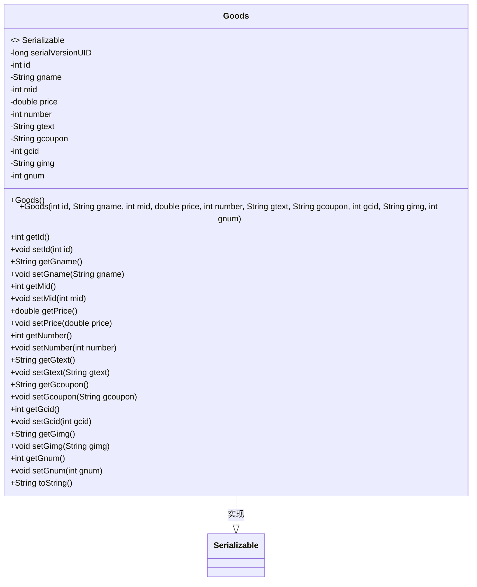

# 基础信息

|      |      |
|------|------|
| 名称 | Goods |
| 编码语言 | .java |
| 代码路径 | happycat/src/com/happycat/Bean/Goods.java |
| 包名 | com.happycat.Bean |
| 依赖项 | ['java.io.Serializable'] |
| 概述说明 | 商品类Goods实现序列化，包含ID、名称、价格、数量、描述、图片等属性及getter/setter方法。 |

# 说明

这是一个名为Goods的Java类，实现了Serializable接口用于序列化。类中包含多个私有属性：id（整型）、gname（字符串）、mid（整型）、price（双精度浮点）、number（整型）、gtext（字符串）、gcoupon（字符串）、gcid（整型）、gimg（字符串）和gnum（整型）。提供了无参构造方法和全参构造方法，以及所有属性的getter和setter方法。类中还重写了toString方法，用于返回包含所有属性值的字符串表示。serialVersionUID设置为1L用于版本控制。

# 类列表 Class Summary

| 名称   | 类型  | 说明 |
|-------|------|-------------|
| Goods | class | 商品类Goods，包含ID、名称、商家ID、价格、数量、描述、优惠券、分类ID、图片、销量等属性及对应get/set方法。 |

## 类 Goods

|      |      |
|------|------|
| 访问范围 | public |
| 类型 | class |
| 名称 | Goods |
| 说明 | 商品类Goods，包含ID、名称、商家ID、价格、数量、描述、优惠券、分类ID、图片、销量等属性及对应get/set方法。 |

### UML类图

这段代码定义了一个名为Goods的类，该类实现了Serializable接口，表明其实例可以被序列化。Goods类包含多个私有字段，如id、gname、price等，分别表示商品的唯一标识、名称、价格等属性。类中提供了两个构造方法（一个无参构造方法和一个全参构造方法）以及各个字段的getter和setter方法，用于访问和修改这些私有字段。此外，还重写了toString方法，以便以字符串形式输出商品的所有属性。这个类主要用于表示商品信息，并支持序列化操作。

### 内部方法调用关系图

```mermaid
graph TD
    A["类Goods"]
    B["实现接口: Serializable"]
    C["属性: int id"]
    D["属性: String gname"]
    E["属性: int mid"]
    F["属性: double price"]
    G["属性: int number"]
    H["属性: String gtext"]
    I["属性: String gcoupon"]
    J["属性: int gcid"]
    K["属性: String gimg"]
    L["属性: int gnum"]
    M["构造方法: Goods()"]
    N["构造方法: Goods(int id, String gname, int mid, double price, int number, String gtext, String gcoupon, int gcid, String gimg, int gnum)"]
    O["方法: int getId()"]
    P["方法: void setId(int id)"]
    Q["方法: String getGname()"]
    R["方法: void setGname(String gname)"]
    S["方法: int getMid()"]
    T["方法: void setMid(int mid)"]
    U["方法: double getPrice()"]
    V["方法: void setPrice(double price)"]
    W["方法: int getNumber()"]
    X["方法: void setNumber(int number)"]
    Y["方法: String getGtext()"]
    Z["方法: void setGtext(String gtext)"]
    AA["方法: String getGcoupon()"]
    AB["方法: void setGcoupon(String gcoupon)"]
    AC["方法: int getGcid()"]
    AD["方法: void setGcid(int gcid)"]
    AE["方法: String getGimg()"]
    AF["方法: void setGimg(String gimg)"]
    AG["方法: int getGnum()"]
    AH["方法: void setGnum(int gnum)"]
    AI["重写方法: String toString()"]

    A --> B
    A --> C
    A --> D
    A --> E
    A --> F
    A --> G
    A --> H
    A --> I
    A --> J
    A --> K
    A --> L
    A --> M
    A --> N
    A --> O
    A --> P
    A --> Q
    A --> R
    A --> S
    A --> T
    A --> U
    A --> V
    A --> W
    A --> X
    A --> Y
    A --> Z
    A --> AA
    A --> AB
    A --> AC
    A --> AD
    A --> AE
    A --> AF
    A --> AG
    A --> AH
    A --> AI
```

这段代码定义了一个名为Goods的类，实现了Serializable接口，用于表示商品信息。类中包含10个私有属性（id、gname、mid等）和对应的getter/setter方法，两个构造方法（无参和全参），以及重写的toString方法。流程图清晰展示了类结构、属性、构造方法和成员方法之间的层级关系，所有方法都直接关联到Goods类，符合Java类的基本组织结构。

### 字段列表 Field List

| 名称  | 类型  | 说明 |
|-------|-------|------|
| price | double | 私有双精度浮点型变量price |
| number | int | 私有整型变量number。 |
| gname | String | 私有字符串变量gname |
| gtext | String | 私有字符串变量gtext。 |
| gimg | String | 声明字符串变量gimg。 |
| gcoupon | String | 私有字符串变量gcoupon。 |
| id | int | 私有整型变量id |
| serialVersionUID = 1L | long | 定义私有静态常量serialVersionUID，值为1L，用于序列化版本控制。 |
| mid | int | 私有整型变量mid |
| gnum | int | 私有整型变量gnum |
| gcid | int | 私有整型变量gcid |

### 方法列表

| 名称  | 类型  | 说明 |
|-------|-------|------|
| setGcoupon | void | Java方法：设置gcoupon字符串值。 |
| setId | void | 设置对象ID的方法，参数为整型id，将输入值赋给当前对象的id属性。 |
| setGtext | void | Java方法：设置gtext变量值为输入参数。 |
| getGtext | String | 获取gtext字符串值的方法。 |
| getNumber | int | 这是一个Java方法，返回私有变量number的值。 |
| getGcoupon | String | 获取gcoupon字符串值的方法。 |
| setGname | void | Java方法：设置gname变量值为输入参数gname。 |
| setNumber | void | 设置整型数值的方法，将参数number赋值给当前对象的number属性。 |
| getGimg | String | 方法getGimg返回字符串类型变量gimg的值。 |
| setGimg | void | Java方法：设置gimg字符串变量值。 |
| getGnum | int | 这是一个Java方法，返回私有整型变量gnum的值。方法名为getGnum，无参数。 |
| setGnum | void | 这是一个Java方法，用于设置类成员变量gnum的值。方法接受一个整数参数gnum，并将其赋值给当前对象的gnum属性。 |
| toString | String | 重写toString方法，返回包含商品id、名称、商家id、价格、数量、描述、优惠券、分类id、图片和库存的字符串。 |
| setGcid | void | 设置gcid的方法，参数为整型gcid，赋值给当前对象的gcid属性。 |
| getId | int | 获取对象ID的方法，返回私有成员变量id的值。 |
| getGname | String | 方法getGname返回字符串变量gname的值。 |
| getPrice | double | 获取价格的公有方法，返回double类型变量price的值。 |
| setMid | void | 这是一个Java方法，用于设置成员变量mid的值。方法接受一个整数参数mid，并将其赋值给当前对象的mid属性。 |
| setPrice | void | 设置价格的方法，参数为double类型，将输入值赋给类的price变量。 |
| getMid | int | 获取mid值的公共方法，返回整数类型。 |
| getGcid | int | 方法返回gcid整数值。 |

