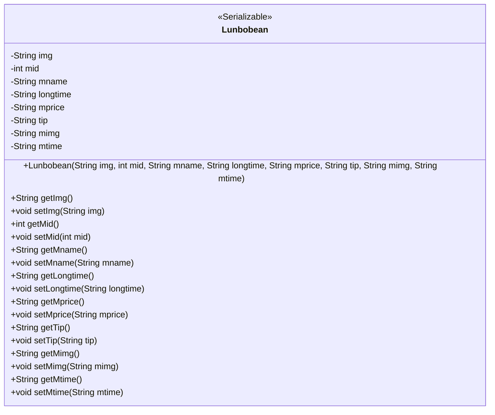
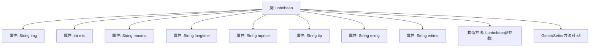

# 基础信息

|      |      |
|------|------|
| 名称 | Lunbobean |
| 编码语言 | .java |
| 代码路径 | happycat/src/com/happycat/Bean/Lunbobean.java |
| 包名 | com.happycat.Bean |
| 依赖项 | ['java.io.Serializable'] |
| 概述说明 | Lunbobean是一个可序列化的Java类，包含图片、ID、名称、时长、价格、提示、图片和时间等属性，提供getter和setter方法。 |

# 说明

Lunbobean是一个实现了Serializable接口的Java类，用于存储轮播图相关数据。类中包含八个私有属性：img（图片路径）、mid（ID）、mname（名称）、longtime（时长）、mprice（价格）、tip（提示信息）、mimg（图片路径）、mtime（时间）。提供了所有属性的getter和setter方法，以及一个包含所有属性的构造函数。该类通过serialVersionUID支持序列化。

# 类列表 Class Summary

| 名称   | 类型  | 说明 |
|-------|------|-------------|
| Lunbobean | class | Lunbobean是一个可序列化的Java类，包含图片、ID、名称、时长、价格、提示、图片和时间等属性及其getter和setter方法。 |

## 类 Lunbobean

|      |      |
|------|------|
| 访问范围 | public |
| 类型 | class |
| 名称 | Lunbobean |
| 说明 | Lunbobean是一个可序列化的Java类，包含图片、ID、名称、时长、价格、提示、图片和时间等属性及其getter和setter方法。 |

### UML类图

类图描述：
Lunbobean 是一个实现了 Serializable 接口的 Java 类，主要用于封装轮播图相关的数据信息。该类包含 8 个私有字段，分别表示图片 URL(img)、ID(mid)、名称(mname)、时长(longtime)、价格(mprice)、提示信息(tip)、主图 URL(mimg)和时间(mtime)。提供了完整的构造方法和 getter/setter 方法，确保数据的封装性和可访问性。通过实现 Serializable 接口，该类支持序列化操作，便于网络传输或持久化存储。

### 内部方法调用关系图

该流程图展示了Lunbobean类的完整结构，这是一个实现了Serializable接口的Java Bean类。类包含8个私有属性字段，每个字段都有对应的getter和setter方法，以及一个全参数构造方法。所有属性均为字符串类型，除了mid是整型。类设计符合标准Java Bean规范，主要用于数据封装和序列化传输，适用于存储轮播图相关的多媒体信息，如图片URL(img)、影片ID(mid)、名称(mname)等元数据。

### 字段列表 Field List

| 名称  | 类型  | 说明 |
|-------|-------|------|
| serialVersionUID = 1L | long | 声明一个私有静态不可变的序列化版本ID，初始值为1L。 |
| mprice | String | 私有字符串变量mprice，用于存储价格信息。 |
| mname | String | 私有字符串变量mname。 |
| mtime | String | 私有字符串变量mtime，用于存储时间信息。 |
| tip | String | 私有字符串变量tip。 |
| longtime | String | 私有字符串变量longtime。 |
| mid | int | 私有整型变量mid |
| mimg | String | 私有字符串变量mimg，用于存储图片数据。 |
| img | String | 声明一个私有字符串变量img。 |

### 方法列表

| 名称  | 类型  | 说明 |
|-------|-------|------|
| getTip | String | 获取tip字符串的方法。 |
| getLongtime | String | 获取longtime字符串值的方法。 |
| getMimg | String | 这是一个Java方法，返回字符串类型的成员变量mimg。 |
| setMimg | void | Java方法：设置成员变量mimg的值。参数为字符串mimg。 |
| getMtime | String | 方法getMtime返回字符串类型的成员变量mtime。 |
| setMtime | void | 设置mtime属性的方法，参数为字符串类型。 |
| setImg | void | 这是一个Java方法，用于设置对象的img属性值。方法接收一个字符串参数img，并将其赋值给当前对象的img成员变量。 |
| setMid | void | 设置成员变量mid的值。 |
| setLongtime | void | Java方法：设置longtime字符串变量值。 |
| setMname | void | Java方法：设置成员变量mname的值。 |
| getMprice | String | 获取mprice值的公共方法。 |
| getMid | int | 方法返回整型变量mid的值。 |
| setMprice | void | 这是一个Java方法，用于设置类成员变量mprice的值。方法接收一个字符串参数mprice，并将其赋值给当前对象的mprice属性。 |
| getImg | String | 获取图片路径的方法。 |
| getMname | String | 这是一个Java方法，返回字符串类型的成员变量mname的值。 |
| setTip | void | 方法setTip接收字符串参数tip，将其赋值给当前对象的tip属性。 |

