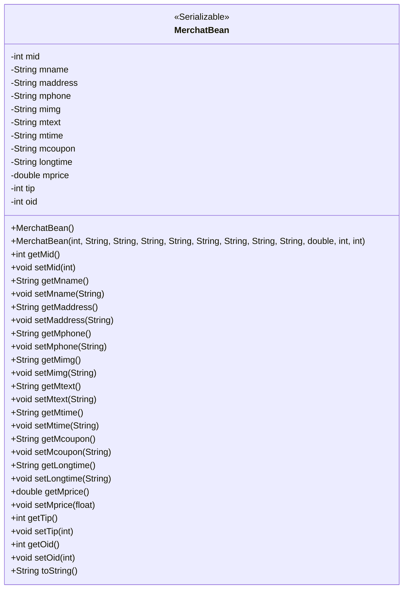

# 基础信息

|      |      |
|------|------|
| 名称 | MerchatBean |
| 编码语言 | .java |
| 代码路径 | happycat/src/com/happycat/Bean/MerchatBean.java |
| 包名 | com.happycat.Bean |
| 依赖项 | ['java.io.Serializable'] |
| 概述说明 | MerchatBean类实现Serializable接口，包含商户ID、名称、地址、电话、图片、描述、时间、优惠、时长、价格、小费、订单ID等属性及对应getter/setter方法，提供全参和无参构造方法。 |

# 说明

MerchatBean是一个实现了Serializable接口的Java类，用于表示商户信息。该类包含多个私有字段：mid（商户ID）、mname（商户名称）、maddress（地址）、mphone（电话）、mimg（图片）、mtext（描述）、mtime（时间）、mcoupon（优惠券）、longtime（长期时间）、mprice（价格）、tip（小费）、oid（订单ID）。每个字段都有对应的getter和setter方法。类提供了两个构造方法：一个无参构造方法和一个全参构造方法，用于初始化所有字段。此外，类重写了toString方法，返回包含所有字段值的字符串表示。

# 类列表 Class Summary

| 名称   | 类型  | 说明 |
|-------|------|-------------|
| MerchatBean | class | MerchatBean类包含商家信息如ID、名称、地址、电话、图片、描述、时间、优惠、价格等，提供getter/setter方法和构造器。 |

## 类 MerchatBean

|      |      |
|------|------|
| 访问范围 | public |
| 类型 | class |
| 名称 | MerchatBean |
| 说明 | MerchatBean类包含商家信息如ID、名称、地址、电话、图片、描述、时间、优惠、价格等，提供getter/setter方法和构造器。 |

### UML类图

MerchatBean 是一个实现了 Serializable 接口的 Java 类，用于表示商户信息的数据模型。该类包含 12 个私有字段，分别记录商户 ID、名称、地址、电话、图片、描述、营业时间、优惠券信息、长期营业标识、价格、小费比例和订单 ID。提供了完整的 getter/setter 方法、两个构造函数（默认构造和全参数构造）以及 toString() 方法。该设计遵循 JavaBean 规范，支持序列化操作，适用于需要持久化或网络传输商户信息的场景。

### 内部方法调用关系图

```mermaid
graph TD
    A["类MerchatBean"]
    B["属性: int mid"]
    C["属性: String mname"]
    D["属性: String maddress"]
    E["属性: String mphone"]
    F["属性: String mimg"]
    G["属性: String mtext"]
    H["属性: String mtime"]
    I["属性: String mcoupon"]
    J["属性: String longtime"]
    K["属性: double mprice"]
    L["属性: int tip"]
    M["属性: int oid"]
    N["构造方法: MerchatBean()"]
    O["构造方法: MerchatBean(全参数)"]
    P["方法: getter/setter组"]
    Q["重写方法: toString()"]

    A --> B
    A --> C
    A --> D
    A --> E
    A --> F
    A --> G
    A --> H
    A --> I
    A --> J
    A --> K
    A --> L
    A --> M
    A --> N
    A --> O
    A --> P
    A --> Q
```

该流程图展示了MerchatBean类的完整结构，包含12个私有属性、2个构造方法（无参和全参数）、12组getter/setter方法以及重写的toString方法。类实现了Serializable接口，主要用于商户数据的封装和序列化操作，每个属性对应商户的不同特征如ID、名称、地址等，全参数构造器支持对象初始化时完整赋值，toString方法提供了标准化的对象字符串表示形式。

### 字段列表 Field List

| 名称  | 类型  | 说明 |
|-------|-------|------|
| mphone | String | 私有字符串类型变量mphone，用于存储手机号信息。 |
| mname | String | 私有字符串变量mname |
| tip | int | 私有整型变量tip |
| maddress | String | 私有字符串变量maddress，用于存储地址信息。 |
| mtime | String | 声明一个私有字符串变量mtime。 |
| mprice | double | 私有双精度浮点型变量mprice，用于存储价格数据。 |
| mcoupon | String | 私有字符串变量mcoupon |
| mid | int | 私有整型变量mid |
| mimg | String | 私有字符串变量mimg，用于存储图像数据。 |
| longtime | String | 长时间字符串变量 |
| oid | int | 私有整型变量oid。 |
| mtext | String | 私有字符串变量mtext |

### 方法列表

| 名称  | 类型  | 说明 |
|-------|-------|------|
| setMid | void | 这是一个Java方法，用于设置成员变量mid的值。方法接收一个整数参数mid，并将其赋值给当前对象的mid属性。 |
| getMphone | String | 获取手机号方法，返回成员变量mphone的值。 |
| getTip | int | 方法返回tip变量的整数值。 |
| setTip | void | 这是一个Java方法，用于设置tip属性的值。方法接收一个int参数tip，并将其赋值给当前对象的tip成员变量。 |
| setMcoupon | void | 设置mcoupon值的公共方法。 |
| getMtime | String | 获取mtime值的公开方法，返回字符串类型。 |
| setMname | void | 这是一个Java方法，用于设置类成员变量mname的值。方法接收一个字符串参数mname，并将其赋值给当前对象的mname属性。 |
| setMtext | void | Java方法：设置mtext字符串变量值。 |
| getLongtime | String | 获取longtime字符串值的方法。 |
| setMphone | void | 设置手机号的方法，参数为mphone，赋值给当前对象的mphone属性。 |
| getMtext | String | 这是一个Java方法，返回字符串类型的成员变量mtext。 |
| getMaddress | String | 获取maddress字符串值的方法。 |
| getOid | int | 方法返回对象标识符oid的整数值。 |
| setMprice | void | 这是一个Java方法，用于设置类成员变量mprice的值，参数为浮点数mprice。 |
| getMprice | double | 获取mprice值的公开方法，返回double类型。 |
| getMcoupon | String | 方法返回字符串类型成员变量mcoupon的值。 |
| setOid | void | 这是一个Java方法，用于设置对象的oid属性值。方法接收一个整数参数oid，并将其赋值给当前对象的oid成员变量。 |
| toString | String | MerchatBean的toString方法返回包含mid、mname、maddress等属性的字符串。 |
| setMaddress | void | 这是一个Java方法，用于设置成员变量maddress的值。方法接收一个字符串参数maddresss，并将其赋值给当前对象的maddress属性。 |
| setLongtime | void | 这是一个Java方法，用于设置longtime属性的值。方法接收一个字符串参数longtime，并将其赋值给当前对象的longtime成员变量。 |
| setMtime | void | Java方法：设置mtime字符串属性值。 |
| setMimg | void | Java方法：设置mimg字符串属性值。 |
| getMimg | String | 这是一个Java方法，返回字符串类型的成员变量mimg的值。 |
| getMname | String | 这是一个Java方法，返回字符串类型的成员变量mname的值。 |
| getMid | int | 获取mid值的公共方法，返回整数类型。 |

