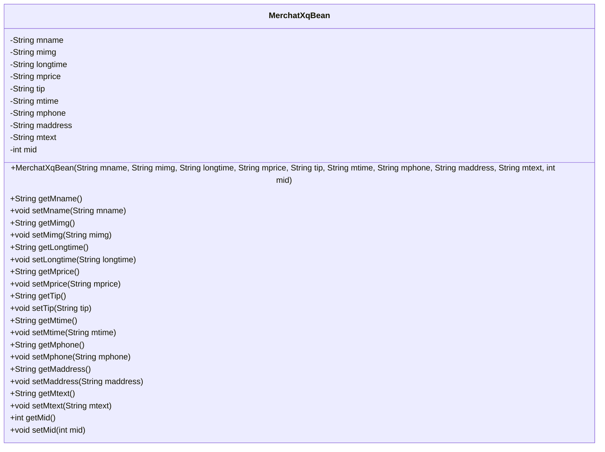
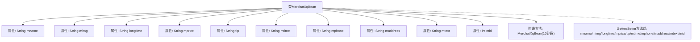

# 基础信息

|      |      |
|------|------|
| 名称 | MerchatXqBean |
| 编码语言 | .java |
| 代码路径 | happycat/src/com/happycat/Bean/MerchatXqBean.java |
| 包名 | com.happycat.Bean |
| 依赖项 | ['java.io.Serializable'] |
| 概述说明 | MerchatXqBean类存储商家信息，包含名称、图片、时长、价格、提示、时间、电话、地址、描述和ID字段，提供getter和setter方法。 |

# 说明

MerchatXqBean是一个实现了Serializable接口的Java类，用于存储商家详细信息。包含商家名称mname、图片mimg、营业时长longtime、价格mprice、提示tip、营业时间mtime、电话mphone、地址maddress、描述mtext和商家ID mid等属性。提供了所有属性的getter和setter方法，以及一个包含所有属性的构造函数。该类支持序列化，序列化版本号为1L。

# 类列表 Class Summary

| 名称   | 类型  | 说明 |
|-------|------|-------------|
| MerchatXqBean | class | MerchatXqBean是一个可序列化的Java类，包含商户名称、图片、时长、价格、提示、时间、电话、地址、文本和ID等属性，提供getter和setter方法。 |

## 类 MerchatXqBean

|      |      |
|------|------|
| 访问范围 | public |
| 类型 | class |
| 名称 | MerchatXqBean |
| 说明 | MerchatXqBean是一个可序列化的Java类，包含商户名称、图片、时长、价格、提示、时间、电话、地址、文本和ID等属性，提供getter和setter方法。 |

### UML类图

该类图展示了一个名为MerchatXqBean的Java类，该类实现了Serializable接口，主要用于存储和操作商家详细信息。类中包含10个私有字段，分别表示商家名称、图片、营业时长、价格、提示信息、营业时间、联系电话、地址、描述文本和唯一标识符。为每个字段提供了对应的getter和setter方法，以及一个包含所有字段的构造方法。该类设计符合JavaBean规范，便于序列化和反序列化操作。

### 内部方法调用关系图

该流程图展示了MerchatXqBean类的完整结构，包含10个String/int类型的私有属性、1个全参数构造方法以及10组对应的getter/setter方法。这是一个典型的JavaBean设计模式实现，用于封装商户详情数据，所有属性都通过getter/setter方法进行访问控制，符合对象封装原则。类实现了Serializable接口，支持序列化操作。

### 字段列表 Field List

| 名称  | 类型  | 说明 |
|-------|-------|------|
| maddress | String | 私有字符串变量maddress，用于存储地址信息。 |
| mtime | String | 私有字符串变量mtime，用于存储时间信息。 |
| mtext | String | 私有字符串变量mtext。 |
| mimg | String | 私有字符串变量mimg |
| longtime | String | 私有字符串变量longtime |
| tip | String | 私有字符串变量tip |
| mname | String | 私有字符串变量mname。 |
| serialVersionUID = 1L | long | 声明一个私有静态不可变的序列化版本ID，值为1L。 |
| mid | int | 私有整型变量mid |
| mphone | String | 私有字符串变量mphone，用于存储手机号信息。 |
| mprice | String | 私有字符串变量mprice，用于存储价格信息。 |

### 方法列表

| 名称  | 类型  | 说明 |
|-------|-------|------|
| setLongtime | void | 设置长时间属性值的方法，参数为字符串longtime。 |
| setMaddress | void | 设置成员变量maddress的方法，参数为字符串maddress。 |
| setMprice | void | 这是一个Java方法，用于设置mprice变量的值。方法接收一个字符串参数mprice，并将其赋值给类的成员变量this.mprice。 |
| setTip | void | 这是一个Java方法，用于设置类的tip属性值。方法接收一个字符串参数tip，并将其赋值给类的成员变量tip。 |
| getMprice | String | 获取mprice字符串值的方法。 |
| getTip | String | 获取tip字符串的方法。 |
| getMimg | String | 方法getMimg返回字符串类型成员变量mimg的值。 |
| getMaddress | String | 获取maddress字符串值的方法。 |
| setMimg | void | 这是一个Java方法，用于设置类成员变量mimg的值。方法接受一个字符串参数mimg，并将其赋值给当前对象的mimg属性。 |
| getMphone | String | 方法返回字符串类型变量mphone的值。 |
| setMtime | void | Java方法：设置mtime字符串属性。 |
| getMtime | String | 方法返回字符串类型变量mtime的值。 |
| getMname | String | 这是一个Java方法，返回字符串类型的成员变量mname。 |
| setMname | void | Java方法：设置成员变量mname的值。 |
| setMphone | void | 设置手机号的方法，参数为字符串mphone，赋值给当前对象的mphone属性。 |
| getLongtime | String | 获取longtime字符串值的方法。 |
| getMtext | String | 获取mtext字符串值的方法。 |
| setMtext | void | Java方法：设置mtext字符串变量的值。 |
| getMid | int | 方法返回整型变量mid的值。 |
| setMid | void | 设置成员变量mid的方法，参数为mid。 |

