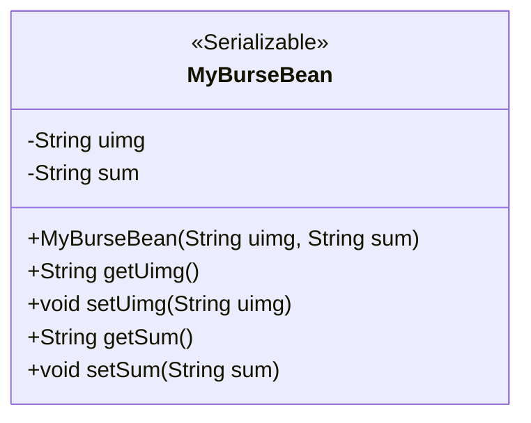
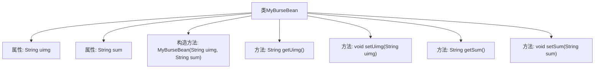

# 基础信息

|      |      |
|------|------|
| 名称 | MyBurseBean |
| 编码语言 | .java |
| 代码路径 | happycat/src/com/happycat/Bean/MyBurseBean.java |
| 包名 | com.happycat.Bean |
| 依赖项 | ['java.io.Serializable'] |
| 概述说明 | 可序列化类MyBurseBean，含uimg和sum属性及对应getter/setter方法，提供带参构造器。 |

# 说明

这是一个名为MyBurseBean的Java类，实现了Serializable接口以便序列化。类中包含两个私有字符串属性uimg和sum，分别通过getter和setter方法进行访问和修改。类还提供了一个构造方法，用于初始化这两个属性。serialVersionUID字段用于版本控制，确保序列化兼容性。

# 类列表 Class Summary

| 名称   | 类型  | 说明 |
|-------|------|-------------|
| MyBurseBean | class | 可序列化的Java类MyBurseBean，包含uimg和sum两个字符串属性，提供getter/setter方法和带参构造函数。 |

## 类 MyBurseBean

|      |      |
|------|------|
| 访问范围 | public |
| 类型 | class |
| 名称 | MyBurseBean |
| 说明 | 可序列化的Java类MyBurseBean，包含uimg和sum两个字符串属性，提供getter/setter方法和带参构造函数。 |

### UML类图

这段代码定义了一个名为MyBurseBean的Java类，该类实现了Serializable接口，表明其实例可以被序列化。类中包含两个私有字符串属性uimg和sum，分别通过getter和setter方法进行访问和修改。构造函数允许在创建对象时初始化这两个属性。该类主要用于封装数据，并通过序列化支持网络传输或持久化存储。

### 内部方法调用关系图

该流程图展示了MyBurseBean类的结构，包含两个私有属性uimg和sum，以及对应的getter和setter方法。类实现了Serializable接口，具有序列化标识serialVersionUID。构造方法用于初始化两个属性值，所有方法均围绕属性操作展开，形成标准的JavaBean结构。图形清晰呈现了类成员与方法的从属关系，便于理解数据封装过程。

### 字段列表 Field List

| 名称  | 类型  | 说明 |
|-------|-------|------|
| sum | String | 私有字符串类型变量sum。 |
| uimg | String | 私有字符串变量uimg，用于存储图像数据。 |
| serialVersionUID = 1L | long | 声明一个私有静态不可变的序列化版本ID，值为1L。 |

### 方法列表

| 名称  | 类型  | 说明 |
|-------|-------|------|
| getUimg | String | 获取uimg字符串值的方法。 |
| setUimg | void | 这是一个Java方法，用于设置对象的uimg属性值。方法接受一个字符串参数uimg，并将其赋值给当前对象的uimg字段。 |
| getSum | String | 获取sum值的公共方法。 |
| setSum | void | Java方法：设置sum字符串值。 |

