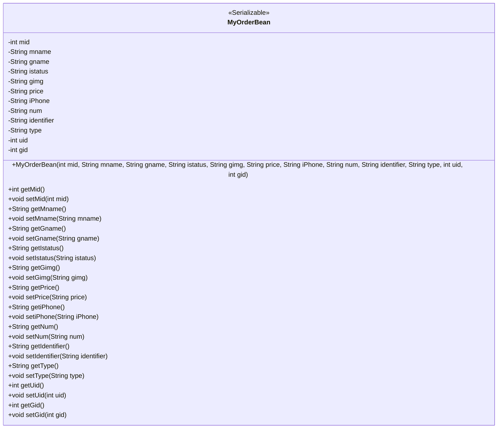

# 基础信息

|      |      |
|------|------|
| 名称 | MyOrderBean |
| 编码语言 | .java |
| 代码路径 | happycat/src/com/happycat/Bean/MyOrderBean.java |
| 包名 | com.happycat.Bean |
| 依赖项 | ['java.io.Serializable'] |
| 概述说明 | MyOrderBean是一个可序列化的Java类，包含订单ID、商品名、状态、价格、数量等属性，提供getter和setter方法。 |

# 说明

MyOrderBean是一个实现了Serializable接口的Java类，用于表示订单信息。它包含12个私有字段：mid、mname、gname、istatus、gimg、price、iPhone、num、identifier、type、uid和gid。这些字段分别存储订单ID、会员名称、商品名称、订单状态、商品图片、价格、手机号、数量、标识符、类型、用户ID和商品ID。类提供了带参构造方法和所有字段的getter与setter方法，用于初始化和访问这些属性。

# 类列表 Class Summary

| 名称   | 类型  | 说明 |
|-------|------|-------------|
| MyOrderBean | class | MyOrderBean是一个可序列化的Java类，包含订单ID、商品名、状态、价格、数量等属性，提供getter和setter方法。 |

## 类 MyOrderBean

|      |      |
|------|------|
| 访问范围 | public |
| 类型 | class |
| 名称 | MyOrderBean |
| 说明 | MyOrderBean是一个可序列化的Java类，包含订单ID、商品名、状态、价格、数量等属性，提供getter和setter方法。 |

### UML类图

这段代码定义了一个名为MyOrderBean的Java类，该类实现了Serializable接口，主要用于表示订单信息。类中包含12个私有字段，分别用于存储订单ID、会员名称、商品名称、订单状态、商品图片、价格、手机号、数量、标识符、类型、用户ID和商品ID。通过构造函数初始化这些字段，并提供了对应的getter和setter方法用于访问和修改这些字段的值。由于实现了Serializable接口，该类的对象可以被序列化和反序列化，便于在网络中传输或持久化存储。

### 内部方法调用关系图

```mermaid
graph TD
    A["类MyOrderBean"]
    B["属性: int mid"]
    C["属性: String mname"]
    D["属性: String gname"]
    E["属性: String istatus"]
    F["属性: String gimg"]
    G["属性: String price"]
    H["属性: String iPhone"]
    I["属性: String num"]
    J["属性: String identifier"]
    K["属性: String type"]
    L["属性: int uid"]
    M["属性: int gid"]
    N["构造方法: MyOrderBean(int mid, String mname, String gname, String istatus, String gimg, String price, String iPhone, String num, String identifier, String type, int uid, int gid)"]
    O["方法: int getMid()"]
    P["方法: void setMid(int mid)"]
    Q["方法: String getMname()"]
    R["方法: void setMname(String mname)"]
    S["方法: String getGname()"]
    T["方法: void setGname(String gname)"]
    U["方法: String getIstatus()"]
    V["方法: void setIstatus(String istatus)"]
    W["方法: String getGimg()"]
    X["方法: void setGimg(String gimg)"]
    Y["方法: String getPrice()"]
    Z["方法: void setPrice(String price)"]
    AA["方法: String getiPhone()"]
    AB["方法: void setiPhone(String iPhone)"]
    AC["方法: String getNum()"]
    AD["方法: void setNum(String num)"]
    AE["方法: String getIdentifier()"]
    AF["方法: void setIdentifier(String identifier)"]
    AG["方法: String getType()"]
    AH["方法: void setType(String type)"]
    AI["方法: int getUid()"]
    AJ["方法: void setUid(int uid)"]
    AK["方法: int getGid()"]
    AL["方法: void setGid(int gid)"]

    A --> B
    A --> C
    A --> D
    A --> E
    A --> F
    A --> G
    A --> H
    A --> I
    A --> J
    A --> K
    A --> L
    A --> M
    A --> N
    A --> O
    A --> P
    A --> Q
    A --> R
    A --> S
    A --> T
    A --> U
    A --> V
    A --> W
    A --> X
    A --> Y
    A --> Z
    A --> AA
    A --> AB
    A --> AC
    A --> AD
    A --> AE
    A --> AF
    A --> AG
    A --> AH
    A --> AI
    A --> AJ
    A --> AK
    A --> AL
```

这段代码定义了一个名为MyOrderBean的Java类，实现了Serializable接口，用于表示订单信息。类中包含12个私有属性，分别记录订单ID、会员名、商品名、订单状态、商品图片、价格、联系电话、数量、标识符、类型、用户ID和商品ID。通过构造方法和对应的getter/setter方法对这些属性进行初始化和访问。该类的设计主要用于封装订单数据，便于在系统中传输和持久化存储。

### 字段列表 Field List

| 名称  | 类型  | 说明 |
|-------|-------|------|
| uid | int | 私有整型变量uid，用于存储用户标识符。 |
| istatus | String | 私有字符串变量istatus，用于表示状态信息。 |
| num | String | 私有字符串变量num。 |
| gname | String | 私有字符串变量gname。 |
| gid | int | 私有整型变量gid |
| identifier | String | 私有字符串变量identifier。 |
| mname | String | 私有字符串变量mname。 |
| iPhone | String | 私有字符串变量iPhone。 |
| price | String | 私有字符串类型变量price，用于存储价格信息。 |
| type | String | 声明一个私有字符串变量type。 |
| mid | int | 私有整型变量mid |
| gimg | String | 私有字符串变量gimg，用于存储图像相关数据。 |

### 方法列表

| 名称  | 类型  | 说明 |
|-------|-------|------|
| setMname | void | Java方法：设置成员变量mname的值。 |
| setGimg | void | Java方法：设置gimg字符串属性值。 |
| setType | void | 设置对象类型的方法，将输入字符串赋值给内部变量type。 |
| getPrice | String | 获取价格的方法，返回字符串类型的价格值。 |
| setNum | void | 设置字符串类型变量num的值。 |
| setGname | void | Java方法：设置gname属性值，参数为字符串gname。 |
| setPrice | void | 设置价格的方法，将输入字符串赋值给类变量price。 |
| getGimg | String | 方法返回字符串类型变量gimg的值。 |
| setUid | void | 设置用户ID的方法，将参数uid赋值给当前对象的uid属性。 |
| getGname | String | 获取gname的字符串值方法。 |
| getGid | int | 方法返回整型变量gid的值。 |
| getIdentifier | String | 方法返回字符串类型的标识符。 |
| getIstatus | String | 获取istatus字符串值的方法。 |
| setMid | void | 设置成员变量mid的方法。 |
| setIstatus | void | 这是一个Java方法，用于设置类成员变量istatus的值。方法接收一个字符串参数，并将其赋值给当前对象的istatus属性。 |
| getMname | String | 这是一个Java方法，返回字符串类型的成员变量mname的值。 |
| getiPhone | String | 获取iPhone字符串值的方法。 |
| setIdentifier | void | 设置标识符的公共方法，将输入字符串赋值给类的成员变量identifier。 |
| getType | String | 方法返回字符串类型的type变量值。 |
| getNum | String | 方法返回字符串类型的num变量值。 |
| getMid | int | 方法返回整型变量mid的值。 |
| getUid | int | 方法返回整型变量uid的值。 |
| setGid | void | 设置对象gid属性的方法，参数为整型gid。 |
| setiPhone | void | 设置iPhone属性的方法，将参数值赋给成员变量iPhone。 |

