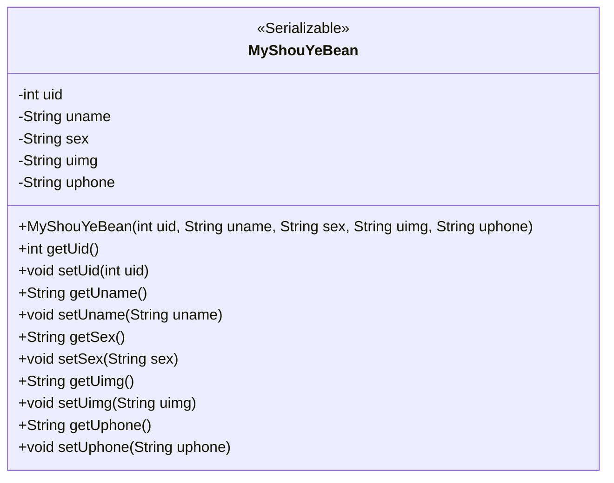

# 基础信息

|      |      |
|------|------|
| 名称 | MyShouYeBean |
| 编码语言 | .java |
| 代码路径 | happycat/src/com/happycat/Bean/MyShouYeBean.java |
| 包名 | com.happycat.Bean |
| 依赖项 | ['java.io.Serializable'] |
| 概述说明 | MyShouYeBean是可序列化类，包含用户ID、姓名、性别、头像和电话字段及对应getter/setter方法。 |

# 说明

MyShouYeBean是一个实现了Serializable接口的Java类，用于封装用户首页信息。该类包含五个私有属性：uid表示用户ID，uname表示用户名，sex表示性别，uimg表示用户头像，uphone表示用户电话。每个属性都有对应的getter和setter方法。此外，该类提供了一个构造方法，用于初始化所有属性。

# 类列表 Class Summary

| 名称   | 类型  | 说明 |
|-------|------|-------------|
| MyShouYeBean | class | MyShouYeBean是可序列化Java类，包含用户ID、姓名、性别、头像和电话字段及对应getter/setter方法。 |

## 类 MyShouYeBean

|      |      |
|------|------|
| 访问范围 | public |
| 类型 | class |
| 名称 | MyShouYeBean |
| 说明 | MyShouYeBean是可序列化Java类，包含用户ID、姓名、性别、头像和电话字段及对应getter/setter方法。 |

### UML类图

这段代码定义了一个名为MyShouYeBean的Java类，该类实现了Serializable接口，表明其实例可以被序列化。类中包含五个私有字段：uid（用户ID）、uname（用户名）、sex（性别）、uimg（用户图片）和uphone（用户电话），并为每个字段提供了对应的getter和setter方法。此外，类还提供了一个构造方法，用于初始化所有字段。这个类主要用于封装用户首页相关的数据，便于在程序中进行传递和处理。

### 内部方法调用关系图

```mermaid
graph TD
    A["类MyShouYeBean"]
    B["属性: int uid"]
    C["属性: String uname"]
    D["属性: String sex"]
    E["属性: String uimg"]
    F["属性: String uphone"]
    G["方法: getUid()"]
    H["方法: setUid(int uid)"]
    I["方法: getUname()"]
    J["方法: setUname(String uname)"]
    K["方法: getSex()"]
    L["方法: setSex(String sex)"]
    M["方法: getUimg()"]
    N["方法: setUimg(String uimg)"]
    O["方法: getUphone()"]
    P["方法: setUphone(String uphone)"]
    Q["构造方法: MyShouYeBean(int uid, String uname, String sex, String uimg, String uphone)"]

    A --> B
    A --> C
    A --> D
    A --> E
    A --> F
    A --> G
    A --> H
    A --> I
    A --> J
    A --> K
    A --> L
    A --> M
    A --> N
    A --> O
    A --> P
    A --> Q
```

这段代码定义了一个名为MyShouYeBean的Java类，实现了Serializable接口，用于表示用户首页信息的数据结构。类中包含五个私有属性：uid（用户ID）、uname（用户名）、sex（性别）、uimg（用户头像）和uphone（用户电话），并为每个属性提供了对应的getter和setter方法。此外，还定义了一个包含所有属性的构造方法，用于初始化对象。这个类主要用于封装用户信息，便于在程序中进行传递和序列化操作。

### 字段列表 Field List

| 名称  | 类型  | 说明 |
|-------|-------|------|
| uphone | String | 私有字符串变量uphone |
| uid | int | 私有整型变量uid。 |
| uimg | String | 私有字符串变量uimg，用于存储图像数据。 |
| sex | String | 声明一个私有字符串变量sex，用于存储性别信息。 |
| uname | String | 声明一个私有字符串变量uname。 |

### 方法列表

| 名称  | 类型  | 说明 |
|-------|-------|------|
| setUphone | void | 这是一个Java方法，用于设置对象的uphone属性值。方法接收一个字符串参数uphone，并将其赋值给对象的同名成员变量。 |
| getUid | int | 方法返回整型变量uid的值。 |
| setSex | void | 这是一个Java方法，用于设置对象的性别属性。方法接受一个字符串参数sex，并将其赋值给当前对象的sex成员变量。 |
| getUphone | String | 获取用户手机号的方法。 |
| getUimg | String | 获取用户图片的方法，返回uimg变量值。 |
| setUname | void | Java方法：设置成员变量uname的值。 |
| setUimg | void | Java方法：设置uimg字符串属性值。 |
| getSex | String | 获取性别的方法，返回字符串类型变量sex。 |
| getUname | String | 方法getUname返回字符串uname的值。 |
| setUid | void | 设置用户ID的方法，将参数uid赋值给当前对象的uid属性。 |

