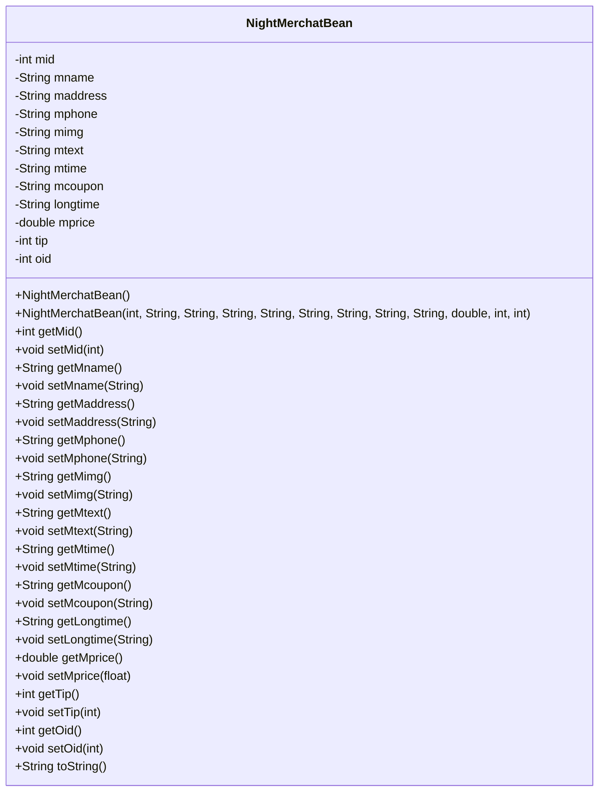

# 基础信息

|      |      |
|------|------|
| 名称 | NightMerchatBean |
| 编码语言 | .java |
| 代码路径 | happycat/src/com/happycat/Bean/NightMerchatBean.java |
| 包名 | com.happycat.Bean |
| 依赖项 | ['java.io.Serializable'] |
| 概述说明 | NightMerchatBean类，包含商家ID、名称、地址、电话、图片、描述、营业时间、优惠、时长、价格、小费、订单ID等属性及对应方法。 |

# 说明

NightMerchatBean是一个实现了Serializable接口的Java类，用于存储商家信息。包含12个私有属性：mid商家ID、mname名称、maddress地址、mphone电话、mimg图片、mtext描述、mtime营业时间、mcoupon优惠券、longtime营业时长、mprice价格、tip小费、oid订单ID。提供所有属性的getter和setter方法，包含全参数构造方法和无参构造方法，并重写了toString方法用于输出对象信息。

# 类列表 Class Summary

| 名称   | 类型  | 说明 |
|-------|------|-------------|
| NightMerchatBean | class | NightMerchatBean类实现Serializable接口，包含商户ID、名称、地址、电话、图片、描述、营业时间、优惠、时长、价格、小费和订单ID等属性，提供构造方法和getter/setter。 |

## 类 NightMerchatBean

|      |      |
|------|------|
| 访问范围 | public |
| 类型 | class |
| 名称 | NightMerchatBean |
| 说明 | NightMerchatBean类实现Serializable接口，包含商户ID、名称、地址、电话、图片、描述、营业时间、优惠、时长、价格、小费和订单ID等属性，提供构造方法和getter/setter。 |

### UML类图

这段代码定义了一个名为NightMerchatBean的Java类，实现了Serializable接口，主要用于存储和操作商户信息。该类包含12个私有字段，分别表示商户ID、名称、地址、电话、图片、描述、营业时间、优惠券信息、营业时长、价格、小费和订单ID。提供了完整的getter/setter方法、两个构造函数（默认构造和全参数构造）以及toString方法。这是一个典型的数据传输对象(DTO)，用于在不同层之间传递商户数据，支持序列化特性使其适合网络传输或持久化存储。

### 内部方法调用关系图

```mermaid
graph TD
    A["类NightMerchatBean"]
    B["属性: int mid"]
    C["属性: String mname"]
    D["属性: String maddress"]
    E["属性: String mphone"]
    F["属性: String mimg"]
    G["属性: String mtext"]
    H["属性: String mtime"]
    I["属性: String mcoupon"]
    J["属性: String longtime"]
    K["属性: double mprice"]
    L["属性: int tip"]
    M["属性: int oid"]
    N["构造方法: NightMerchatBean()"]
    O["构造方法: NightMerchatBean(全参数)"]
    P["方法: getMid/setMid"]
    Q["方法: getMname/setMname"]
    R["方法: getMaddress/setMaddress"]
    S["方法: getMphone/setMphone"]
    T["方法: getMimg/setMimg"]
    U["方法: getMtext/setMtext"]
    V["方法: getMtime/setMtime"]
    W["方法: getMcoupon/setMcoupon"]
    X["方法: getLongtime/setLongtime"]
    Y["方法: getMprice/setMprice"]
    Z["方法: getTip/setTip"]
    AA["方法: getOid/setOid"]
    AB["重写方法: toString()"]

    A --> B
    A --> C
    A --> D
    A --> E
    A --> F
    A --> G
    A --> H
    A --> I
    A --> J
    A --> K
    A --> L
    A --> M
    A --> N
    A --> O
    A --> P
    A --> Q
    A --> R
    A --> S
    A --> T
    A --> U
    A --> V
    A --> W
    A --> X
    A --> Y
    A --> Z
    A --> AA
    A --> AB
```

这段代码是一个Java实体类NightMerchatBean，实现了Serializable接口，包含12个属性和对应的getter/setter方法。类中定义了两个构造方法（无参和全参数构造），并重写了toString()方法用于对象信息格式化输出。流程图展示了类的完整结构，包括所有私有属性、构造方法、访问器方法以及toString()方法，反映了该实体类作为数据载体的典型特征，适用于商户信息的存储和传输场景。

### 字段列表 Field List

| 名称  | 类型  | 说明 |
|-------|-------|------|
| longtime | String | 私有字符串变量longtime |
| mtext | String | 私有字符串变量mtext。 |
| mimg | String | 私有字符串变量mimg，用于存储图片信息。 |
| mphone | String | 私有字符串变量mphone，用于存储手机号信息。 |
| mid | int | 私有整型变量mid |
| oid | int | 私有整型变量oid |
| mprice | double | 私有双精度浮点型变量mprice |
| mcoupon | String | 私有字符串变量mcoupon，用于存储优惠券信息。 |
| mtime | String | 声明一个私有字符串变量mtime。 |
| tip | int | 私有整型变量tip |
| maddress | String | 私有字符串变量maddress，用于存储地址信息。 |
| mname | String | 私有字符串变量mname。 |

### 方法列表

| 名称  | 类型  | 说明 |
|-------|-------|------|
| setLongtime | void | 这是一个Java方法，用于设置成员变量longtime的值。方法名为setLongtime，接收一个String类型参数longtime，并将其赋值给当前对象的同名成员变量。 |
| getOid | int | 方法返回对象标识符oid的整数值。 |
| getMtime | String | 获取mtime值的字符串方法。 |
| setMprice | void | 设置商品价格的方法，参数为浮点数mprice。 |
| setTip | void | 设置小费数值的方法，将参数tip赋值给成员变量tip。 |
| setMtime | void | Java方法：设置mtime字符串属性值。 |
| setMimg | void | 这是一个Java方法，用于设置成员变量mimg的值。方法名为setMimg，接收一个String类型参数mimg，并将其赋值给当前对象的mimg属性。 |
| getLongtime | String | 获取longtime字符串值的方法。 |
| setMphone | void | 设置手机号的方法，参数为mphone，赋值给当前对象的mphone属性。 |
| getMtext | String | 方法getMtext返回字符串mtext的值。 |
| setMname | void | Java方法：设置成员变量mname的值。 |
| getTip | int | 方法返回tip变量的整数值。 |
| setMcoupon | void | Java方法：设置mcoupon字符串值。 |
| setMid | void | 设置成员变量mid的值。 |
| getMid | int | 方法返回整型变量mid的值。 |
| setMaddress | void | 这是一个Java方法，用于设置成员变量maddress的值。方法接收一个字符串参数maddresss，并将其赋值给当前对象的maddress属性。 |
| getMcoupon | String | 方法返回字符串变量mcoupon的值。 |
| setOid | void | 这是一个Java方法，用于设置对象中的oid属性值。方法接受一个整数参数oid，并将其赋值给当前对象的oid成员变量。 |
| toString | String | MerchatBean的toString方法返回包含mid、mname、maddress等13个字段的字符串。 |
| setMtext | void | 这是一个Java方法，用于设置类成员变量mtext的值。方法接收一个字符串参数mtext，并将其赋值给当前对象的mtext属性。 |
| getMprice | double | 获取mprice值的公开方法，返回double类型。 |
| getMname | String | 方法getMname返回成员变量mname的值。 |
| getMaddress | String | 方法getMaddress返回成员变量maddress的值。 |
| getMimg | String | 这是一个Java方法，返回字符串类型的成员变量mimg的值。 |
| getMphone | String | 获取手机号的方法，返回mphone变量值。 |

