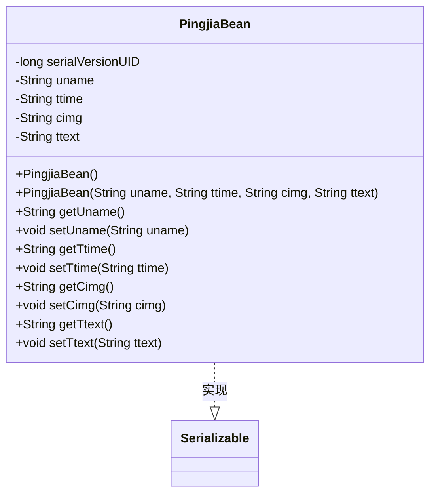

# 基础信息

|      |      |
|------|------|
| 名称 | PingjiaBean |
| 编码语言 | .java |
| 代码路径 | happycat/src/com/happycat/Bean/PingjiaBean.java |
| 包名 | com.happycat.Bean |
| 依赖项 | ['java.io.Serializable'] |
| 概述说明 | Java类PingjiaBean实现序列化，包含用户名、时间、图片和文本字段及其getter/setter方法。 |

# 说明

PingjiaBean是一个实现了Serializable接口的Java类，用于存储评价信息。该类包含四个私有字符串属性：uname（用户名）、ttime（时间）、cimg（图片）和ttext（评价文本）。提供了无参构造方法和带参构造方法，以及每个属性的getter和setter方法。serialVersionUID用于版本控制。

# 类列表 Class Summary

| 名称   | 类型  | 说明 |
|-------|------|-------------|
| PingjiaBean | class | PingjiaBean是可序列化类，包含用户名、时间、图片和文本字段及其getter/setter方法。 |

## 类 PingjiaBean

|      |      |
|------|------|
| 访问范围 | public |
| 类型 | class |
| 名称 | PingjiaBean |
| 说明 | PingjiaBean是可序列化类，包含用户名、时间、图片和文本字段及其getter/setter方法。 |

### UML类图

类图描述：
PingjiaBean 是一个实现了 Serializable 接口的 Java Bean 类，用于封装评价信息。包含四个私有字符串属性：uname（用户名）、ttime（评价时间）、cimg（图片路径）和 ttext（评价内容），并提供了对应的 getter 和 setter 方法。类中包含两个构造方法：默认无参构造方法和带全部参数的构造方法。该类通过实现 Serializable 接口支持序列化功能，serialVersionUID 用于版本控制。

### 内部方法调用关系图

```mermaid
graph TD
    A["类PingjiaBean"]
    B["静态属性: long serialVersionUID = 1L"]
    C["私有属性: String uname"]
    D["私有属性: String ttime"]
    E["私有属性: String cimg"]
    F["私有属性: String ttext"]
    G["无参构造方法: PingjiaBean()"]
    H["带参构造方法: PingjiaBean(String uname, String ttime, String cimg, String ttext)"]
    I["方法: String getUname()"]
    J["方法: void setUname(String uname)"]
    K["方法: String getTtime()"]
    L["方法: void setTtime(String ttime)"]
    M["方法: String getCimg()"]
    N["方法: void setCimg(String cimg)"]
    O["方法: String getTtext()"]
    P["方法: void setTtext(String ttext)"]

    A --> B
    A --> C
    A --> D
    A --> E
    A --> F
    A --> G
    A --> H
    A --> I
    A --> J
    A --> K
    A --> L
    A --> M
    A --> N
    A --> O
    A --> P
```

该流程图展示了PingjiaBean类的完整结构，这是一个实现了Serializable接口的Java Bean类。类包含4个私有字符串属性(uname, ttime, cimg, ttext)及其对应的getter/setter方法，同时提供了无参构造器和带全部参数的构造器。静态属性serialVersionUID用于序列化版本控制。整个类结构清晰体现了Java Bean的标准设计模式，适用于数据封装和序列化场景。

### 字段列表 Field List

| 名称  | 类型  | 说明 |
|-------|-------|------|
| cimg | String | 私有字符串变量cimg，用于存储图像相关数据。 |
| serialVersionUID = 1L | long | 声明一个私有静态不可变的序列化版本ID，初始值为1L。 |
| uname | String | 私有字符串变量uname。 |
| ttext | String | 私有字符串变量ttext。 |
| ttime | String | 声明一个私有字符串变量ttime。 |

### 方法列表

| 名称  | 类型  | 说明 |
|-------|-------|------|
| setUname | void | 这是一个Java方法，用于设置类成员变量uname的值。方法接收一个字符串参数uname，并将其赋值给当前对象的uname属性。 |
| getTtime | String | 获取ttime字符串的方法。 |
| setTtime | void | Java方法：设置ttime字符串属性值。 |
| getUname | String | 方法getUname返回成员变量uname的值。 |
| getCimg | String | 获取cimg字符串值的方法。 |
| setCimg | void | Java方法：设置cimg字符串属性值。 |
| getTtext | String | 方法getTtext返回字符串变量ttext的值。 |
| setTtext | void | 这是一个Java方法，用于设置类成员变量ttext的值。方法接收一个字符串参数ttext，并将其赋值给当前对象的ttext属性。 |

