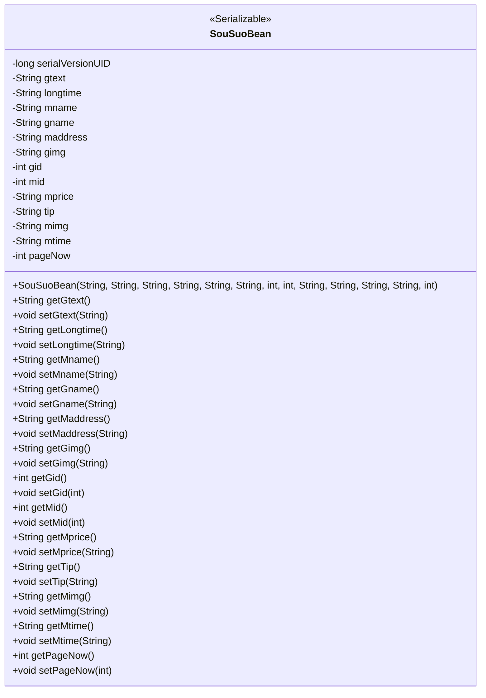

# 基础信息

|      |      |
|------|------|
| 名称 | SouSuoBean |
| 编码语言 | .java |
| 代码路径 | happycat/src/com/happycat/Bean/SouSuoBean.java |
| 包名 | com.happycat.Bean |
| 依赖项 | ['java.io.Serializable'] |
| 概述说明 | SouSuoBean是一个可序列化的Java类，包含商品和商家信息，如名称、地址、价格、图片等，提供getter和setter方法。 |

# 说明

SouSuoBean是一个实现了Serializable接口的Java类，用于存储搜索相关的数据。类中包含多个私有字段，包括gtext、longtime、mname、gname、maddress、gimg、gid、mid、mprice、tip、mimg、mtime和pageNow，分别表示搜索文本、长时间、名称、地址、图片、ID、价格、提示信息、图片、时间和当前页码。每个字段都有对应的getter和setter方法，用于获取和设置字段值。类还提供了一个构造函数，用于初始化所有字段。该类主要用于数据传输和序列化操作。

# 类列表 Class Summary

| 名称   | 类型  | 说明 |
|-------|------|-------------|
| SouSuoBean | class | SouSuoBean是一个可序列化的Java类，包含商品和商家信息字段如gtext、gname、mname、maddress等，提供getter和setter方法。 |

## 类 SouSuoBean

|      |      |
|------|------|
| 访问范围 | public |
| 类型 | class |
| 名称 | SouSuoBean |
| 说明 | SouSuoBean是一个可序列化的Java类，包含商品和商家信息字段如gtext、gname、mname、maddress等，提供getter和setter方法。 |

### UML类图

这段代码定义了一个名为SouSuoBean的Java类，实现了Serializable接口，表明其实例可以被序列化。该类包含13个私有字段，分别存储搜索相关的各种信息（如文本、名称、地址、图片、ID、价格等），以及一个表示当前页码的字段。类中提供了完整的getter和setter方法用于字段访问和修改，并通过一个包含所有字段的构造方法进行初始化。这个类典型用于在搜索功能中封装和传输搜索结果数据。

### 内部方法调用关系图

```mermaid
graph TD
    A["类SouSuoBean"]
    B["属性: String gtext"]
    C["属性: String longtime"]
    D["属性: String mname"]
    E["属性: String gname"]
    F["属性: String maddress"]
    G["属性: String gimg"]
    H["属性: int gid"]
    I["属性: int mid"]
    J["属性: String mprice"]
    K["属性: String tip"]
    L["属性: String mimg"]
    M["属性: String mtime"]
    N["属性: int pageNow"]
    O["构造方法: SouSuoBean(13参数)"]
    P["Getter/Setter方法组"]

    A --> B
    A --> C
    A --> D
    A --> E
    A --> F
    A --> G
    A --> H
    A --> I
    A --> J
    A --> K
    A --> L
    A --> M
    A --> N
    A --> O
    A --> P
```

该流程图展示了SouSuoBean类的完整结构，包含13个私有属性字段、1个多参数构造方法和多组Getter/Setter方法。作为可序列化的JavaBean，它主要用于封装搜索相关的复合数据，包含商品文本(gtext)、商家信息(mname/maddress)、图片资源(gimg/mimg)、价格信息(mprice)、时间信息(longtime/mtime)等字段，并通过标准化的访问器方法提供数据操作接口。类设计符合POJO规范，适合用于数据传输和持久化场景。

### 字段列表 Field List

| 名称  | 类型  | 说明 |
|-------|-------|------|
| mid | int | 私有整型变量mid |
| pageNow | int | 当前页码变量 |
| gname | String | 私有字符串变量gname。 |
| maddress | String | 私有字符串变量maddress，用于存储地址信息。 |
| mimg | String | 私有字符串变量mimg，用于存储图像相关数据。 |
| gimg | String | 私有字符串变量gimg，用于存储图像数据或路径。 |
| longtime | String | 私有字符串类型变量longtime |
| serialVersionUID = 1L | long | 声明一个私有静态不可变的长整型序列化版本号，初始值为1L。 |
| tip | String | 私有字符串变量tip。 |
| mtime | String | 私有字符串变量mtime，用于存储时间信息。 |
| gid | int | 私有整型变量gid。 |
| gtext | String | 私有字符串变量gtext。 |
| mprice | String | 私有字符串变量mprice，用于存储价格信息。 |
| mname | String | 私有字符串变量mname |

### 方法列表

| 名称  | 类型  | 说明 |
|-------|-------|------|
| getMimg | String | 方法getMimg返回字符串mimg的值。 |
| setGimg | void | 这是一个Java方法，用于设置类中的gimg字符串变量。方法接受一个字符串参数gimg，并将其赋值给类的成员变量this.gimg。 |
| setLongtime | void | 方法setLongtime用于设置longtime变量的值，参数为字符串类型。 |
| getMid | int | 方法返回整型变量mid的值。 |
| getMname | String | 这是一个Java方法，返回字符串类型的成员变量mname的值。 |
| getLongtime | String | 获取longtime字符串值的方法。 |
| setMname | void | Java方法：设置成员变量mname的值。 |
| setGid | void | 设置对象gid属性的方法，参数为整型gid。 |
| setTip | void | 方法setTip用于设置tip属性的值，参数为字符串tip。 |
| getMprice | String | 这是一个Java方法，返回字符串类型的mprice值。 |
| setMid | void | 设置成员变量mid的方法，参数为mid。 |
| setGtext | void | 这是一个Java方法，用于设置类中的gtext字符串变量值。方法接收一个字符串参数gtext，并将其赋值给类的同名成员变量。 |
| getGid | int | 方法返回整型变量gid的值。 |
| getGtext | String | 这是一个Java方法，返回字符串类型的gtext变量值。 |
| setMprice | void | Java方法：设置mprice字符串属性值。 |
| getGname | String | 方法getGname返回字符串变量gname的值。 |
| getTip | String | 获取提示字符串的方法。 |
| setMaddress | void | 设置成员地址的方法，参数为字符串maddress，赋值给当前对象的maddress属性。 |
| setGname | void | Java方法：设置gname变量值为输入参数。 |
| getGimg | String | 方法getGimg返回字符串gimg。 |
| getMaddress | String | 获取maddress字符串值的方法。 |
| setMimg | void | Java方法：设置成员变量mimg的值。 |
| getMtime | String | 方法getMtime返回字符串类型的成员变量mtime。 |
| setMtime | void | 设置mtime属性的方法，参数为字符串类型。 |
| getPageNow | int | 方法getPageNow返回当前页码pageNow的值。 |
| setPageNow | void | 设置当前页码的方法，参数为pageNow。 |

