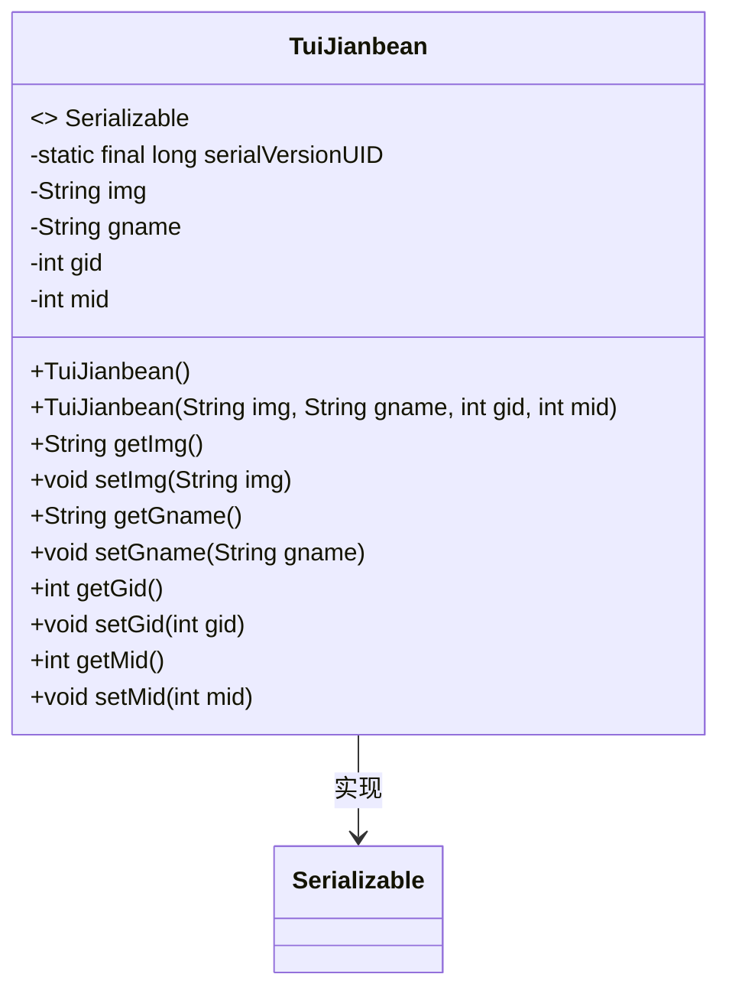
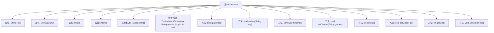

# 基础信息

|      |      |
|------|------|
| 名称 | TuiJianbean |
| 编码语言 | .java |
| 代码路径 | happycat/src/com/happycat/Bean/TuiJianbean.java |
| 包名 | com.happycat.Bean |
| 依赖项 | ['java.io.Serializable'] |
| 概述说明 | TuiJianbean是一个可序列化的Java类，包含img、gname、gid和mid属性，提供构造方法和getter/setter。 |

# 说明

这是一个名为TuiJianbean的Java类，实现了Serializable接口以便序列化。类中包含四个私有属性：img（字符串类型，存储图片信息）、gname（字符串类型，存储名称）、gid（整型，存储ID）、mid（整型，存储另一个ID）。提供了无参构造器和带参构造器，以及每个属性的getter和setter方法。serialVersionUID设为1L用于版本控制。

# 类列表 Class Summary

| 名称   | 类型  | 说明 |
|-------|------|-------------|
| TuiJianbean | class | TuiJianbean是一个可序列化的Java类，包含img、gname、gid和mid属性，提供构造方法和getter/setter。 |

## 类 TuiJianbean

|      |      |
|------|------|
| 访问范围 | public |
| 类型 | class |
| 名称 | TuiJianbean |
| 说明 | TuiJianbean是一个可序列化的Java类，包含img、gname、gid和mid属性，提供构造方法和getter/setter。 |

### UML类图

这段代码定义了一个名为TuiJianbean的Java类，该类实现了Serializable接口，表明其实例可以被序列化。类中包含四个私有字段（img、gname、gid、mid）及其对应的getter和setter方法，以及两个构造函数（一个无参构造和一个全参构造）。serialVersionUID字段用于控制序列化版本兼容性。该类主要用于封装推荐相关的数据，如图片路径、名称和ID信息。

### 内部方法调用关系图

这段代码定义了一个名为TuiJianbean的Java类，实现了Serializable接口，表明其实例可以被序列化。类中包含四个私有属性：img、gname、gid和mid，分别表示图片、名称、游戏ID和会员ID。提供了无参构造方法和带参构造方法，以及每个属性的getter和setter方法。流程图清晰地展示了类的结构，包括属性、构造方法和各种方法之间的层级关系。

### 字段列表 Field List

| 名称  | 类型  | 说明 |
|-------|-------|------|
| gid | int | 私有整型变量gid |
| serialVersionUID = 1L | long | 声明一个私有静态不可变的序列化版本ID，初始值为1L。 |
| gname | String | 私有字符串变量gname。 |
| mid | int | 私有整型变量mid |
| img | String | 私有字符串变量img，用于存储图像信息。 |

### 方法列表

| 名称  | 类型  | 说明 |
|-------|-------|------|
| getGname | String | 获取gname的方法，返回字符串类型的gname值。 |
| setImg | void | 设置图片属性的方法，将参数img赋值给当前对象的img属性。 |
| getImg | String | 方法返回字符串类型变量img的值。 |
| getGid | int | 方法getGid返回整型变量gid的值。 |
| setGid | void | 设置对象gid属性的方法，参数为整型gid。 |
| getMid | int | 方法返回整型变量mid的值。 |
| setMid | void | 设置成员变量mid的方法。 |
| setGname | void | 这是一个Java方法，用于设置类成员变量gname的值。方法接收一个字符串参数gname，并将其赋值给当前对象的同名属性。 |

