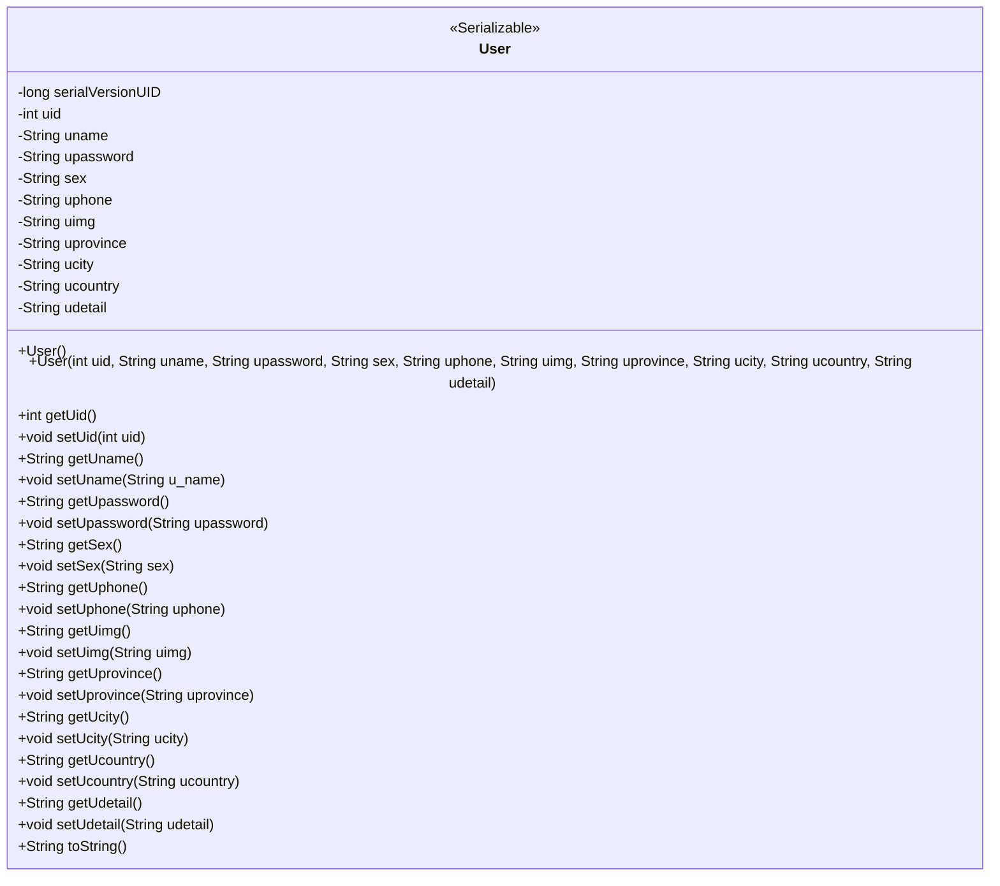

# 基础信息

|      |      |
|------|------|
| 名称 | User |
| 编码语言 | .java |
| 代码路径 | happycat/src/com/happycat/Bean/User.java |
| 包名 | com.happycat.Bean |
| 依赖项 | ['java.io.Serializable'] |
| 概述说明 | 用户类包含ID、姓名、密码、性别、电话、头像、省市区及详细地址等属性，提供构造方法和getter/setter。 |

# 说明

这是一个名为User的Java类，实现了Serializable接口以便序列化。类中包含用户的基本信息字段：uid（用户ID）、uname（用户名）、upassword（密码）、sex（性别）、uphone（电话）、uimg（头像）、uprovince（省份）、ucity（城市）、ucountry（国家）和udetail（详细地址）。提供了所有字段的getter和setter方法，以及包含所有字段的构造方法和无参构造方法。类中还重写了toString方法用于输出对象信息，并定义了serialVersionUID用于版本控制。

# 类列表 Class Summary

| 名称   | 类型  | 说明 |
|-------|------|-------------|
| User | class | Java用户类，实现Serializable接口，包含用户ID、姓名、密码、性别、电话、头像、省份、城市、国家、详情等属性及getter/setter方法，提供全参构造和空构造，重写toString方法。 |

## 类 User

|      |      |
|------|------|
| 访问范围 | public |
| 类型 | class |
| 名称 | User |
| 说明 | Java用户类，实现Serializable接口，包含用户ID、姓名、密码、性别、电话、头像、省份、城市、国家、详情等属性及getter/setter方法，提供全参构造和空构造，重写toString方法。 |

### UML类图

该代码定义了一个名为User的类，实现了Serializable接口，用于表示用户信息。类中包含用户的基本属性如uid、uname、upassword等，以及对应的getter和setter方法。此外，还提供了两个构造函数（一个无参构造和一个全参构造）和toString方法。该类主要用于用户数据的封装和序列化操作，适用于需要持久化或传输用户信息的场景。

### 内部方法调用关系图

```mermaid
graph TD
    A["类User"]
    B["实现接口: Serializable"]
    C["静态属性: long serialVersionUID = 1L"]
    D["私有属性: int uid"]
    E["私有属性: String uname"]
    F["私有属性: String upassword"]
    G["私有属性: String sex"]
    H["私有属性: String uphone"]
    I["私有属性: String uimg"]
    J["私有属性: String uprovince"]
    K["私有属性: String ucity"]
    L["私有属性: String ucountry"]
    M["私有属性: String udetail"]
    N["构造方法: User(全参数)"]
    O["构造方法: User()"]
    P["方法: toString()"]
    Q["Getter/Setter方法组"]

    A --> B
    A --> C
    A --> D
    A --> E
    A --> F
    A --> G
    A --> H
    A --> I
    A --> J
    A --> K
    A --> L
    A --> M
    A --> N
    A --> O
    A --> P
    A --> Q
```

这段代码展示了一个实现了Serializable接口的User类，包含10个私有属性字段和对应的Getter/Setter方法。类中定义了两个构造方法（全参数构造和空构造）以及重写的toString方法。流程图清晰地展示了类的组成结构，包括接口实现、静态常量、属性字段、构造方法和常规方法的分组关系。该设计是典型的数据模型类，用于存储用户信息并支持序列化操作。

### 字段列表 Field List

| 名称  | 类型  | 说明 |
|-------|-------|------|
| sex | String | 定义私有字符串变量sex，用于存储性别信息。 |
| udetail | String | 私有字符串变量udetail，用于存储详细信息。 |
| uimg | String | 私有字符串变量uimg，用于存储图像数据。 |
| uname | String | 私有字符串变量uname，用于存储用户名。 |
| upassword | String | 私有字符串类型变量，用于存储用户密码。 |
| ucity | String | 私有字符串变量ucity，用于存储城市信息。 |
| uphone | String | 私有字符串变量uphone |
| uid | int | 私有整型变量uid。 |
| uprovince | String | 私有字符串变量uprovince |
| ucountry | String | 声明私有字符串变量ucountry，用于存储国家信息。 |
| serialVersionUID = 1L | long | 声明一个私有静态不可变的序列化版本号1L，用于对象序列化兼容性。 |

### 方法列表

| 名称  | 类型  | 说明 |
|-------|-------|------|
| getSex | String | 获取性别的方法，返回字符串类型变量sex的值。 |
| setUname | void | 设置用户名的Java方法，将参数u_name赋值给成员变量uname。 |
| setUimg | void | 这是一个Java方法，用于设置对象的uimg属性值。方法接受一个字符串参数uimg，并将其赋值给当前对象的uimg字段。 |
| getUphone | String | 获取用户电话号码的方法。 |
| getUcity | String | 方法getUcity返回字符串类型变量ucity的值。 |
| getUprovince | String | 方法返回省份信息字符串。 |
| setUpassword | void | 设置用户密码的方法，将输入参数upassword赋值给类的成员变量upassword。 |
| getUname | String | 方法getUname返回字符串uname的值。 |
| setUphone | void | Java方法：设置用户电话号码，参数uphone赋值给类成员变量this.uphone。 |
| setUid | void | 设置用户ID的方法，将参数uid赋值给当前对象的uid属性。 |
| toString | String | 重写toString方法，返回包含用户ID、姓名、密码、性别、电话、图片、省、市、国家、详细地址的字符串。 |
| setSex | void | 设置性别属性的方法，参数为字符串类型sex。 |
| setUcity | void | Java方法：设置ucity字符串属性值。 |
| setUprovince | void | 设置用户省份的方法，将参数uprovince赋值给类的同名成员变量。 |
| getUpassword | String | 获取用户密码的方法，返回字符串类型的密码值。 |
| getUid | int | 方法返回整型变量uid的值。 |
| getUimg | String | 获取uimg字符串值的方法。 |
| getUcountry | String | 方法getUcountry返回字符串类型变量ucountry的值。 |
| setUcountry | void | 设置用户国家属性的方法，参数为ucountry。 |
| getUdetail | String | 这是一个Java方法，返回字符串类型的udetail变量值。 |
| setUdetail | void | Java方法：设置udetail字符串属性。 |
| getSerialversionuid | long | 获取序列化版本标识符的方法，返回静态常量serialVersionUID的值。 |

