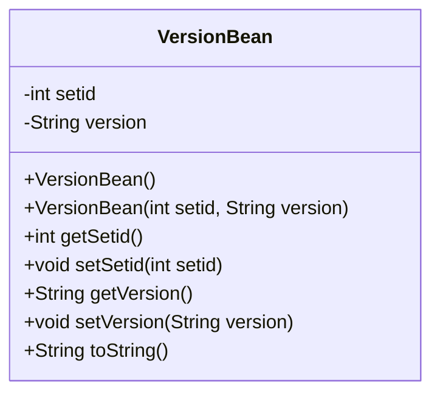
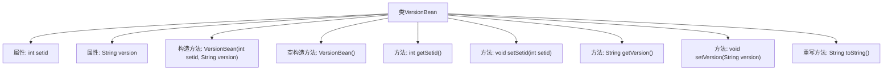

# 基础信息

|      |      |
|------|------|
| 名称 | VersionBean |
| 编码语言 | .java |
| 代码路径 | happycat/src/com/happycat/Bean/VersionBean.java |
| 包名 | com.happycat.Bean |
| 依赖项 | [] |
| 概述说明 | VersionBean类包含setid和version属性，提供getter/setter方法、带参和无参构造器，以及toString方法。 |

# 说明

VersionBean是一个Java类，用于存储版本信息。该类包含两个私有属性：整数类型的setid和字符串类型的version。提供了这两个属性的getter和setter方法。类中定义了两个构造函数，一个无参构造函数和一个接受setid和version参数的构造函数。此外，重写了toString方法，返回包含setid和version的字符串表示形式。

# 类列表 Class Summary

| 名称   | 类型  | 说明 |
|-------|------|-------------|
| VersionBean | class | VersionBean类包含setid和version属性，提供构造方法、getter/setter及toString方法。 |

## 类 VersionBean

|      |      |
|------|------|
| 访问范围 | public |
| 类型 | class |
| 名称 | VersionBean |
| 说明 | VersionBean类包含setid和version属性，提供构造方法、getter/setter及toString方法。 |

### UML类图

这段代码定义了一个名为VersionBean的Java类，它是一个典型的Java Bean，用于封装版本信息数据。该类包含两个私有字段：setid（整型）和version（字符串类型），并提供了完整的getter和setter方法。类中实现了两个构造函数（一个无参构造和一个全参构造）以及toString()方法用于对象字符串表示。这个类的主要作用是作为数据载体，用于存储和传输版本相关的信息，符合Java Bean的设计规范。

### 内部方法调用关系图

这段代码定义了一个名为VersionBean的Java类，主要用于存储和操作版本信息。该类包含两个私有属性：整型的setid和字符串型的version，分别通过getter和setter方法进行访问和修改。类提供了两个构造方法，一个带参数的构造方法用于初始化属性，另一个无参构造方法为空实现。此外，重写了toString()方法以格式化输出对象内容。流程图清晰地展示了类的结构、属性与方法之间的调用关系，体现了标准的Java Bean设计模式。

### 字段列表 Field List

| 名称  | 类型  | 说明 |
|-------|-------|------|
| version | String | 私有字符串变量version，用于存储版本信息。 |
| setid | int | 私有整型变量setid |

### 方法列表

| 名称  | 类型  | 说明 |
|-------|-------|------|
| getSetid | int | 方法返回setid的值。 |
| setSetid | void | 这是一个Java方法，用于设置类成员变量setid的值。方法接受一个整数参数setid，并将其赋值给当前对象的setid成员变量。 |
| getVersion | String | 获取当前版本号的方法，直接返回version变量值。 |
| setVersion | void | 设置版本号的方法，将输入参数赋值给内部变量version。 |
| toString | String | Java重写toString方法，返回包含setid和version的字符串。 |

