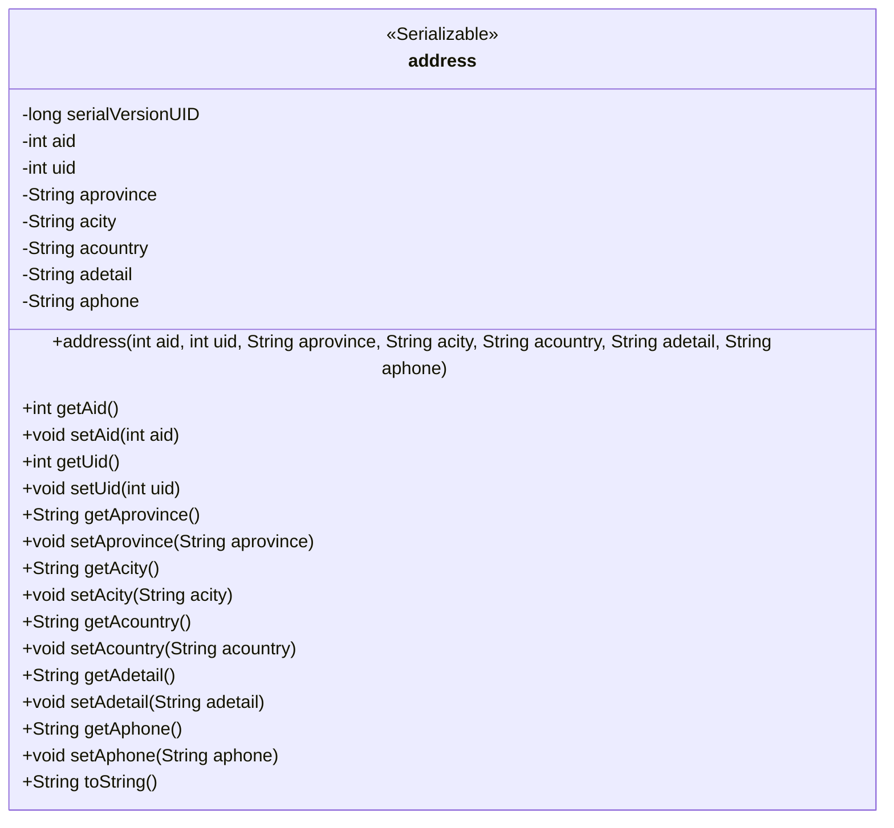

# 基础信息

|      |      |
|------|------|
| 名称 | address |
| 编码语言 | .java |
| 代码路径 | happycat/src/com/happycat/Bean/address.java |
| 包名 | com.happycat.Bean |
| 依赖项 | ['java.io.Serializable'] |
| 概述说明 | Java类address实现Serializable接口，包含地址ID、用户ID、省、市、国家、详细地址和电话字段，提供构造方法和getter/setter。 |

# 说明

这是一个名为address的Java类，实现了Serializable接口，用于表示地址信息。类中包含私有字段aid（地址ID）、uid（用户ID）、aprovince（省份）、acity（城市）、acountry（国家）、adetail（详细地址）和aphone（电话号码）。提供了带参数的构造函数以及所有字段的getter和setter方法。重写了toString方法以返回包含所有字段值的字符串表示形式。该类支持序列化，序列化版本号为1L。

# 类列表 Class Summary

| 名称   | 类型  | 说明 |
|-------|------|-------------|
| address | class | Java类address实现Serializable接口，包含地址ID、用户ID、省份、城市、国家、详细地址和电话字段，提供getter和setter方法。 |

## 类 address

|      |      |
|------|------|
| 访问范围 | public |
| 类型 | class |
| 名称 | address |
| 说明 | Java类address实现Serializable接口，包含地址ID、用户ID、省份、城市、国家、详细地址和电话字段，提供getter和setter方法。 |

### UML类图

这段代码定义了一个名为`address`的类，实现了`Serializable`接口，用于表示地址信息。类中包含7个私有字段：`aid`（地址ID）、`uid`（用户ID）、`aprovince`（省份）、`acity`（城市）、`acountry`（国家）、`adetail`（详细地址）和`aphone`（联系电话），以及对应的getter和setter方法。构造函数用于初始化所有字段，`toString()`方法返回地址信息的字符串表示。该类设计用于序列化存储地址数据，适合在网络传输或持久化存储中使用。

### 内部方法调用关系图

```mermaid
graph TD
    A["类address"]
    B["属性: int aid"]
    C["属性: int uid"]
    D["属性: String aprovince"]
    E["属性: String acity"]
    F["属性: String acountry"]
    G["属性: String adetail"]
    H["属性: String aphone"]
    I["构造方法: address(int aid, int uid, String aprovince, String acity, String acountry, String adetail, String aphone)"]
    J["方法: int getAid()"]
    K["方法: void setAid(int aid)"]
    L["方法: int getUid()"]
    M["方法: void setUid(int uid)"]
    N["方法: String getAprovince()"]
    O["方法: void setAprovince(String aprovince)"]
    P["方法: String getAcity()"]
    Q["方法: void setAcity(String acity)"]
    R["方法: String getAcountry()"]
    S["方法: void setAcountry(String acountry)"]
    T["方法: String getAdetail()"]
    U["方法: void setAdetail(String adetail)"]
    V["方法: String getAphone()"]
    W["方法: void setAphone(String aphone)"]
    X["重写方法: String toString()"]

    A --> B
    A --> C
    A --> D
    A --> E
    A --> F
    A --> G
    A --> H
    A --> I
    A --> J
    A --> K
    A --> L
    A --> M
    A --> N
    A --> O
    A --> P
    A --> Q
    A --> R
    A --> S
    A --> T
    A --> U
    A --> V
    A --> W
    A --> X
```

这段代码定义了一个名为`address`的类，实现了`Serializable`接口，用于表示地址信息。类中包含7个私有属性：`aid`和`uid`为整型，其余5个为字符串类型，分别表示省份、城市、国家、详细地址和电话号码。类提供了一个构造方法用于初始化所有属性，并为每个属性提供了getter和setter方法。此外，还重写了`toString()`方法，用于返回对象的字符串表示形式。这个类主要用于存储和操作地址相关的数据，适用于需要序列化地址信息的场景。

### 字段列表 Field List

| 名称  | 类型  | 说明 |
|-------|-------|------|
| serialVersionUID = 1L | long | 声明一个私有静态不可变的长整型序列化版本号，初始值为1。 |
| uid | int | 定义两个私有整型变量：aid和uid。 |
| aphone | String | 私有字符串变量：省份、城市、国家、详细地址、电话。 |

### 方法列表

| 名称  | 类型  | 说明 |
|-------|-------|------|
| getUid | int | 方法返回整型变量uid的值。 |
| getAdetail | String | 获取adetail字符串的方法。 |
| setAcity | void | 设置城市属性的方法，参数为字符串acity。 |
| getAprovince | String | 获取省份信息的公共方法，返回字符串类型变量aprovince。 |
| getAid | int | 方法返回整型变量aid的值。 |
| getAcountry | String | 获取国家字段的方法，返回字符串类型变量acountry。 |
| setAid | void | 设置aid属性的方法，将参数aid赋值给当前对象的aid成员变量。 |
| setAcountry | void | 设置国家属性的方法，参数为字符串acountry。 |
| getAcity | String | 获取字符串类型属性acity的值的方法。 |
| setUid | void | 设置用户ID的方法，将参数uid赋值给当前对象的uid属性。 |
| setAprovince | void | 设置省份属性的方法，参数为字符串类型。 |
| setAdetail | void | 这是一个Java方法，用于设置类成员变量adetail的值。方法接受一个字符串参数adetail，并将其赋值给当前对象的adetail属性。 |
| getAphone | String | 这是一个Java方法，返回私有字符串变量aphone的值。方法名为getAphone，无参数，返回类型为String。 |
| setAphone | void | 这是一个Java方法，用于设置类成员变量aphone的值。方法接受一个字符串参数aphone，并将其赋值给当前对象的aphone属性。 |
| toString | String | 重写toString方法，返回包含aid、uid、省、市、国家、详细地址和电话的字符串。 |

