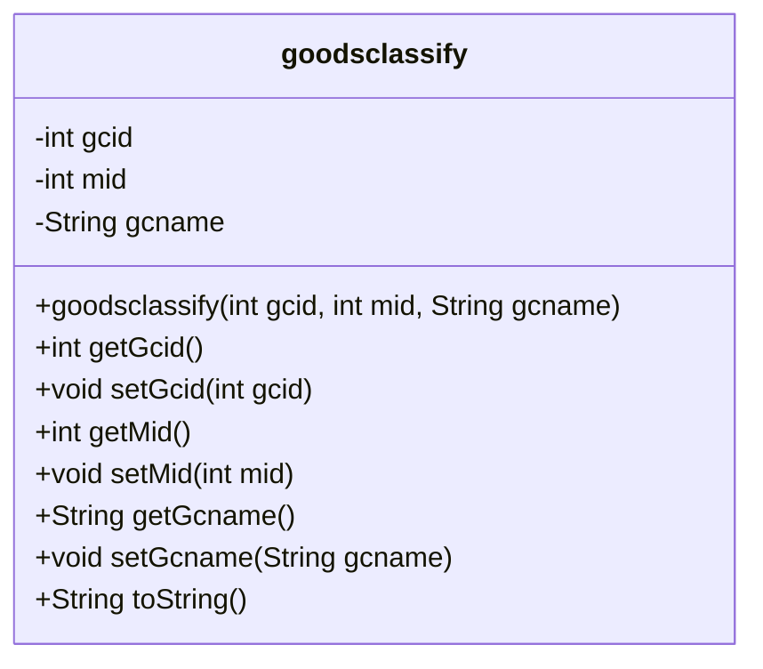
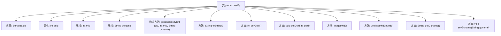

# 基础信息

|      |      |
|------|------|
| 名称 | goodsclassify |
| 编码语言 | .java |
| 代码路径 | happycat/src/com/happycat/Bean/goodsclassify.java |
| 包名 | com.happycat.Bean |
| 依赖项 | ['java.io.Serializable'] |
| 概述说明 | 商品分类类，实现序列化，包含ID、商户ID和名称字段，提供构造方法和getter/setter。 |

# 说明

这是一个名为goodsclassify的Java类，实现了Serializable接口以便序列化。该类包含三个私有字段：整型的gcid和mid，以及字符串类型的gcname。提供了这些字段的getter和setter方法，并重写了toString方法以返回包含所有字段值的字符串。类中还有一个构造方法，用于初始化所有字段。serialVersionUID设置为1L以确保序列化兼容性。

# 类列表 Class Summary

| 名称   | 类型  | 说明 |
|-------|------|-------------|
| goodsclassify | class | 商品分类类，实现序列化，包含分类ID、模块ID和分类名称属性，提供构造方法和getter/setter。 |

## 类 goodsclassify

|      |      |
|------|------|
| 访问范围 | public |
| 类型 | class |
| 名称 | goodsclassify |
| 说明 | 商品分类类，实现序列化，包含分类ID、模块ID和分类名称属性，提供构造方法和getter/setter。 |

### UML类图

该类图展示了一个名为`goodsclassify`的可序列化Java类，用于表示商品分类信息。该类包含三个私有字段：`gcid`（分类ID）、`mid`（关联ID）和`gcname`（分类名称），以及对应的getter和setter方法。构造函数接受这三个参数进行初始化，并重写了`toString()`方法以提供对象信息的字符串表示。由于实现了`Serializable`接口，该类支持序列化操作，适合网络传输或持久化存储场景。类结构简单清晰，符合JavaBean规范，便于数据封装和访问控制。

### 内部方法调用关系图

这段代码定义了一个名为goodsclassify的类，实现了Serializable接口，包含三个私有属性：gcid、mid和gcname。类中提供了构造方法用于初始化这三个属性，以及对应的getter和setter方法用于访问和修改属性值。toString方法被重写以返回包含所有属性值的字符串表示。流程图清晰地展示了类的结构、属性、构造方法以及各个方法之间的层级关系。

### 字段列表 Field List

| 名称  | 类型  | 说明 |
|-------|-------|------|
| gcid | int | 私有整型变量gcid |
| serialVersionUID = 1L | long | 声明一个私有静态常量serialVersionUID，值为1L，用于序列化版本控制。 |
| gcname | String | 声明字符串变量gcname。 |
| mid | int | 私有整型变量mid |

### 方法列表

| 名称  | 类型  | 说明 |
|-------|-------|------|
| setGcid | void | Java方法：设置gcid属性值。参数为整型gcid，直接赋值给类的gcid成员变量。 |
| getGcid | int | 方法返回整型变量gcid的值。 |
| toString | String | 重写toString方法，返回包含gcid、mid、gcname的字符串。 |
| setMid | void | 设置成员变量mid的方法。 |
| getMid | int | 方法返回整型变量mid的值。 |
| getGcname | String | 方法返回字符串类型变量gcname的值。 |
| setGcname | void | Java方法：设置字符串类型成员变量gcname的值。 |

