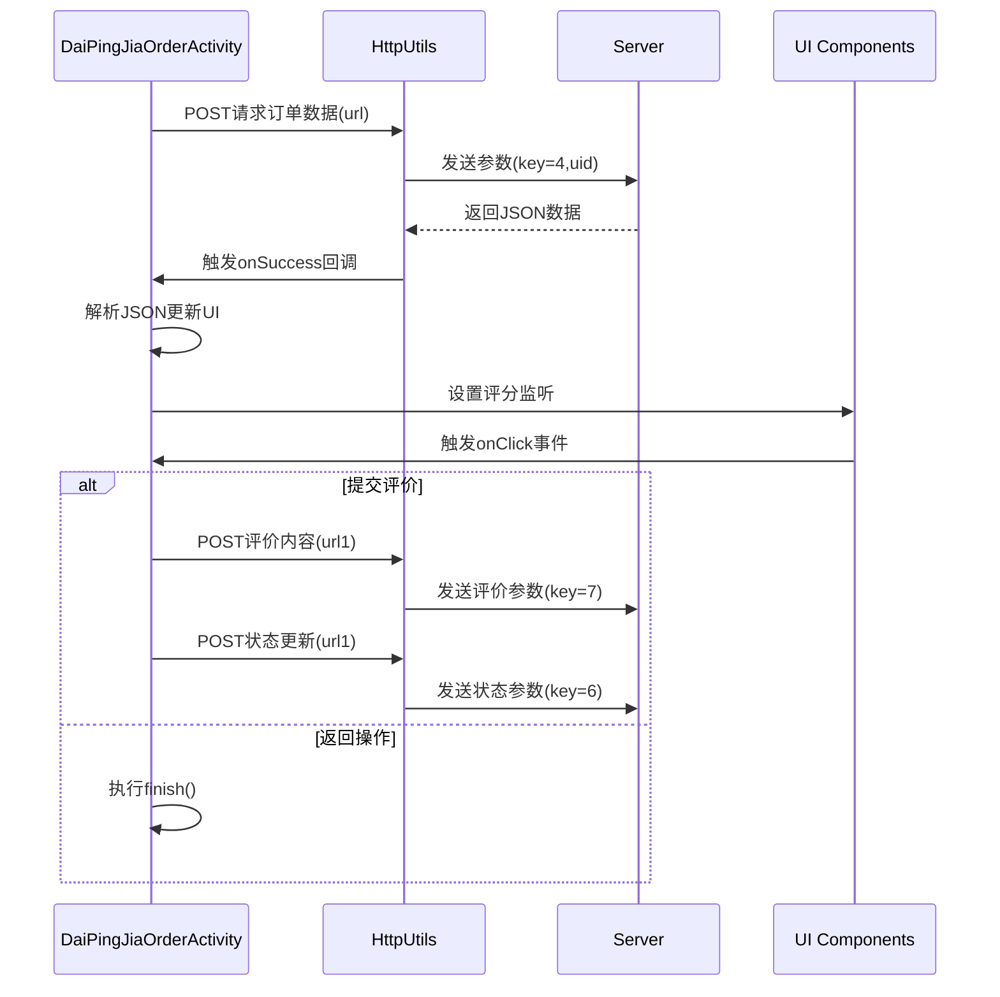

# 基础信息

|      |      |
|------|------|
| 名称 | DaiPingJiaOrderActivity |
| 编码语言 | .java |
| 代码路径 | happycat/src/com/happycat/DaiPingJiaOrderActivity.java |
| 包名 | com.happycat |
| 依赖项 | ['java.io.UnsupportedEncodingException', 'java.lang.reflect.Type', 'java.net.URLEncoder', 'java.util.LinkedList', 'java.util.List', 'com.example.happucat.R', 'com.example.happucat.R.layout', 'com.example.happucat.R.menu', 'com.google.gson.Gson', 'com.google.gson.reflect.TypeToken', 'com.happycat.Bean.MerchatXqBean', 'com.happycat.Bean.MyOrderBean', 'com.happycat.Bean.SouSuoBean', 'com.happycat.global.GlobalContacts', 'com.happycat.util.MyApplication', 'com.lidroid.xutils.HttpUtils', 'com.lidroid.xutils.exception.HttpException', 'com.lidroid.xutils.http.RequestParams', 'com.lidroid.xutils.http.ResponseInfo', 'com.lidroid.xutils.http.callback.RequestCallBack', 'com.lidroid.xutils.http.client.HttpRequest.HttpMethod', 'android.os.Bundle', 'android.app.ActionBar', 'android.app.Activity', 'android.content.Intent', 'android.util.Log', 'android.view.Menu', 'android.view.View', 'android.view.View.OnClickListener', 'android.widget.Button', 'android.widget.EditText', 'android.widget.ImageButton', 'android.widget.ImageView', 'android.widget.RatingBar', 'android.widget.RatingBar.OnRatingBarChangeListener', 'android.widget.TextView', 'android.widget.Toast'] |
| 概述说明 | DaiPingJiaOrderActivity是一个订单评价界面，包含订单信息展示、星级评分和评语提交功能。通过HTTP请求获取订单数据，用户可输入评语并提交，提交后更新订单状态。支持返回操作。 |

# 说明

DaiPingJiaOrderActivity是一个Android订单评价界面，继承Activity并实现点击监听。主要功能包括初始化视图组件、通过HTTP请求获取订单数据并展示商品图片、名称、价格等信息。用户可通过RatingBar评分和EditText输入评语，点击提交按钮将评价内容通过POST请求发送至服务器，同时更新订单状态。界面包含返回按钮，支持返回订单页面或直接关闭当前界面。网络请求使用HttpUtils处理，数据解析采用Gson框架。

# 类列表 Class Summary

| 名称   | 类型  | 说明 |
|-------|------|-------------|
| DaiPingJiaOrderActivity | class | Android订单评价页面，包含订单详情展示、星级评分和评语提交功能，通过HTTP请求与服务器交互，支持返回操作。 |


## 类 DaiPingJiaOrderActivity

|      |      |
|------|------|
| 访问范围 | public |
| 类型 | class |
| 名称 | DaiPingJiaOrderActivity |
| 说明 | Android订单评价页面，包含订单详情展示、星级评分和评语提交功能，通过HTTP请求与服务器交互，支持返回操作。 |


### UML类图

```mermaid
classDiagram
    class DaiPingJiaOrderActivity {
        <<Interface>>
        +OnClickListener
        -ImageView gimg
        -HttpUtils httpUtils
        -Intent intent
        -String url
        -String url1
        -String uid
        -TextView mname
        -TextView gname
        -TextView istatus
        -TextView sumprice
        -TextView number
        -TextView iphone
        -TextView identifier
        -List~MyOrderBean~ mlist
        -EditText editText
        -Button button
        -ImageButton imageButton
        -String cimg
        -RatingBar ratingBar
        +onCreate(Bundle savedInstanceState) void
        -initData() void
        -initViews() void
        +onClick(View arg0) void
    }

    class MyApplication {
        <<static>>
        +String SP_user_id
        +String getIp() String
        +BitmapUtils bitmapUtils
    }

    class MyOrderBean {
        +String gimg
        +String mname
        +String gname
        +String istatus
        +String price
        +String num
        +String iPhone
        +String identifier
        +String mid
    }

    class HttpUtils {
        +send(HttpMethod method, String url, RequestParams params, RequestCallBack~String~ callback) void
    }

    class RequestParams {
        +addBodyParameter(String key, String value) void
    }

    class RequestCallBack~R~ {
        <<Interface>>
        +onSuccess(ResponseInfo~R~ responseInfo) void
        +onFailure(HttpException error, String msg) void
    }

    class Gson {
        +fromJson(String json, Type typeOfT) Object
    }

    class TypeToken~T~ {
        +getType() Type
    }

    DaiPingJiaOrderActivity --> MyApplication : 使用静态成员
    DaiPingJiaOrderActivity --> HttpUtils : 发送HTTP请求
    DaiPingJiaOrderActivity --> MyOrderBean : 存储订单数据
    DaiPingJiaOrderActivity --> RequestParams : 构造请求参数
    DaiPingJiaOrderActivity --> RequestCallBack~String~ : 处理响应
    DaiPingJiaOrderActivity --> Gson : JSON解析
    DaiPingJiaOrderActivity --> TypeToken~LinkedList~MyOrderBean~~ : 获取类型信息
    HttpUtils --> RequestCallBack~String~ : 回调处理
    Gson --> TypeToken~LinkedList~MyOrderBean~~ : 获取泛型类型
```

该代码实现了一个Android订单评价界面，主要功能包括：1) 通过HTTP请求获取订单数据并展示；2) 提供星级评分和评语输入功能；3) 提交评价后更新订单状态。类图中展示了核心组件及其关系，包括Activity、网络请求工具、数据模型和JSON解析工具等，体现了MVC架构模式。特别注意处理了网络请求回调、数据解析和UI更新的完整流程。


### 内部方法调用关系图

```mermaid
graph TD
    A["DaiPingJiaOrderActivity"]
    B["属性: ImageView gimg"]
    C["属性: HttpUtils httpUtils"]
    D["属性: String url/url1/uid"]
    E["属性: TextView/EditText组件群"]
    F["属性: RatingBar ratingBar"]
    G["onCreate: 初始化Activity"]
    H["initViews: 初始化UI组件"]
    I["initData: 加载订单数据"]
    J["onClick: 处理按钮点击事件"]
    K["HTTP请求: 获取订单数据"]
    L["HTTP请求: 提交评价"]
    M["HTTP请求: 更新订单状态"]

    A --> B
    A --> C
    A --> D
    A --> E
    A --> F
    A --> G
    G --> H
    G --> I
    H -->|"设置监听器"| J
    I --> K
    K -->|"解析JSON"| E
    J -->|"R.id.tijiao"| L
    L --> M
    J -->|"R.id.sjreturn"| "finish/跳转"
```



该流程图展示了订单评价页面的核心逻辑：1) 初始化时通过HTTP请求加载订单数据并渲染UI；2) 通过评分组件收集用户输入；3) 根据用户操作分支出提交评价（含双重HTTP请求）或返回功能。时序图详细描述了网络请求交互过程，包括订单数据获取、评价提交和状态更新的完整链式调用，以及UI事件与网络请求的触发关系。

### 字段列表 Field List

| 名称  | 类型  | 说明 |
|-------|-------|------|
| gimg | ImageView | 定义图像视图变量gimg。 |
| intent | Intent | 声明一个Intent对象 |
| editText | EditText | 定义了一个EditText类型的变量editText。 |
| identifier | TextView | 定义七个TextView变量：mname名称、gname组名、istatus状态、sumprice总价、number数量、iphone电话、identifier标识符。 |
| url = "http://" + MyApplication.getIp() + ":8080/happycat/myServlet" | String | 代码拼接URL字符串，使用应用IP地址和端口8080，路径为happycat/myServlet。 |
| httpUtils | HttpUtils | 声明了一个HttpUtils类型的变量httpUtils。 |
| cimg | String | 声明字符串变量cimg。 |
| button | Button | 声明一个名为button的按钮对象。 |
| mlist | List<MyOrderBean> | 变量mlist是MyOrderBean类型的列表。 |
| url1 = "http://" + MyApplication.getIp() + ":8080/happycat/MG" | String | 代码拼接URL字符串，使用应用IP地址和固定路径/happycat/MG，端口8080。 |
| ratingBar | RatingBar | RatingBar是Android中的评分控件，用于显示和选择星级评分。 |
| uid = MyApplication.SP_user_id + "" | String | 将用户ID转换为字符串并赋值给变量uid。 |
| imageButton | ImageButton | 声明一个ImageButton类型的变量imageButton。 |

### 方法列表

| 名称  | 类型  | 说明 |
|-------|-------|------|
| onCreate | void | Android Activity的onCreate方法中隐藏标题栏，设置布局并初始化视图和数据。 |
| initData | void | 方法initData初始化数据，通过POST请求获取订单信息，解析JSON后更新UI显示订单详情，包括图片、名称、商品、状态、价格、数量、电话和标识符。失败时记录日志。 |
| initViews | void | 初始化视图组件并设置点击监听，根据评分设置对应图片。 |
| onClick | void | 点击事件处理：根据按钮ID执行不同操作。提交按钮验证评语长度，通过后使用HttpUtils发送POST请求提交评语和订单状态更新，失败显示错误。返回按钮检查输入后跳转或关闭页面。 |


