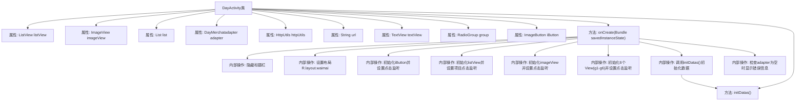

# 基础信息

|      |      |
|------|------|
| 名称 | DayActivity |
| 编码语言 | .java |
| 代码路径 | happycat/src/com/happycat/DayActivity.java |
| 包名 | com.happycat |
| 依赖项 | ['java.lang.reflect.Type', 'java.util.ArrayList', 'java.util.List', 'com.example.happucat.R', 'com.google.gson.Gson', 'com.google.gson.reflect.TypeToken', 'com.happycat.Bean.DayMerchatBean', 'com.happycat.adapter.DayMerchatadapter', 'com.happycat.util.MyApplication', 'com.lidroid.xutils.HttpUtils', 'com.lidroid.xutils.exception.HttpException', 'com.lidroid.xutils.http.ResponseInfo', 'com.lidroid.xutils.http.callback.RequestCallBack', 'com.lidroid.xutils.http.client.HttpRequest.HttpMethod', 'android.os.Bundle', 'android.app.ActionBar', 'android.app.Activity', 'android.content.Intent', 'android.util.Log', 'android.view.View', 'android.view.View.OnClickListener', 'android.widget.AdapterView', 'android.widget.BaseAdapter', 'android.widget.ImageButton', 'android.widget.ImageView', 'android.widget.ListAdapter', 'android.widget.ListView', 'android.widget.RadioGroup', 'android.widget.TextView', 'android.widget.AdapterView.OnItemClickListener'] |
| 概述说明 | DayActivity是一个Android活动类，包含列表视图、图片按钮等控件，处理用户点击事件并通过HTTP请求获取数据，使用Gson解析JSON并更新列表适配器。 |

# 说明

DayActivity是一个Android活动类，用于显示外卖商家列表。界面包含列表视图、图片按钮和通知图标。列表数据通过HTTP请求从服务器获取，使用Gson解析JSON数据并填充到适配器中。点击列表项会跳转到商家详情页，传递商家ID、名称、配送费等信息。底部有六个分类按钮，点击不同按钮会跳转到对应分类的商家列表页。初始化时隐藏标题栏，若适配器为空则显示错误提示。图片按钮点击关闭当前页面，通知图标点击跳转到其他活动。

# 类列表 Class Summary

| 名称   | 类型  | 说明 |
|-------|------|-------------|
| DayActivity | class | DayActivity是一个Android活动类，包含列表视图、图片视图等控件，处理用户点击事件并跳转至不同活动，通过HTTP请求获取数据并显示。 |


## 类 DayActivity

|      |      |
|------|------|
| 访问范围 | public |
| 类型 | class |
| 名称 | DayActivity |
| 说明 | DayActivity是一个Android活动类，包含列表视图、图片视图等控件，处理用户点击事件并跳转至不同活动，通过HTTP请求获取数据并显示。 |


### UML类图

```mermaid
classDiagram
    class Activity {
        <<Android>>
    }
    
    class DayActivity {
        -ListView listView
        -ImageView imageView
        -List~DayMerchatBean~ list
        -DayMerchatadapter adapter
        -HttpUtils httpUtils
        -String url
        -TextView textView
        -RadioGroup group
        -ImageButton iButton
        +onCreate(Bundle savedInstanceState) void
        -initDatas() void
    }
    
    class DayMerchatadapter {
        <<Adapter>>
        +notifyDataSetChanged() void
    }
    
    class DayMerchatBean {
        <<DataModel>>
        +getMid() int
        +getMname() String
        +getTip() String
        +getLongtime() String
        +getMprice() double
        +getMtime() String
        +getMimg() String
    }
    
    class HttpUtils {
        +send(HttpMethod method, String url, RequestCallBack~String~ callback) void
    }
    
    class RequestCallBack~T~ {
        <<Interface>>
        +onFailure(HttpException e, String msg) void
        +onSuccess(ResponseInfo~T~ info) void
    }
    
    class Gson {
        +fromJson(String json, Type type) Object
    }
    
    class TypeToken~T~ {
        <<GenericType>>
        +getType() Type
    }
    
    Activity <|-- DayActivity
    RequestCallBack~String~ <|.. DayActivity
    DayActivity --> DayMerchatadapter : 使用
    DayActivity --> DayMerchatBean : 包含数据
    DayActivity --> HttpUtils : 使用
    HttpUtils --> RequestCallBack~String~ : 回调
    DayActivity --> Gson : 使用
    Gson --> TypeToken~List~DayMerchatBean~~ : 使用
```

这段类图描述了DayActivity的结构及其相关组件。DayActivity继承自Android的Activity类，包含多个UI组件（如ListView、ImageView等）和业务逻辑组件（如HttpUtils、Gson）。它通过DayMerchatadapter显示DayMerchatBean数据列表，使用HttpUtils进行网络请求，并通过Gson解析JSON数据。RequestCallBack接口处理网络请求的回调结果，TypeToken用于获取泛型类型信息。整体展现了Android活动中数据加载、显示和事件处理的典型架构。


### 内部方法调用关系图



这段代码是Android平台上的DayActivity类实现，主要功能是显示一个外卖相关的界面。代码流程包括：初始化界面元素（隐藏标题栏、设置布局）、设置多个按钮的点击事件监听器、初始化列表视图及其点击事件、通过网络请求获取数据并更新UI。特别值得注意的是，代码中处理了6种不同的分类点击事件，每种都会构造不同的URL参数并跳转到WaiMAIMainActivity，同时还有列表项点击跳转到MerchatDataActivity的详细逻辑。当数据加载失败时，会显示错误提示信息。

### 字段列表 Field List

| 名称  | 类型  | 说明 |
|-------|-------|------|
| iButton | ImageButton | 图像按钮控件iButton |
| list = new ArrayList<DayMerchatBean>() | List<DayMerchatBean> | 创建名为list的ArrayList，存储DayMerchatBean类型对象。 |
| listView | ListView | 声明一个ListView类型的变量listView。 |
| textView | TextView | 定义TextView控件变量textView。 |
| url | String | 私有字符串变量url，用于存储网址。 |
| httpUtils | HttpUtils | HttpUtils工具类实例声明。 |
| imageView | ImageView | 声明一个ImageView类型的变量imageView。 |
| adapter | DayMerchatadapter | DayMerchatadapter适配器实例声明。 |
| group | RadioGroup | 定义了一个RadioGroup类型的变量group。 |

### 方法列表

| 名称  | 类型  | 说明 |
|-------|-------|------|
| onCreate | void | 代码实现外卖应用界面功能，包括隐藏标题栏、按钮点击事件、列表项点击跳转及数据传递，以及多个分类按钮的点击跳转逻辑。 |
| initDatas | void | 初始化数据方法：创建适配器并设置列表视图，通过HTTP GET请求从服务器获取数据，使用Gson解析JSON结果并更新适配器。 |


