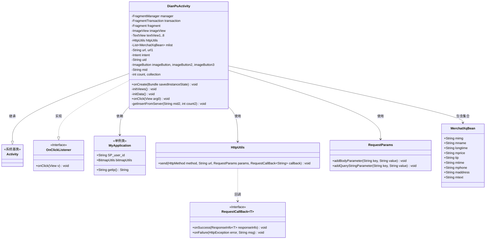
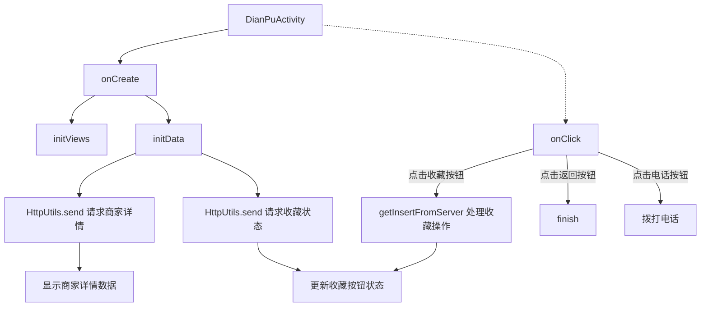

# 基础信息

|      |      |
|------|------|
| 名称 | DianPuActivity |
| 编码语言 | .java |
| 代码路径 | happycat/src/com/happycat/DianPuActivity.java |
| 包名 | com.happycat |
| 依赖项 | ['java.lang.reflect.Type', 'java.util.ArrayList', 'java.util.LinkedList', 'java.util.List', 'com.example.happucat.R', 'com.google.gson.Gson', 'com.google.gson.reflect.TypeToken', 'com.happycat.Bean.MerchatXqBean', 'com.happycat.global.GlobalContacts', 'com.happycat.util.MyApplication', 'com.lidroid.xutils.HttpUtils', 'com.lidroid.xutils.exception.HttpException', 'com.lidroid.xutils.http.RequestParams', 'com.lidroid.xutils.http.ResponseInfo', 'com.lidroid.xutils.http.callback.RequestCallBack', 'com.lidroid.xutils.http.client.HttpRequest.HttpMethod', 'android.R.integer', 'android.R.string', 'android.net.Uri', 'android.os.Bundle', 'android.app.ActionBar', 'android.app.Activity', 'android.content.Intent', 'android.support.v4.app.Fragment', 'android.support.v4.app.FragmentManager', 'android.support.v4.app.FragmentPagerAdapter', 'android.support.v4.app.FragmentTransaction', 'android.support.v4.view.PagerAdapter', 'android.support.v4.view.ViewPager', 'android.util.Log', 'android.view.Menu', 'android.view.View', 'android.view.View.OnClickListener', 'android.widget.ImageButton', 'android.widget.ImageView', 'android.widget.LinearLayout', 'android.widget.RadioGroup', 'android.widget.TextView', 'android.widget.Toast'] |
| 概述说明 | DianPuActivity是一个店铺详情页，包含商家信息展示、收藏功能和电话拨打功能。通过HTTP请求获取商家数据并显示，支持收藏状态切换和电话呼叫。 |

# 说明

DianPuActivity是一个Android活动类，用于展示商家详情页面。它包含多个TextView和ImageView用于显示商家信息，如名称、营业时间、价格、电话、地址等。通过HttpUtils发送POST请求获取商家数据，使用Gson解析JSON响应并更新UI。还实现了收藏功能，通过判断count值切换收藏状态，并发送相应请求到服务器。点击事件处理包括返回首页、收藏/取消收藏商家以及拨打电话功能。活动初始化时隐藏ActionBar，并设置布局为dianpu.xml。

# 类列表 Class Summary

| 名称   | 类型  | 说明 |
|-------|------|-------------|
| DianPuActivity | class | DianPuActivity是一个Android店铺详情页，包含商家信息展示、收藏功能和电话拨打。通过HTTP请求获取商家数据并显示，支持收藏/取消收藏操作，点击按钮可拨打电话。 |

## 类 DianPuActivity

|      |      |
|------|------|
| 访问范围 | public |
| 类型 | class |
| 名称 | DianPuActivity |
| 说明 | DianPuActivity是一个Android店铺详情页，包含商家信息展示、收藏功能和电话拨打。通过HTTP请求获取商家数据并显示，支持收藏/取消收藏操作，点击按钮可拨打电话。 |

### UML类图

该代码实现了一个店铺详情页面(DianPuActivity)，主要功能包括：1) 通过HTTP请求获取店铺详情数据并展示；2) 处理用户收藏/取消收藏操作；3) 提供电话拨打功能。类图展示了核心类关系，包括与Android系统组件的继承关系、网络请求相关类的依赖关系，以及数据模型MerchatXqBean的关联关系。特别注意处理了网络回调、用户交互和状态管理等边界情况。

### 内部方法调用关系图

这段代码是Android平台上的店铺详情页面(DianPuActivity)实现，主要功能包括：1)初始化界面元素；2)从服务器获取商家详情数据并显示；3)处理用户收藏操作；4)提供返回和电话拨打功能。流程从onCreate开始，依次初始化视图和数据，通过HTTP请求获取商家信息和收藏状态，最后处理用户交互事件。特别注意收藏状态的双向切换逻辑和网络请求的异步回调处理。

### 字段列表 Field List

| 名称  | 类型  | 说明 |
|-------|-------|------|
| textView8 | TextView | 声明了8个TextView变量：textView1至textView8。 |
| manager | FragmentManager | Fragment管理器实例。 |
| collection | int | 声明两个私有整型变量：count和collection。 |
| transaction | FragmentTransaction | Fragment事务操作实例。 |
| intent | Intent | 声明一个Intent对象 |
| httpUtils | HttpUtils | HttpUtils工具类实例声明。 |
| mlist | List<MerchatXqBean> | 定义了一个名为mlist的列表，存储MerchatXqBean类型对象。 |
| uid=MyApplication.SP_user_id+"" | String | 代码片段将应用全局变量SP_user_id转为字符串并赋值给uid。 |
| url1 | String | 声明两个私有字符串变量url和url1。 |
| mid | String | 字符串变量mid声明 |
| imageButton3 | ImageButton | 定义了三个ImageButton控件：imageButton、imageButton2、imageButton3。 |
| fragment | Fragment | Fragment对象实例声明。 |
| imageView | ImageView | 声明一个ImageView类型的变量imageView。 |

### 方法列表

| 名称  | 类型  | 说明 |
|-------|-------|------|
| onCreate | void | Android Activity的onCreate方法，隐藏ActionBar并初始化布局和数据。 |
| initData | void | 方法initData使用XUtils框架从服务器获取商家详情和收藏状态。通过POST请求获取商家数据并解析JSON，更新UI显示商家信息。同时检查收藏状态，根据结果设置收藏按钮图标。失败时记录错误日志。 |
| initViews | void | 初始化视图组件：1个ImageView、8个TextView、3个ImageButton，并设置点击监听。 |
| onClick | void | 点击事件处理：返回首页结束当前页面；收藏按钮切换状态并提交服务器；拨号按钮启动电话应用拨打指定号码。 |
| getInsertFromServer | void | 方法getInsertFromServer向服务器发送POST请求，参数包括mid、uid和count。根据返回结果更新UI：成功收藏显示星标和提示，取消收藏显示空星标和提示，未登录提示登录。失败时不处理。 |

