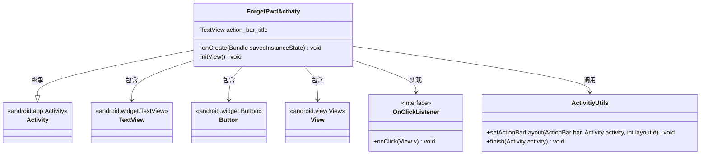
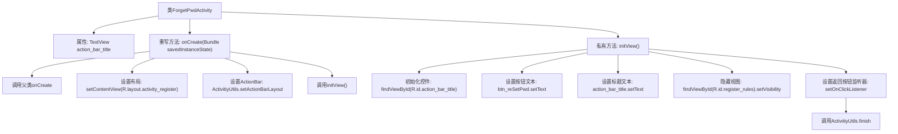

# 基础信息

|      |      |
|------|------|
| 名称 | ForgetPwdActivity |
| 编码语言 | .java |
| 代码路径 | happycat/src/com/happycat/ForgetPwdActivity.java |
| 包名 | com.happycat |
| 依赖项 | ['com.example.happucat.R', 'com.happycat.util.ActivitiyUtils', 'android.app.Activity', 'android.os.Bundle', 'android.view.View', 'android.view.View.OnClickListener', 'android.widget.Button', 'android.widget.TextView'] |
| 概述说明 | ForgetPwdActivity是Android密码找回页面，初始化视图并设置标题、按钮文本及返回点击事件。 |

# 说明

ForgetPwdActivity是一个继承自Activity的类，用于实现找回密码功能。在onCreate方法中设置了activity_register布局和title_bar_login标题栏布局，并调用initView初始化视图。initView方法中设置了标题文本为"找回密码"，将注册按钮文本改为"重设密码"，隐藏了注册规则视图，并为返回按钮设置了点击事件，点击时调用ActivitiyUtils.finish方法关闭当前Activity。

# 类列表 Class Summary

| 名称   | 类型  | 说明 |
|-------|------|-------------|
| ForgetPwdActivity | class | ForgetPwdActivity是Android密码找回页面，初始化视图设置标题和按钮，隐藏规则条款，提供返回按钮关闭页面。 |

## 类 ForgetPwdActivity

|      |      |
|------|------|
| 访问范围 | public |
| 类型 | class |
| 名称 | ForgetPwdActivity |
| 说明 | ForgetPwdActivity是Android密码找回页面，初始化视图设置标题和按钮，隐藏规则条款，提供返回按钮关闭页面。 |

### UML类图

这段代码展示了一个Android的ForgetPwdActivity类，主要用于实现找回密码功能界面。该类继承自Activity基类，包含TextView、Button等UI组件，并通过ActivitiyUtils工具类进行界面布局设置和活动关闭操作。在initView()方法中初始化视图元素并设置点击监听器，其中按钮文本被修改为"重设密码"，标题设置为"找回密码"，同时隐藏了注册规则视图。整个类结构清晰地体现了Android活动组件的典型设计模式。

### 内部方法调用关系图

这段代码展示了一个Android的`ForgetPwdActivity`类，主要用于实现找回密码功能。流程图清晰地描述了从Activity创建到界面初始化的完整过程：首先调用父类onCreate方法，然后设置布局和ActionBar样式，接着初始化视图控件包括设置按钮文本、标题文本和隐藏特定视图，最后为返回按钮设置点击监听器以关闭当前Activity。整个过程体现了Android Activity的典型生命周期和UI操作逻辑。

### 字段列表 Field List

| 名称  | 类型  | 说明 |
|-------|-------|------|
| action_bar_title | TextView | 私有文本视图控件，用于显示标题。 |

### 方法列表

| 名称  | 类型  | 说明 |
|-------|-------|------|
| onCreate | void | Android Activity的onCreate方法，初始化视图和布局，设置标题栏。 |
| initView | void | 初始化界面：设置标题为“找回密码”，按钮文本为“重设密码”，隐藏注册规则视图，并添加返回按钮点击事件以关闭当前活动。 |

