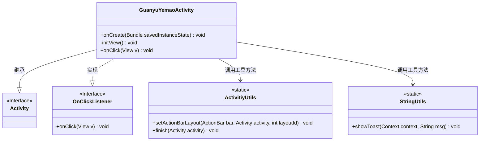
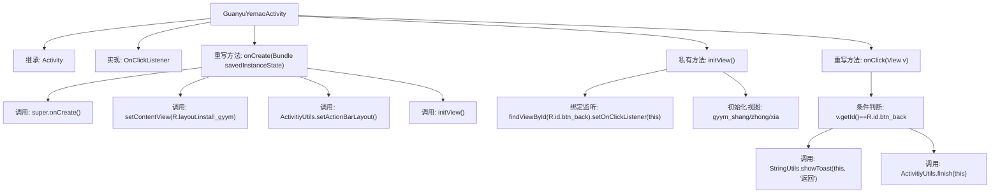

# 基础信息

|      |      |
|------|------|
| 名称 | GuanyuYemaoActivity |
| 编码语言 | .java |
| 代码路径 | happycat/src/com/happycat/GuanyuYemaoActivity.java |
| 包名 | com.happycat |
| 依赖项 | ['com.example.happucat.R', 'com.happycat.util.ActivitiyUtils', 'com.happycat.util.StringUtils', 'android.app.Activity', 'android.os.Bundle', 'android.view.View', 'android.view.View.OnClickListener'] |
| 概述说明 | Android活动类GuanyuYemaoActivity实现点击监听，初始化视图并设置返回按钮功能。 |

# 说明

这段代码描述了一个名为GuanyuYemaoActivity的安卓Activity类，主要用于实现"关于夜猫"界面功能。该类继承Activity并实现了点击监听接口。在onCreate方法中设置了布局文件install_gyym.xml，并通过ActivitiyUtils设置了自定义标题栏。initView方法初始化了返回按钮和三个界面元素(上、中、下)的视图。点击事件处理中，当点击返回按钮时会显示"返回"提示并关闭当前Activity。整个类主要完成界面初始化和基本交互功能。

# 类列表 Class Summary

| 名称   | 类型  | 说明 |
|-------|------|-------------|
| GuanyuYemaoActivity | class | 这是一个Android活动类GuanyuYemaoActivity，实现点击监听。初始化时设置布局和标题栏，绑定返回按钮点击事件，点击时显示"返回"并关闭活动。 |

## 类 GuanyuYemaoActivity

|      |      |
|------|------|
| 访问范围 | public |
| 类型 | class |
| 名称 | GuanyuYemaoActivity |
| 说明 | 这是一个Android活动类GuanyuYemaoActivity，实现点击监听。初始化时设置布局和标题栏，绑定返回按钮点击事件，点击时显示"返回"并关闭活动。 |

### UML类图

这段代码展示了一个Android活动类`GuanyuYemaoActivity`，它继承自`Activity`基类并实现了`OnClickListener`接口。类中主要包含界面初始化逻辑和点击事件处理，通过工具类`ActivitiyUtils`和`StringUtils`完成动作栏设置和Toast提示功能。该活动包含返回按钮和三个视图元素的初始化，点击返回按钮时会显示提示并关闭当前活动。类图清晰地展示了继承关系、接口实现以及工具类的依赖关系。

### 内部方法调用关系图

该流程图描述了GuanyuYemaoActivity的生命周期和交互逻辑。Activity启动时依次执行onCreate初始化布局和视图，其中initView方法绑定返回按钮的点击监听器并初始化三个界面元素。当用户点击返回按钮时触发onClick事件，显示提示信息并关闭当前Activity。整个流程清晰展示了从界面初始化到用户交互的完整处理链条。

### 字段列表 Field List

| 名称  | 类型  | 说明 |
|-------|-------|------|

### 方法列表

| 名称  | 类型  | 说明 |
|-------|-------|------|
| onClick | void | 点击返回按钮时显示"返回"提示并关闭当前活动。 |
| onCreate | void | Android Activity的onCreate方法：调用父类方法、设置布局文件、自定义标题栏、初始化视图。 |
| initView | void | 初始化视图方法，设置返回按钮点击监听并绑定三个视图组件。 |

