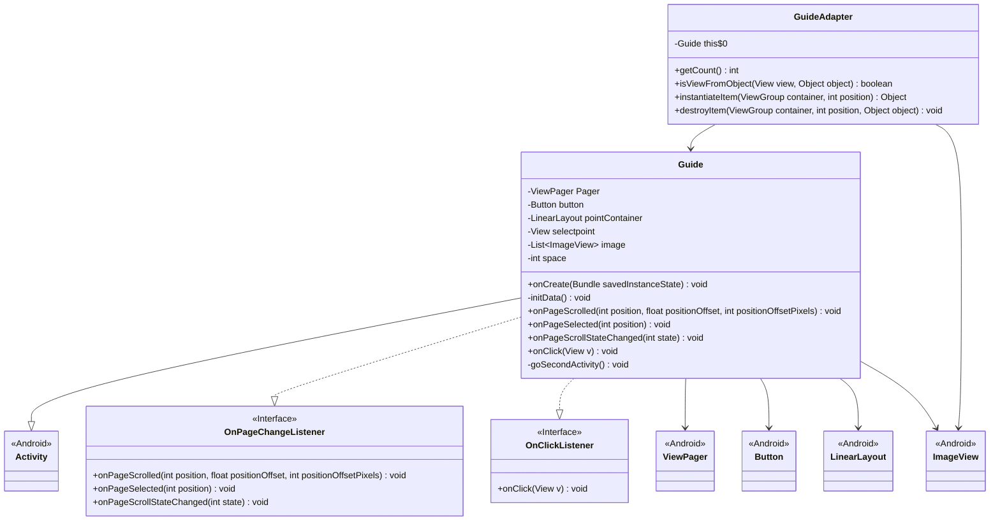
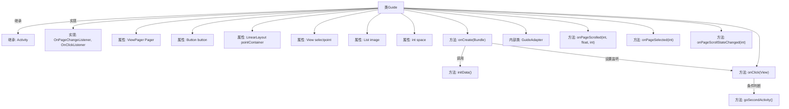

# 基础信息

|      |      |
|------|------|
| 名称 | Guide |
| 编码语言 | .java |
| 代码路径 | happycat/src/com/happycat/Guide.java |
| 包名 | com.happycat |
| 依赖项 | ['java.util.ArrayList', 'java.util.List', 'javax.security.auth.PrivateCredentialPermission', 'com.example.happucat.R', 'com.happycat.util.CacheUtils', 'android.app.Activity', 'android.content.Intent', 'android.os.Bundle', 'android.support.v4.view.PagerAdapter', 'android.support.v4.view.ViewPager', 'android.support.v4.view.ViewPager.OnPageChangeListener', 'android.view.View', 'android.view.View.OnClickListener', 'android.view.ViewGroup', 'android.view.ViewTreeObserver.OnGlobalLayoutListener', 'android.view.Window', 'android.widget.Button', 'android.widget.ImageView', 'android.widget.ImageView.ScaleType', 'android.widget.LinearLayout', 'android.widget.RelativeLayout', 'android.widget.RelativeLayout.LayoutParams'] |
| 概述说明 | Android引导页实现，包含ViewPager滑动、圆点指示器、按钮跳转功能，适配器管理图片资源，监听页面切换更新UI状态。 |

# 说明

该代码描述了一个Android引导页Activity，包含ViewPager展示多张引导图，底部有点状指示器和启动按钮。主要功能包括：初始化时加载三张图片到ViewPager，设置圆点指示器布局；监听页面滑动事件实时更新选中圆点位置；在最后一页显示启动按钮，点击后跳转至主界面并标记非首次启动。通过自定义PagerAdapter管理图片视图，计算圆点间距实现平滑滑动效果，整体实现了标准的应用引导流程功能。

# 类列表 Class Summary

| 名称   | 类型  | 说明 |
|-------|------|-------------|
| Guide | class | Guide类实现引导页功能，包含ViewPager展示图片、圆点指示器及跳转按钮，滑动时动态调整圆点位置，最后点击按钮跳转至主界面并标记非首次登录。 |

## 类 Guide

|      |      |
|------|------|
| 访问范围 | public |
| 类型 | class |
| 名称 | Guide |
| 说明 | Guide类实现引导页功能，包含ViewPager展示图片、圆点指示器及跳转按钮，滑动时动态调整圆点位置，最后点击按钮跳转至主界面并标记非首次登录。 |

### UML类图

这段代码描述了一个Android引导页面的实现，Guide类继承自Activity并实现了OnPageChangeListener和OnClickListener接口。主要功能包括通过ViewPager展示多张引导图片，底部显示指示点（随页面滑动动态移动），最后一页显示"开启"按钮。GuideAdapter作为内部类处理ViewPager的页面管理，通过initData()初始化图片资源和指示点，onPageScrolled()实现指示点动画效果，onPageSelected()控制按钮显示逻辑。整体实现了完整的引导页功能，包括页面切换监听、点击事件处理和跳转逻辑。

### 内部方法调用关系图

流程图展示了Guide类的结构和主要方法调用关系。该类继承Activity并实现两个监听器接口，包含ViewPager、按钮等UI组件属性。核心逻辑在onCreate中初始化视图和数据，通过GuideAdapter管理图片显示，并处理页面滑动事件和按钮点击事件，最终通过goSecondActivity跳转页面。各方法间通过监听器和条件判断进行交互。

### 字段列表 Field List

| 名称  | 类型  | 说明 |
|-------|-------|------|
| space | int | 私有整型变量space。 |
| selectpoint | View | 私有视图变量selectpoint |
| Pager | ViewPager | 私有视图分页控件Pager |
| image | List<ImageView> | 声明一个私有的ImageView对象列表，变量名为image。 |
| pointContainer | LinearLayout | 声明一个私有线性布局变量pointContainer。 |
| button | Button | 声明一个私有按钮变量button。 |

### 方法列表

| 名称  | 类型  | 说明 |
|-------|-------|------|
| onCreate | void | Android Activity初始化：隐藏标题，设置布局，绑定ViewPager、按钮和指示点，监听布局完成计算间距。 |
| onPageScrolled | void | 方法重写，处理页面滚动：根据位置和偏移量计算并设置左边距，四舍五入后更新布局参数。 |
| initData | void | 初始化数据方法：加载图片资源到ImageView列表，添加圆点指示器，设置ViewPager适配器和页面变化监听。 |
| onPageSelected | void | 代码功能：根据页面位置控制按钮显示。若在最后一页显示按钮，否则隐藏。使用三元运算符简化条件判断。 |
| onPageScrollStateChanged | void | 页面滚动状态变化时的空实现方法。 |
| onClick | void | 点击按钮时跳转到第二个活动。 |
| goSecondActivity | void | 方法goSecondActivity保存非首次登录状态并跳转到MainActivity。 |

