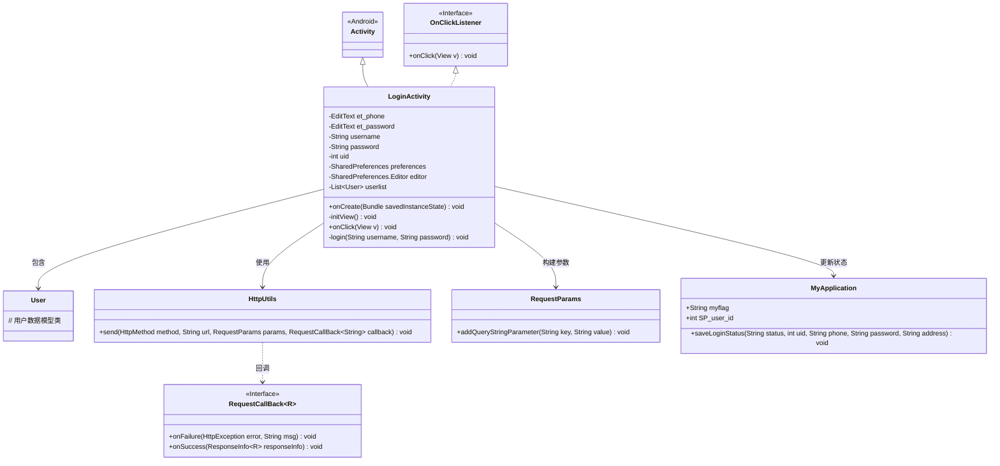
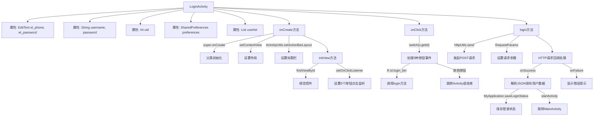

# 基础信息

|      |      |
|------|------|
| 名称 | LoginActivity |
| 编码语言 | .java |
| 代码路径 | happycat/src/com/happycat/LoginActivity.java |
| 包名 | com.happycat |
| 依赖项 | ['java.lang.reflect.Type', 'java.util.ArrayList', 'java.util.List', 'android.R.string', 'android.app.Activity', 'android.content.Intent', 'android.content.SharedPreferences', 'android.os.Bundle', 'android.util.Log', 'android.view.View', 'android.view.View.OnClickListener', 'android.widget.Button', 'android.widget.EditText', 'android.widget.Toast', 'com.example.happucat.R', 'com.google.gson.Gson', 'com.google.gson.reflect.TypeToken', 'com.happycat.Bean.User', 'com.happycat.Bean.goodsclassify', 'com.happycat.global.GlobalContacts', 'com.happycat.util.ActivitiyUtils', 'com.happycat.util.MyApplication', 'com.happycat.util.StringUtils', 'com.lidroid.xutils.HttpUtils', 'com.lidroid.xutils.exception.HttpException', 'com.lidroid.xutils.http.RequestParams', 'com.lidroid.xutils.http.ResponseInfo', 'com.lidroid.xutils.http.callback.RequestCallBack', 'com.lidroid.xutils.http.client.HttpRequest.HttpMethod'] |
| 概述说明 | 这是一个Android登录页面代码，包含手机号密码输入框，实现登录、注册、忘记密码功能。登录时验证用户信息，成功跳转主页面并保存用户状态，失败提示错误。 |

# 说明

该代码定义了一个名为LoginActivity的Android登录界面类，继承自Activity并实现了点击监听接口。类中包含手机号和密码输入框控件，以及用户信息存储相关变量。在onCreate方法中初始化界面布局和视图组件，设置多个按钮的点击监听事件。点击事件处理包括返回、注册、忘记密码和登录功能。登录时验证输入有效性，通过HTTP POST请求与服务器交互验证用户信息，成功登录后保存用户状态并跳转到主界面，失败则提示错误信息。整个过程涉及SharedPreferences存储、Gson解析和全局状态管理。

# 类列表 Class Summary

| 名称   | 类型  | 说明 |
|-------|------|-------------|
| LoginActivity | class | 这是一个安卓登录界面代码，包含手机号密码输入、注册、忘记密码功能，通过HTTP请求验证用户信息，登录成功跳转主页面并保存用户状态。 |

## 类 LoginActivity

|      |      |
|------|------|
| 访问范围 | public |
| 类型 | class |
| 名称 | LoginActivity |
| 说明 | 这是一个安卓登录界面代码，包含手机号密码输入、注册、忘记密码功能，通过HTTP请求验证用户信息，登录成功跳转主页面并保存用户状态。 |

### UML类图

该代码实现了一个Android登录界面，主要功能包括：初始化视图组件、处理用户点击事件、验证登录信息、通过HTTP请求与服务器交互。LoginActivity继承自Activity并实现OnClickListener接口，包含用户输入处理、网络请求（使用HttpUtils）、数据解析（Gson）和状态保存（MyApplication）等核心功能。类图展示了各组件间的依赖关系，特别是网络请求模块与回调机制的交互方式。

### 内部方法调用关系图

流程图描述：该流程图展示了Android登录功能的完整流程，从LoginActivity的初始化开始，包括视图绑定和事件监听设置。核心流程包含按钮点击事件分发（返回/注册/登录等操作），重点描述了登录按钮触发的网络请求过程：构造参数、发送POST请求、处理成功响应（解析JSON数据并跳转主界面）和失败处理（显示错误提示）。整个过程体现了从UI交互到网络通信的数据流转和状态管理。

### 字段列表 Field List

| 名称  | 类型  | 说明 |
|-------|-------|------|
| et_password | EditText | 定义两个EditText控件变量：et_phone和et_password。 |
| password | String | 声明字符串变量password |
| userlist = new ArrayList<User>() | List<User> | 创建存储用户对象的动态数组。 |
| username | String | 声明字符串变量username。 |
| preferences | SharedPreferences | 定义SharedPreferences对象preferences，用于存储轻量级键值对数据。 |
| uid | int | 整型变量uid，用于存储唯一标识符。 |
| editor | SharedPreferences.Editor | SharedPreferences.Editor用于修改SharedPreferences数据，提供键值对存储的编辑操作。 |

### 方法列表

| 名称  | 类型  | 说明 |
|-------|-------|------|
| onCreate | void | Android登录Activity的onCreate方法：调用父类方法、设置布局、自定义标题栏、初始化视图。 |
| initView | void | 初始化视图方法，绑定手机号、密码输入框及五个控件的点击事件监听器。 |
| onClick | void | 点击返回按钮关闭当前页面；点击注册、忘记密码或登录页注册按钮跳转对应页面；点击登录按钮验证输入后执行登录。 |
| login | void | 登录功能：获取用户名密码，POST请求验证，成功跳转主界面保存用户信息，失败提示错误。 |

