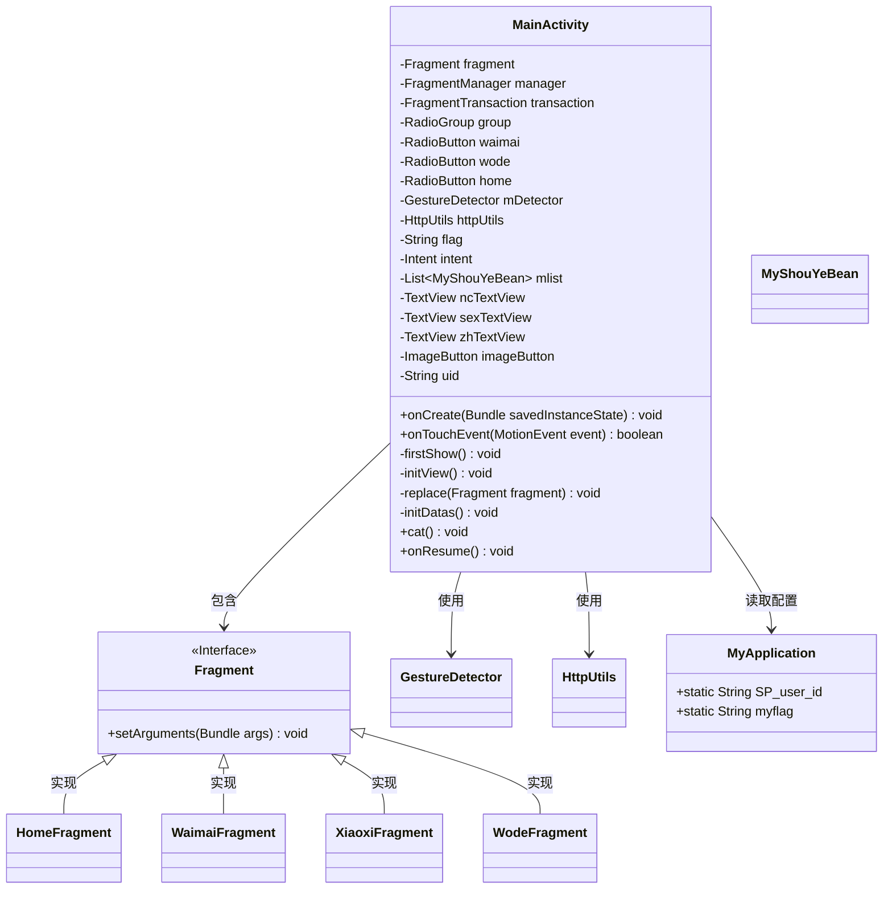
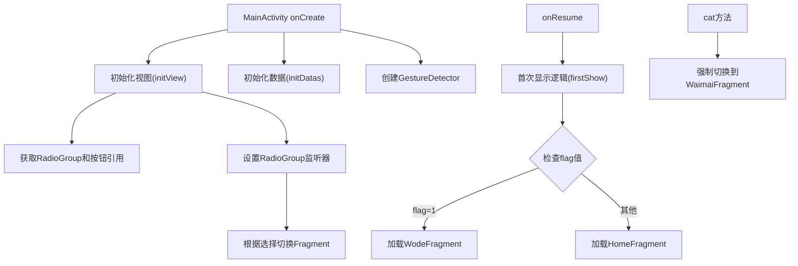
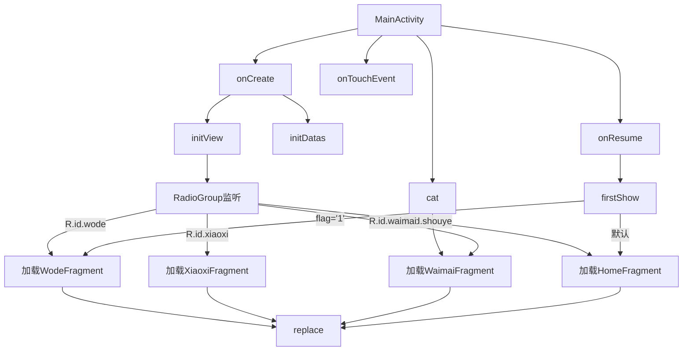

# 基础信息

|      |      |
|------|------|
| 名称 | MainActivity |
| 编码语言 | .java |
| 代码路径 | happycat/src/com/happycat/MainActivity.java |
| 包名 | com.happycat |
| 依赖项 | ['java.util.List', 'com.example.happucat.R', 'com.happycat.Bean.MyShouYeBean', 'com.happycat.global.GlobalContacts', 'com.happycat.util.DanjiUtils', 'com.happycat.util.MyApplication', 'com.happycay.fragments.HomeFragment', 'com.happycay.fragments.WaimaiFragment', 'com.happycay.fragments.WodeFragment', 'com.happycay.fragments.XiaoxiFragment', 'com.lidroid.xutils.HttpUtils', 'android.os.Bundle', 'android.app.ActionBar', 'android.content.Intent', 'android.support.v4.app.Fragment', 'android.support.v4.app.FragmentActivity', 'android.support.v4.app.FragmentManager', 'android.support.v4.app.FragmentTransaction', 'android.util.Log', 'android.view.GestureDetector', 'android.view.MotionEvent', 'android.widget.ImageButton', 'android.widget.RadioButton', 'android.widget.RadioGroup', 'android.widget.RadioGroup.OnCheckedChangeListener', 'android.widget.TextView'] |
| 概述说明 | MainActivity继承FragmentActivity，管理多个Fragment切换，包含底部导航栏和手势检测，根据标志位显示不同Fragment，支持用户信息展示和搜索功能。 |

# 说明

该代码描述了一个名为MainActivity的Android FragmentActivity类，主要用于管理应用主界面。主要功能包括初始化视图组件（如RadioGroup、ImageButton、TextView等），处理底部导航栏切换（首页、外卖、我的等Fragment），支持手势检测，并通过FragmentTransaction动态替换Fragment。类中还包含用户ID处理、Bundle数据传递、Activity生命周期管理（如onCreate、onResume）以及特定Fragment的显示逻辑（如首次显示时根据flag判断显示哪个Fragment）。此外，还提供了搜索功能入口和用户信息显示功能。

# 类列表 Class Summary

| 名称   | 类型  | 说明 |
|-------|------|-------------|
| MainActivity | class | MainActivity继承FragmentActivity，管理多个Fragment切换，包含底部导航栏和手势检测，根据标志位动态加载首页或个人页，支持Fragment替换和状态保存。 |

## 类 MainActivity

|      |      |
|------|------|
| 访问范围 | public |
| 类型 | class |
| 名称 | MainActivity |
| 说明 | MainActivity继承FragmentActivity，管理多个Fragment切换，包含底部导航栏和手势检测，根据标志位动态加载首页或个人页，支持Fragment替换和状态保存。 |

### UML类图

该代码实现了一个Android主活动(MainActivity)，管理底部导航栏和Fragment切换。类图展示了与Fragment、手势检测器、网络工具等组件的依赖关系，核心功能包括：1) 初始化视图和数据；2) 通过RadioGroup控制Fragment切换；3) 根据应用状态(flag)决定初始显示内容；4) 支持手势操作和特定方法强制跳转。流程图清晰呈现了生命周期方法和关键业务逻辑的调用顺序，特别是onCreate和onResume的初始化流程，以及用户交互触发的Fragment切换路径。

### 内部方法调用关系图

这段代码是Android应用中一个主活动(MainActivity)的实现，主要功能包括：初始化视图和数据、处理手势事件、管理Fragment切换以及响应界面交互。流程图展示了从onCreate开始的初始化流程，到firstShow根据标志位显示不同Fragment，再到RadioGroup监听实现底部导航切换，最后通过replace方法完成Fragment替换的核心逻辑。其中包含四个主要Fragment的加载路径和右上角搜索按钮的特殊处理。

### 字段列表 Field List

| 名称  | 类型  | 说明 |
|-------|-------|------|
| flag | String | 声明字符串变量flag。 |
| home | RadioButton | 三个单选按钮：外卖、我的、首页。 |
| httpUtils | HttpUtils | HttpUtils工具类实例声明，用于HTTP相关操作。 |
| uid=MyApplication.SP_user_id+"" | String | 代码片段将应用全局变量SP_user_id转为字符串并赋值给uid变量。 |
| manager | FragmentManager | Fragment管理器实例声明。 |
| mlist | List<MyShouYeBean> | 定义了一个名为mlist的列表，存储MyShouYeBean类型的数据。 |
| fragment | Fragment | Fragment对象声明 |
| group | RadioGroup | 声明一个名为group的单选按钮组控件变量。 |
| intent | Intent | 声明一个Intent对象。 |
| mDetector | GestureDetector | 手势检测器对象mDetector，用于识别和处理手势操作。 |
| imageButton | ImageButton | 图像按钮控件实例声明。 |
| zhTextView | TextView | 定义了三个TextView控件：ncTextView、sexTextView、zhTextView。 |
| transaction | FragmentTransaction | FragmentTransaction用于执行Fragment的添加、移除或替换操作。 |

### 方法列表

| 名称  | 类型  | 说明 |
|-------|-------|------|
| firstShow | void | 方法firstShow检查全局标志flag，若为1则跳转至WodeFragment并传递参数uid和flag，重置标志后选中wode；否则跳转至HomeFragment并选中home。 |
| initView | void | 初始化视图组件并设置底部导航栏切换逻辑，包括首页、外卖、消息和个人中心四个模块，点击切换对应Fragment。 |
| onTouchEvent | boolean | Android触摸事件处理方法，调用mDetector处理触摸事件并返回结果。 |
| initDatas | void | 初始化数据方法：获取FragmentManager实例并赋值给manager变量。 |
| replace | void | 替换Fragment：开启事务，用新Fragment替换容器中的当前Fragment，提交事务。 |
| onResume | void | 在Activity恢复时先执行firstShow()，再调用父类onResume()。 |
| onCreate | void | Android Activity的onCreate方法中初始化视图和数据，隐藏标题栏并设置手势检测器。 |
| cat | void | 创建WaimaiFragment实例并替换当前片段，同时选中waimai选项。 |

