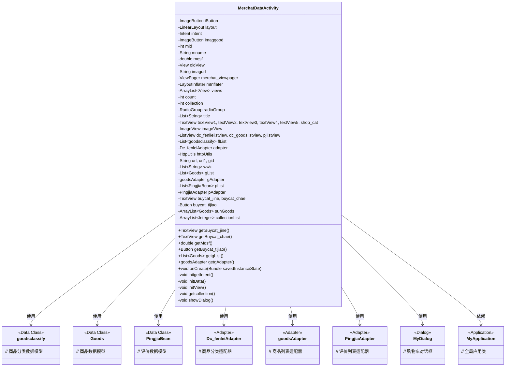
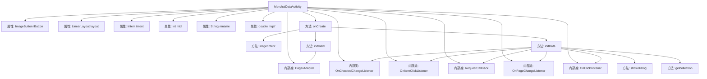

# 基础信息

|      |      |
|------|------|
| 名称 | MerchatDataActivity |
| 编码语言 | .java |
| 代码路径 | happycat/src/com/happycat/MerchatDataActivity.java |
| 包名 | com.happycat |
| 依赖项 | ['java.lang.reflect.Type', 'java.util.ArrayList', 'java.util.List', 'com.example.happucat.R', 'com.google.gson.Gson', 'com.google.gson.reflect.TypeToken', 'com.happycat.Bean.CountDto', 'com.happycat.Bean.Goods', 'com.happycat.Bean.MerchatBean', 'com.happycat.Bean.PingjiaBean', 'com.happycat.Bean.goodsclassify', 'com.happycat.adapter.Dc_fenleiAdapter', 'com.happycat.adapter.DingDan_indentAdapter', 'com.happycat.adapter.PingjiaAdapter', 'com.happycat.adapter.goodsAdapter', 'com.happycat.global.GlobalContacts', 'com.happycat.util.MyApplication', 'com.lidroid.xutils.HttpUtils', 'com.lidroid.xutils.exception.HttpException', 'com.lidroid.xutils.http.RequestParams', 'com.lidroid.xutils.http.ResponseInfo', 'com.lidroid.xutils.http.callback.RequestCallBack', 'com.lidroid.xutils.http.client.HttpRequest.HttpMethod', 'android.R.integer', 'android.annotation.SuppressLint', 'android.app.Activity', 'android.app.AlertDialog', 'android.content.DialogInterface', 'android.content.Intent', 'android.os.Bundle', 'android.support.v4.view.PagerAdapter', 'android.support.v4.view.ViewPager', 'android.support.v4.view.ViewPager.OnPageChangeListener', 'android.util.Log', 'android.view.LayoutInflater', 'android.view.View', 'android.view.View.OnClickListener', 'android.view.Window', 'android.widget.AdapterView', 'android.widget.AdapterView.OnItemClickListener', 'android.widget.RadioGroup.OnCheckedChangeListener', 'android.widget.Button', 'android.widget.ImageButton', 'android.widget.ImageView', 'android.widget.LinearLayout', 'android.widget.ListView', 'android.widget.RadioGroup', 'android.widget.TextView', 'android.widget.Toast'] |
| 概述说明 | MerchatDataActivity是一个商家数据展示页面，包含商品分类、商品列表、评价和购物车功能，支持商品浏览、收藏和下单操作。 |

# 说明

MerchatDataActivity是一个Android商家数据展示页面，主要功能包括商家信息展示、商品分类浏览、购物车管理和用户评价查看。页面使用ViewPager实现订餐与评价双标签页切换，顶部通过RadioGroup控制页面导航。订餐页包含商品分类列表与对应商品展示，支持购物车功能（含金额计算、起送价校验）。评价页展示用户评论列表。数据通过HTTP请求从服务器获取，使用Gson解析JSON。购物车支持商品增减操作，提交订单时校验金额并跳转至订单页。页面还包含商家LOGO、营业时间、配送费等基本信息展示。

# 类列表 Class Summary

| 名称   | 类型  | 说明 |
|-------|------|-------------|
| MerchatDataActivity | class | MerchatDataActivity是一个商家数据展示页面，包含商品分类、商品列表、评价和购物车功能。通过ViewPager切换订餐和评价视图，支持商品分类筛选、购物车结算及收藏功能。数据通过HTTP请求获取，使用Gson解析JSON。 |

## 类 MerchatDataActivity

|      |      |
|------|------|
| 访问范围 | @SuppressLint("InflateParams");public |
| 类型 | class |
| 名称 | MerchatDataActivity |
| 说明 | MerchatDataActivity是一个商家数据展示页面，包含商品分类、商品列表、评价和购物车功能。通过ViewPager切换订餐和评价视图，支持商品分类筛选、购物车结算及收藏功能。数据通过HTTP请求获取，使用Gson解析JSON。 |

### UML类图

类图描述：
MerchatDataActivity是一个Android商家数据展示页面，包含商品分类、商品列表、评价展示三大核心功能模块。通过多个适配器(Dc_fenleiAdapter、goodsAdapter、PingjiaAdapter)处理不同类型数据的展示，使用HttpUtils进行网络请求获取商品和评价数据，并通过MyDialog实现购物车功能。页面采用ViewPager+RadioGroup实现顶部标签切换，整体架构清晰体现了MVP模式的数据-视图分离思想。

### 内部方法调用关系图

这段代码是Android平台上的一个商家数据展示Activity，主要功能包括：1) 初始化商家基本信息展示；2) 实现商品分类和商品列表的双栏联动；3) 集成ViewPager实现"订餐"和"评价"页面切换；4) 购物车功能实现；5) 网络请求获取商品数据和评价数据。代码结构上分为初始化方法(onCreate)、数据获取方法(initData)、视图初始化方法(initView)三大模块，通过多个内部类处理各种交互事件，整体采用MVC架构模式，数据通过HTTP请求从服务器获取并使用Gson解析。

### 字段列表 Field List

| 名称  | 类型  | 说明 |
|-------|-------|------|
| intent | Intent | 声明一个Intent对象。 |
| pjlistview | ListView | 定义了三个ListView控件：dc_fenlielistview、dc_goodslistview、pjlistview。 |
| mInflater | LayoutInflater | 私有布局填充器变量mInflater。 |
| imaggood | ImageButton | 图像按钮控件imaggood。 |
| merchat_viewpager | ViewPager | 私有视图分页控件merchat_viewpager。 |
| sunGoods | ArrayList<Goods> | 私有商品列表sunGoods，类型为ArrayList，存储Goods对象。 |
| buycat_chae | TextView | 定义两个TextView变量：buycat_jine和buycat_chae。 |
| wwk | List<String> | 私有字符串列表变量wwk。 |
| adapter | Dc_fenleiAdapter | 定义分类适配器对象adapter。 |
| pList = new ArrayList<PingjiaBean>() | List<PingjiaBean> | 创建了一个存储PingjiaBean对象的动态数组pList。 |
| iButton | ImageButton | 图像按钮控件iButton。 |
| pAdapter | PingjiaAdapter | PingjiaAdapter的实例pAdapter。 |
| mname | String | 声明字符串变量mname |
| flList = new ArrayList<goodsclassify>() | List<goodsclassify> | 创建商品分类列表flList，使用ArrayList存储goodsclassify对象。 |
| gid | String | 定义了三个字符串变量：url、url1、gid。 |
| imagurl = "http://" + MyApplication.getIp()			+ ":8080/happycat/upimage/" | String | 代码拼接字符串生成图片URL，包含IP地址和路径。 |
| collectionList | ArrayList<Integer> | 保护类型整数动态数组collectionList。 |
| httpUtils | HttpUtils | 声明了一个HttpUtils类型的变量httpUtils。 |
| imageView | ImageView | 声明一个ImageView控件变量。 |
| collection | int | 声明两个私有整型变量：count和collection。 |
| gAdapter | goodsAdapter | 声明了一个名为gAdapter的goodsAdapter类型变量。 |
| oldView = null | View | 声明一个名为oldView的视图变量并初始化为null。 |
| mid = 1 | int | 定义整型变量mid并初始化为1。 |
| buycat_tijiao | Button | 按钮buycat_tijiao用于提交操作。 |
| shop_cat | TextView | 定义了六个TextView控件：textView1至textView5和shop_cat。 |
| layout | LinearLayout | LinearLayout是一种Android布局，用于水平或垂直排列子视图。 |
| gList = new ArrayList<Goods>() | List<Goods> | 创建存储Goods对象的动态数组gList。 |
| title = new ArrayList<String>() | List<String> | 创建字符串类型的动态数组title。 |
| mqsf | double | 声明一个双精度浮点型变量mqsf。 |
| radioGroup | RadioGroup | RadioGroup是一个用于管理单选按钮组的控件。 |
| views | ArrayList<View> | 私有视图集合，类型为ArrayList，存储View对象。 |

### 方法列表

| 名称  | 类型  | 说明 |
|-------|-------|------|
| showDialog | void | 方法`showDialog`清空`sunGoods`后遍历`gList`，将库存大于0的商品加入`sunGoods`，创建并显示包含这些商品的对话框，同时打印日志。 |
| getMqsf | double | 获取mqsf值的公共方法，返回double类型。 |
| initView | void | 初始化视图方法，设置ViewPager适配器，实现页面数量、视图绑定、页面销毁、实例化及标题获取功能。 |
| getBuycat_chae | TextView | 获取buycat_chae的TextView对象。 |
| getBuycat_jine | TextView | 获取buycat_jine的TextView对象。 |
| getBuycat_tijiao | Button | 获取buycat_tijiao按钮对象的方法。 |
| getgList | List<Goods> | 方法getgList返回商品列表gList。 |
| getgAdapter | goodsAdapter | 获取公共商品适配器实例的方法。 |
| onCreate | void | Android Activity的onCreate方法：初始化无标题窗口、设置布局、获取Intent数据、初始化视图和数据，并为ImageButton设置点击事件以关闭Activity。 |
| initgetIntent | void | 方法initgetIntent从Intent获取数据并初始化UI，包括ID、名称、配送费、平均速度、起送价、图片和营业时间，设置对应TextView和ImageView显示。 |
| initData | void | 初始化数据方法，包含订餐和评价页面切换、购物车操作、商品分类及评论加载，使用HTTP请求获取数据并更新UI。 |
| getcollection | void | 该方法通过HTTP POST请求向指定URL发送用户收藏的商品ID列表，接收返回的收藏列表并更新适配器显示。包含请求参数设置、成功回调处理和失败回调处理。 |

