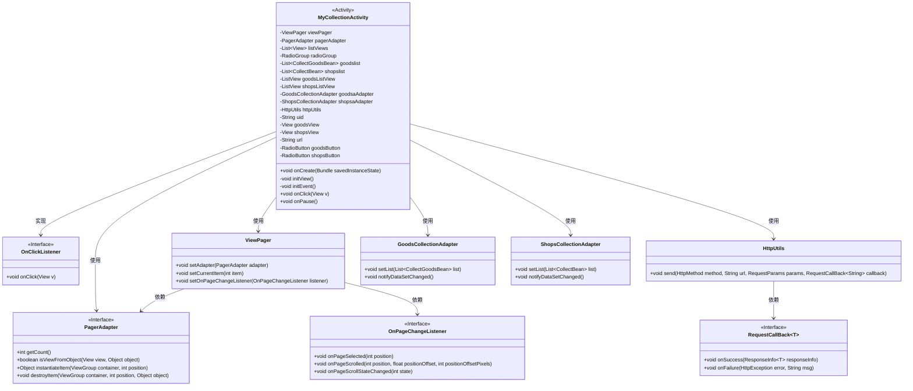
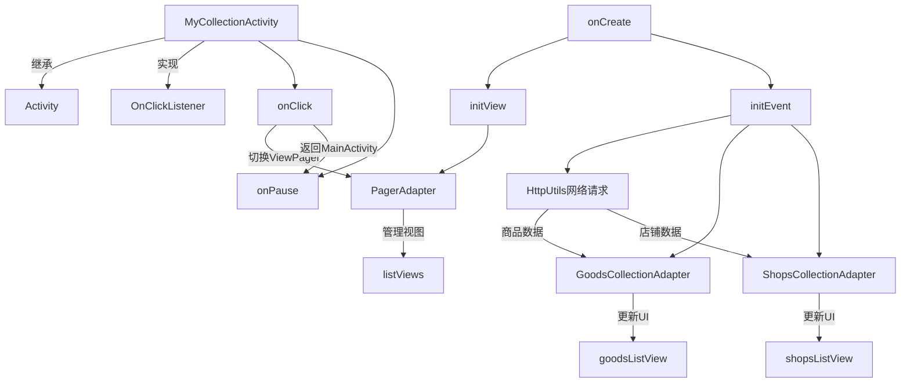

# 基础信息

|      |      |
|------|------|
| 名称 | MyCollectionActivity |
| 编码语言 | .java |
| 代码路径 | happycat/src/com/happycat/MyCollectionActivity.java |
| 包名 | com.happycat |
| 依赖项 | ['java.lang.reflect.Type', 'java.util.ArrayList', 'java.util.List', 'com.example.happucat.R', 'com.google.gson.Gson', 'com.google.gson.reflect.TypeToken', 'com.happycat.Bean.CollectBean', 'com.happycat.Bean.CollectGoodsBean', 'com.happycat.adapter.GoodsCollectionAdapter', 'com.happycat.adapter.ShopsCollectionAdapter', 'com.happycat.util.ActivitiyUtils', 'com.happycat.util.MyApplication', 'com.happycat.util.StringUtils', 'com.lidroid.xutils.HttpUtils', 'com.lidroid.xutils.exception.HttpException', 'com.lidroid.xutils.http.RequestParams', 'com.lidroid.xutils.http.ResponseInfo', 'com.lidroid.xutils.http.callback.RequestCallBack', 'com.lidroid.xutils.http.client.HttpRequest.HttpMethod', 'android.R.integer', 'android.app.Activity', 'android.content.Intent', 'android.os.Bundle', 'android.support.v4.view.PagerAdapter', 'android.support.v4.view.ViewPager', 'android.support.v4.view.ViewPager.OnPageChangeListener', 'android.util.Log', 'android.view.LayoutInflater', 'android.view.View', 'android.view.ViewGroup', 'android.view.View.OnClickListener', 'android.widget.AdapterView', 'android.widget.AdapterView.OnItemClickListener', 'android.widget.ListView', 'android.widget.RadioButton', 'android.widget.RadioGroup', 'android.widget.TextView'] |
| 概述说明 | MyCollectionActivity是一个Android收藏页面，包含商品和店铺两个标签页，通过ViewPager切换展示。商品页使用ListView展示收藏商品列表，店铺页展示收藏店铺列表，数据通过HTTP请求获取并解析JSON。点击商品或店铺跳转详情页，提供返回按钮返回主页。 |

# 说明

MyCollectionActivity是一个Android活动类，用于展示用户收藏的商品和店铺。它使用ViewPager实现商品和店铺页面的滑动切换，并通过RadioButton控制页面跳转。商品和店铺数据分别通过HttpUtils从服务器获取，使用Gson解析JSON数据并显示在ListView中。点击商品或店铺项会跳转到MerchatDataActivity展示详情。返回按钮点击后跳转至MainActivity并结束当前活动。

# 类列表 Class Summary

| 名称   | 类型  | 说明 |
|-------|------|-------------|
| MyCollectionActivity | class | MyCollectionActivity是一个Android收藏页面，包含商品和店铺两个标签页，使用ViewPager切换，通过HTTP请求获取数据并展示，支持点击跳转详情页和返回主页功能。 |

## 类 MyCollectionActivity

|      |      |
|------|------|
| 访问范围 | public |
| 类型 | class |
| 名称 | MyCollectionActivity |
| 说明 | MyCollectionActivity是一个Android收藏页面，包含商品和店铺两个标签页，使用ViewPager切换，通过HTTP请求获取数据并展示，支持点击跳转详情页和返回主页功能。 |

### UML类图

这段代码描述了一个Android收藏管理活动，主要功能包括商品和店铺的收藏展示与切换。类图展示了MyCollectionActivity继承Activity并实现OnClickListener接口，通过ViewPager管理两个分页（商品/店铺），使用自定义适配器展示数据，并通过HttpUtils进行网络请求获取收藏数据。该活动包含视图初始化、事件处理、网络请求回调等核心功能模块，通过观察者模式实现页面切换与数据更新的联动。

### 内部方法调用关系图

这段代码实现了一个收藏管理Activity，主要功能包括：1) 通过ViewPager展示商品和店铺两个收藏页签；2) 使用RadioButton实现页签切换；3) 通过HttpUtils从服务器获取收藏数据；4) 使用自定义Adapter展示列表数据；5) 处理列表项点击跳转详情页。核心流程是：初始化界面→设置适配器→发起网络请求→解析数据→更新UI，同时处理页面切换和返回按钮事件。代码结构清晰，但存在重复网络请求逻辑，可考虑抽象优化。

### 字段列表 Field List

| 名称  | 类型  | 说明 |
|-------|-------|------|
| shopsView | View | 私有视图变量 shopsView。 |
| shopsaAdapter | ShopsCollectionAdapter | 商店集合适配器shopsaAdapter。 |
| goodsView | View | 私有视图变量goodsView |
| shopsListView | ListView | 定义了两个列表视图控件：商品列表和店铺列表。 |
| shopsButton | RadioButton | 定义了两个单选按钮：goodsButton和shopsButton。 |
| viewPager | ViewPager | ViewPager是Android中用于实现滑动切换页面的控件。 |
| goodsaAdapter | GoodsCollectionAdapter | 商品集合适配器对象goodsaAdapter。 |
| goodslist | List<CollectGoodsBean> | 商品列表集合，存储CollectGoodsBean类型对象。 |
| uid = MyApplication.SP_user_id + "" | String | 代码片段：将应用内用户ID转为字符串并赋值给变量uid。 |
| shopslist | List<CollectBean> | 存储CollectBean对象的列表变量shopslist。 |
| radioGroup | RadioGroup | RadioGroup是一个用于管理一组单选按钮的控件，确保用户只能选择其中一个选项。 |
| pagerAdapter | PagerAdapter | PagerAdapter是Android中用于管理页面切换的适配器基类，需自定义实现。 |
| listViews = new ArrayList<View>() | List<View> | 创建存储View对象的动态数组列表。 |
| httpUtils | HttpUtils | HttpUtils工具类实例声明。 |
| url = "http://" + MyApplication.getIp() + ":8080/happycat/GetUpload" | String | 代码拼接URL，使用应用IP和固定路径8080/happycat/GetUpload。 |

### 方法列表

| 名称  | 类型  | 说明 |
|-------|-------|------|
| onCreate | void | Android Activity的onCreate方法，初始化视图和事件，设置布局和标题栏。 |
| onPause | void | 重写onPause方法，调用父类方法后将MyApplication的myflag设为1。 |
| initEvent | void | 初始化商品和店铺收藏页面，设置点击事件和列表适配器，通过XUtils框架从服务器获取数据并解析展示，实现页面切换功能。 |
| initView | void | 初始化视图：设置返回按钮点击事件，配置ViewPager和RadioButton，加载商品和店铺布局，自定义PagerAdapter管理视图切换。 |
| onClick | void | 点击事件处理：根据ID切换ViewPager页面或返回主界面。商品页切至0，店铺页切至1，返回按钮跳转至MainActivity并结束当前页。 |

