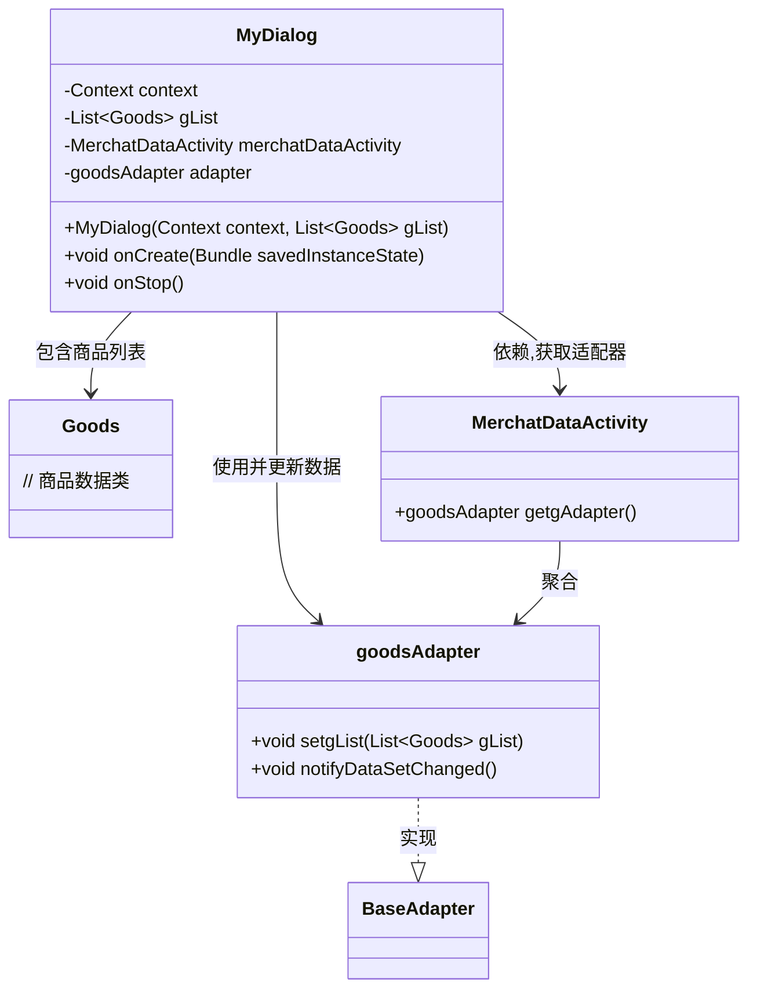
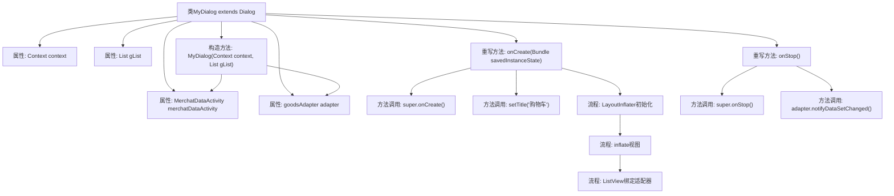

# 基础信息

|      |      |
|------|------|
| 名称 | MyDialog |
| 编码语言 | .java |
| 代码路径 | happycat/src/com/happycat/MyDialog.java |
| 包名 | com.happycat |
| 依赖项 | ['java.util.List', 'com.example.happucat.R', 'com.happycat.Bean.Goods', 'com.happycat.adapter.goodsAdapter', 'android.annotation.SuppressLint', 'android.app.Dialog', 'android.content.Context', 'android.os.Bundle', 'android.view.LayoutInflater', 'android.view.View', 'android.widget.ListView'] |
| 概述说明 | 自定义对话框类MyDialog，继承Dialog，用于显示购物车商品列表。构造函数接收上下文和商品列表，初始化适配器。onCreate中设置标题、布局和列表视图，绑定适配器。onStop时通知适配器数据更新。 |

# 说明

这是一个自定义对话框类MyDialog，继承自Dialog类。主要功能是显示购物车商品列表。构造函数接收Context和商品列表gList参数，并将上下文转换为MerchatDataActivity以获取适配器。在onCreate方法中设置对话框标题为"购物车"，加载布局文件shopcat_alterdialog，初始化ListView并设置自定义适配器goodsAdapter来显示商品数据。当对话框关闭时，在onStop方法中会通知原适配器更新数据。整个类用于在商家数据活动中展示和管理购物车商品信息。

# 类列表 Class Summary

| 名称   | 类型  | 说明 |
|-------|------|-------------|
| MyDialog | class | 自定义对话框类MyDialog，继承Dialog，用于显示购物车商品列表。构造函数接收上下文和商品列表，初始化适配器。onCreate中设置标题、布局和列表视图，绑定适配器。onStop时通知适配器数据更新。 |

## 类 MyDialog

|      |      |
|------|------|
| 访问范围 | @SuppressLint("InflateParams");public |
| 类型 | class |
| 名称 | MyDialog |
| 说明 | 自定义对话框类MyDialog，继承Dialog，用于显示购物车商品列表。构造函数接收上下文和商品列表，初始化适配器。onCreate中设置标题、布局和列表视图，绑定适配器。onStop时通知适配器数据更新。 |

### UML类图

类图描述：该图展示了一个自定义对话框MyDialog的结构，它继承自Android的Dialog类，包含商品列表数据(gList)和关联的MerchatDataActivity。通过goodsAdapter适配器管理ListView的显示，在onStop时通知数据更新。MerchatDataActivity作为上下文提供适配器实例，goodsAdapter继承自BaseAdapter实现列表项渲染逻辑。

### 内部方法调用关系图

该流程图展示了MyDialog类的结构和方法调用关系。从构造方法初始化属性开始，到onCreate中完成对话框标题设置、视图填充和列表适配器绑定，最后在onStop时通知适配器数据更新。关键流程包括LayoutInflater初始化视图、ListView与自定义适配器的绑定，体现了对话框生命周期与数据交互的核心逻辑。

### 字段列表 Field List

| 名称  | 类型  | 说明 |
|-------|-------|------|
| gList | List<Goods> | 商品列表gList |
| adapter | goodsAdapter | 商品列表适配器实例。 |
| merchatDataActivity | MerchatDataActivity | MerchatDataActivity是一个商户数据活动对象。 |
| context | Context | 定义Context类型的变量context。 |

### 方法列表

| 名称  | 类型  | 说明 |
|-------|-------|------|
| onCreate | void | Android Activity创建时初始化购物车界面，设置标题、布局和列表适配器。 |
| onStop | void | Android生命周期方法onStop中调用父类方法并通知适配器数据更新。 |

