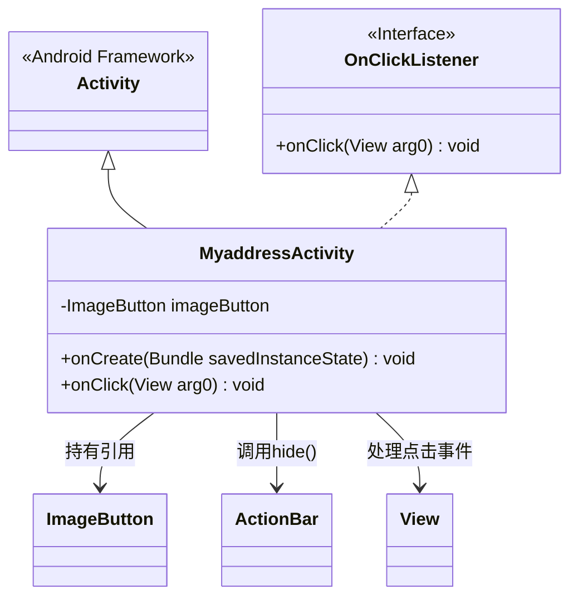
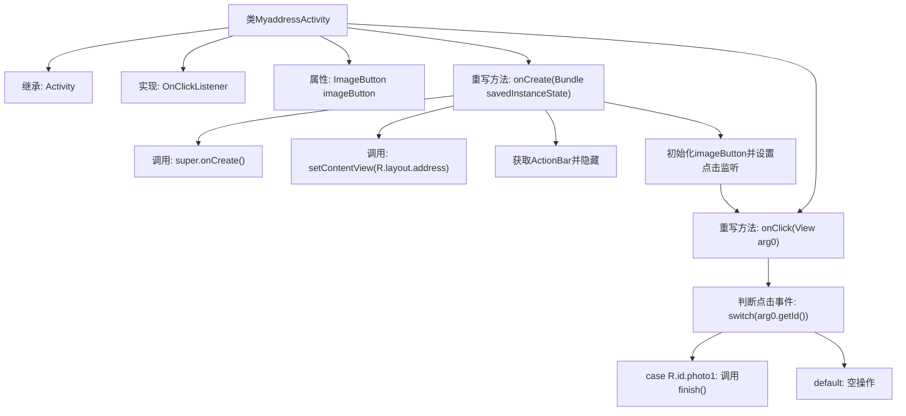

# 基础信息

|      |      |
|------|------|
| 名称 | MyaddressActivity |
| 编码语言 | .java |
| 代码路径 | happycat/src/com/happycat/MyaddressActivity.java |
| 包名 | com.happycat |
| 依赖项 | ['com.example.happucat.R', 'com.example.happucat.R.id', 'com.example.happucat.R.layout', 'android.os.Bundle', 'android.app.ActionBar', 'android.app.Activity', 'android.view.Menu', 'android.view.View', 'android.view.View.OnClickListener', 'android.widget.ImageButton'] |
| 概述说明 | MyaddressActivity继承Activity并实现点击监听，隐藏标题栏，设置ImageButton点击后关闭当前界面。 |

# 说明

这是一个名为MyaddressActivity的Android Activity类，继承自Activity并实现了OnClickListener接口。该类主要功能是显示一个地址界面，包含一个图片按钮。在onCreate方法中，初始化界面布局并隐藏了标题栏，同时为图片按钮设置了点击监听器。当用户点击该按钮时，会触发onClick方法，执行finish()操作关闭当前Activity。图片按钮的ID为photo1，对应的布局文件是address.xml。

# 类列表 Class Summary

| 名称   | 类型  | 说明 |
|-------|------|-------------|
| MyaddressActivity | class | MyaddressActivity继承Activity并实现点击监听，隐藏标题栏，设置ImageButton点击事件，点击后关闭当前界面。 |

## 类 MyaddressActivity

|      |      |
|------|------|
| 访问范围 | public |
| 类型 | class |
| 名称 | MyaddressActivity |
| 说明 | MyaddressActivity继承Activity并实现点击监听，隐藏标题栏，设置ImageButton点击事件，点击后关闭当前界面。 |

### UML类图

这段代码展示了一个Android的Activity类`MyaddressActivity`，它继承自基础`Activity`类并实现了`OnClickListener`接口。主要功能包括初始化界面时隐藏标题栏，设置图片按钮点击监听器，并在点击事件中根据按钮ID执行相应操作（当前仅处理photo1的点击关闭Activity）。类图中清晰体现了继承关系、接口实现以及关键的对象依赖关系。

### 内部方法调用关系图

这段代码描述了一个Android活动类MyaddressActivity，它继承自Activity并实现了点击监听接口。流程图展示了从类结构到具体方法的完整调用链：初始化时隐藏标题栏、设置布局和按钮监听，当点击特定图片按钮时会关闭当前活动。整个过程体现了Android活动的典型生命周期和事件处理机制，特别是通过switch-case结构处理不同视图点击事件的模式。

### 字段列表 Field List

| 名称  | 类型  | 说明 |
|-------|-------|------|
| imageButton | ImageButton | 声明一个ImageButton类型的变量imageButton。 |

### 方法列表

| 名称  | 类型  | 说明 |
|-------|-------|------|
| onClick | void | Android点击事件处理：当点击photo1时关闭当前Activity，其他情况无操作。 |
| onCreate | void | Android代码片段：在onCreate中隐藏标题栏，设置布局address，绑定ImageButton点击事件。 |

