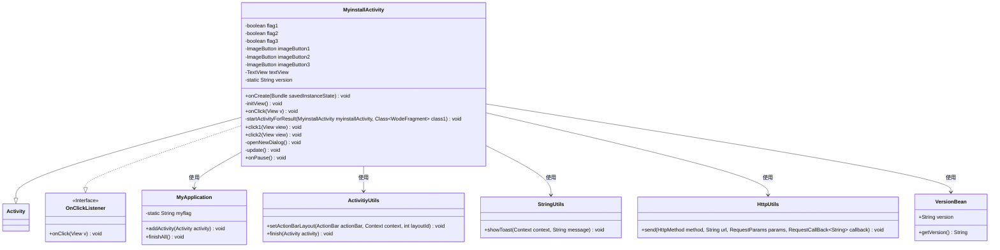
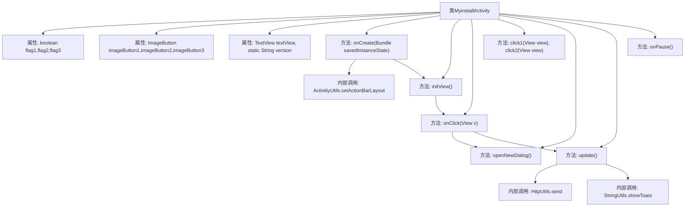

# 基础信息

|      |      |
|------|------|
| 名称 | MyinstallActivity |
| 编码语言 | .java |
| 代码路径 | happycat/src/com/happycat/MyinstallActivity.java |
| 包名 | com.happycat |
| 依赖项 | ['java.lang.reflect.Type', 'java.util.ArrayList', 'com.aps.v', 'com.example.happucat.R', 'com.google.gson.Gson', 'com.google.gson.reflect.TypeToken', 'com.happycat.Bean.User', 'com.happycat.Bean.VersionBean', 'com.happycat.global.GlobalContacts', 'com.happycat.util.ActivitiyUtils', 'com.happycat.util.MyApplication', 'com.happycat.util.StringUtils', 'com.happycay.fragments.WodeFragment', 'com.lidroid.xutils.HttpUtils', 'com.lidroid.xutils.exception.HttpException', 'com.lidroid.xutils.http.RequestParams', 'com.lidroid.xutils.http.ResponseInfo', 'com.lidroid.xutils.http.callback.RequestCallBack', 'com.lidroid.xutils.http.client.HttpRequest.HttpMethod', 'android.R.string', 'android.app.Activity', 'android.app.AlertDialog', 'android.content.DialogInterface', 'android.content.Intent', 'android.os.Bundle', 'android.view.View', 'android.view.View.OnClickListener', 'android.widget.ImageButton', 'android.widget.TextView'] |
| 概述说明 | MyinstallActivity是一个Android活动类，实现点击监听，包含初始化视图、处理按钮点击事件、版本更新检查、清除缓存、退出账号等功能。 |

# 说明

MyinstallActivity是一个Android活动类，实现了点击监听接口。它包含三个布尔标志和三个图片按钮，以及一个文本视图用于显示版本信息。在onCreate方法中初始化布局和视图，并通过initView方法绑定多个按钮的点击事件。点击事件处理包括返回主界面、检查版本更新、清除图片缓存、关于应用、退出账号等功能。退出账号时会弹出确认对话框。还包含两个方法用于切换非WiFi省流量模式和自动定位功能的图标状态。版本更新功能通过HTTP请求与服务器交互，解析返回的JSON数据判断是否为最新版本。在onPause方法中设置应用标志位。

# 类列表 Class Summary

| 名称   | 类型  | 说明 |
|-------|------|-------------|
| MyinstallActivity | class | MyinstallActivity是一个Android活动类，实现点击监听，包含初始化视图、按钮点击处理、版本更新检查、退出账号确认对话框等功能。 |

## 类 MyinstallActivity

|      |      |
|------|------|
| 访问范围 | public |
| 类型 | class |
| 名称 | MyinstallActivity |
| 说明 | MyinstallActivity是一个Android活动类，实现点击监听，包含初始化视图、按钮点击处理、版本更新检查、退出账号确认对话框等功能。 |

### UML类图

这段代码描述了一个Android活动类`MyinstallActivity`，它继承自`Activity`并实现了`OnClickListener`接口。该类主要用于处理用户安装和设置相关的操作，包括初始化视图、处理按钮点击事件、显示对话框、检查版本更新等。它依赖于多个工具类如`MyApplication`、`ActivitiyUtils`、`StringUtils`和`HttpUtils`来完成特定功能。类图中清晰地展示了这些类之间的关系和依赖。

### 内部方法调用关系图

这段代码是一个Android活动类`MyinstallActivity`，主要功能包括界面初始化、按钮点击事件处理、版本更新检查、对话框弹出等。流程图展示了类属性、主要方法及其调用关系，如`onCreate`初始化视图并调用`initView`绑定监听器，`onClick`处理不同按钮点击事件并触发对应操作（如跳转活动、显示对话框、调用网络请求等），`update`方法通过HTTP请求检查版本更新，`openNewDialog`创建退出确认对话框。类还包含图标切换功能（`click1/click2`）和生命周期管理（`onPause`）。

### 字段列表 Field List

| 名称  | 类型  | 说明 |
|-------|-------|------|
| imageButton3 | ImageButton | 定义了三个ImageButton控件：imageButton1、imageButton2、imageButton3。 |
| flag3=false | boolean | 声明三个布尔变量flag1、flag2、flag3，初始值均为false。 |
| version | String | 私有静态字符串变量version。 |
| textView | TextView | 定义私有TextView变量textView。 |

### 方法列表

| 名称  | 类型  | 说明 |
|-------|-------|------|
| onPause | void | Android生命周期方法onPause中设置全局变量myflag为1。 |
| startActivityForResult | void | 方法startActivityForResult未实现，用于启动MyinstallActivity并返回结果到WodeFragment。 |
| click1 | void | 点击切换图标：flag1为真时显示绿色yuan图标，为假时显示白色yuan1图标，每次点击反转flag1状态。 |
| onClick | void | 点击返回跳转主界面；点击版本检查更新；点击清除图片缓存提示成功；点击关于跳转页面；点击退出账号提示并弹窗。 |
| onCreate | void | Android Activity的onCreate方法：初始化视图、设置布局、获取应用状态并添加当前Activity，同时配置ActionBar。 |
| initView | void | 初始化视图，设置按钮点击监听器，包括返回、检查、各功能安装及定位流量等，同时获取文本视图实例。 |
| click2 | void | 点击切换按钮图标：初始绿色（yuan），点击后变白色（yuan1），每次点击反转flag2状态。 |
| openNewDialog | void | 创建退出确认对话框，标题为“您确定要退出吗？”，提供“是”和“否”按钮。点击“是”退出程序，点击“否”关闭对话框。 |
| update | void | 该方法用于检查版本更新。从界面获取当前版本号，通过POST请求发送到服务器。若请求失败提示获取失败；成功则解析返回数据，比较版本号并提示是否是最新版本。 |

