# 基础信息

|      |      |
|------|------|
| 名称 | NightActivity |
| 编码语言 | .java |
| 代码路径 | happycat/src/com/happycat/NightActivity.java |
| 包名 | com.happycat |
| 依赖项 | ['java.lang.reflect.Type', 'java.util.ArrayList', 'java.util.List', 'com.example.happucat.R', 'com.google.gson.Gson', 'com.google.gson.reflect.TypeToken', 'com.happycat.Bean.NightMerchatBean', 'com.happycat.adapter.NightMerchatadapter', 'com.happycat.util.MyApplication', 'com.lidroid.xutils.HttpUtils', 'com.lidroid.xutils.exception.HttpException', 'com.lidroid.xutils.http.ResponseInfo', 'com.lidroid.xutils.http.callback.RequestCallBack', 'com.lidroid.xutils.http.client.HttpRequest.HttpMethod', 'android.os.Bundle', 'android.app.ActionBar', 'android.app.Activity', 'android.content.Intent', 'android.util.Log', 'android.view.View', 'android.view.View.OnClickListener', 'android.widget.AdapterView', 'android.widget.ImageButton', 'android.widget.ImageView', 'android.widget.ListView', 'android.widget.RadioGroup', 'android.widget.TextView', 'android.widget.AdapterView.OnItemClickListener'] |
| 概述说明 | NightActivity是一个Android活动类，包含列表视图、图片视图等控件，实现商家数据展示与点击跳转功能，通过HTTP请求获取JSON数据并解析，支持多个分类按钮跳转不同URL页面。 |

# 说明

NightActivity是一个Android活动类，主要用于展示夜间商家列表。界面包含列表视图、图片按钮和多个分类按钮。初始化时隐藏标题栏，设置布局并绑定控件。列表项点击事件会跳转至商家详情页，传递商家ID、名称、配送费等信息。六个分类按钮分别对应不同URL参数，点击后跳转至外卖主页面。数据通过HTTP请求从服务器获取，使用Gson解析JSON并填充列表。若适配器为空则显示错误提示。网络请求失败时不处理，成功时更新列表数据。

# 类列表 Class Summary

| 名称   | 类型  | 说明 |
|-------|------|-------------|
| NightActivity | class | NightActivity类实现外卖列表功能，包含ListView展示数据、点击跳转详情、多个分类按钮及网络请求获取数据。 |


## 类 NightActivity

|      |      |
|------|------|
| 访问范围 | public |
| 类型 | class |
| 名称 | NightActivity |
| 说明 | NightActivity类实现外卖列表功能，包含ListView展示数据、点击跳转详情、多个分类按钮及网络请求获取数据。 |


### UML类图

```mermaid
classDiagram
    class Activity {
        <<Android>>
    }
    
    class NightActivity {
        -ListView listView
        -ImageView imageView
        -List~NightMerchatBean~ list
        -NightMerchatadapter adapter
        -HttpUtils httpUtils
        -String url
        -TextView textView
        -RadioGroup group
        -ImageButton iButton
        +onCreate(Bundle savedInstanceState) void
        -initDatas() void
    }
    
    class NightMerchatBean {
        <<Data>>
        +getMid() int
        +getMname() String
        +getTip() double
        +getLongtime() String
        +getMprice() double
        +getMtime() String
        +getMimg() String
    }
    
    class NightMerchatadapter {
        +NightMerchatadapter(List~NightMerchatBean~ list, Context context)
        +notifyDataSetChanged() void
    }
    
    class HttpUtils {
        +send(HttpMethod method, String url, RequestCallBack~String~ callback) void
    }
    
    class RequestCallBack~T~ {
        <<Interface>>
        +onFailure(HttpException e, String msg) void
        +onSuccess(ResponseInfo~T~ info) void
    }
    
    class Gson {
        +fromJson(String json, Type typeOfT) Object
    }
    
    class TypeToken~T~ {
        +getType() Type
    }
    
    Activity <|-- NightActivity
    RequestCallBack~String~ <|.. NightActivity
    NightMerchatadapter --> NightMerchatBean
    NightActivity --> HttpUtils
    NightActivity --> NightMerchatadapter
    HttpUtils --> RequestCallBack~String~
    NightActivity ..> Gson : 使用
    NightActivity ..> TypeToken~List~NightMerchatBean~~ : 使用
```

这段代码描述了一个Android的NightActivity类，继承自Activity，主要功能是展示夜间商家列表。通过HttpUtils从服务器获取商家数据，使用Gson解析JSON数据并填充到ListView中。类图中包含了核心的数据模型NightMerchatBean、适配器NightMerchatadapter、网络工具HttpUtils以及相关的回调接口和工具类，清晰地展示了各组件之间的依赖关系。


### 内部方法调用关系图

```mermaid
graph TD
    A["NightActivity类"]
    B["属性: ListView listView"]
    C["属性: ImageView imageView"]
    D["属性: List<NightMerchatBean> list"]
    E["属性: NightMerchatadapter adapter"]
    F["属性: HttpUtils httpUtils"]
    G["属性: String url"]
    H["属性: TextView textView"]
    I["属性: RadioGroup group"]
    J["属性: ImageButton iButton"]
    K["方法: onCreate(Bundle savedInstanceState)"]
    L["方法: initDatas()"]
    M["内部操作: 隐藏ActionBar"]
    N["内部操作: 设置布局R.layout.waimai"]
    O["内部操作: 初始化iButton并设置点击事件"]
    P["内部操作: 初始化listView并设置点击事件"]
    Q["内部操作: 初始化imageView并设置点击事件"]
    R["内部操作: 初始化6个View并设置点击事件"]
    S["内部操作: 调用initDatas()"]
    T["内部操作: 检查adapter并设置空视图"]

    A --> B
    A --> C
    A --> D
    A --> E
    A --> F
    A --> G
    A --> H
    A --> I
    A --> J
    A --> K
    A --> L
    K --> M
    K --> N
    K --> O
    K --> P
    K --> Q
    K --> R
    K --> S
    K --> T
    L --> E
    L --> F
    L --> G
    L --> D
```



这段代码是Android平台上的一个Activity类，主要实现了一个夜间活动展示界面。流程图展示了类结构和主要方法调用关系，包括初始化UI组件、设置各种点击事件监听器、数据初始化和网络请求等核心功能。该Activity通过HttpUtils发送GET请求获取商家数据，使用Gson解析JSON响应，并通过自定义Adapter在ListView中展示数据。同时提供了多个按钮点击跳转功能，整体实现了完整的商家列表展示和交互逻辑。

### 字段列表 Field List

| 名称  | 类型  | 说明 |
|-------|-------|------|
| adapter | NightMerchatadapter | NightMerchatadapter适配器实例声明。 |
| imageView | ImageView | 声明一个ImageView类型的变量imageView。 |
| url | String | 声明一个私有字符串变量url。 |
| iButton | ImageButton | 图像按钮控件iButton。 |
| group | RadioGroup | 声明一个单选按钮组变量group。 |
| list = new ArrayList<NightMerchatBean>() | List<NightMerchatBean> | 创建名为list的ArrayList，存储NightMerchatBean类型对象。 |
| httpUtils | HttpUtils | HttpUtils工具类实例声明。 |
| textView | TextView | 声明一个TextView类型的变量textView。 |
| listView | ListView | 声明一个ListView控件变量listView。 |

### 方法列表

| 名称  | 类型  | 说明 |
|-------|-------|------|
| onCreate | void | 安卓Activity初始化，隐藏标题栏，设置布局，处理按钮点击、列表项点击及分组按钮跳转，传递参数启动新Activity，初始化数据并处理空视图。 |
| initDatas | void | 初始化数据方法：创建适配器并设置到列表视图，通过HTTP GET请求获取服务器数据，使用Gson解析JSON并更新适配器。 |


