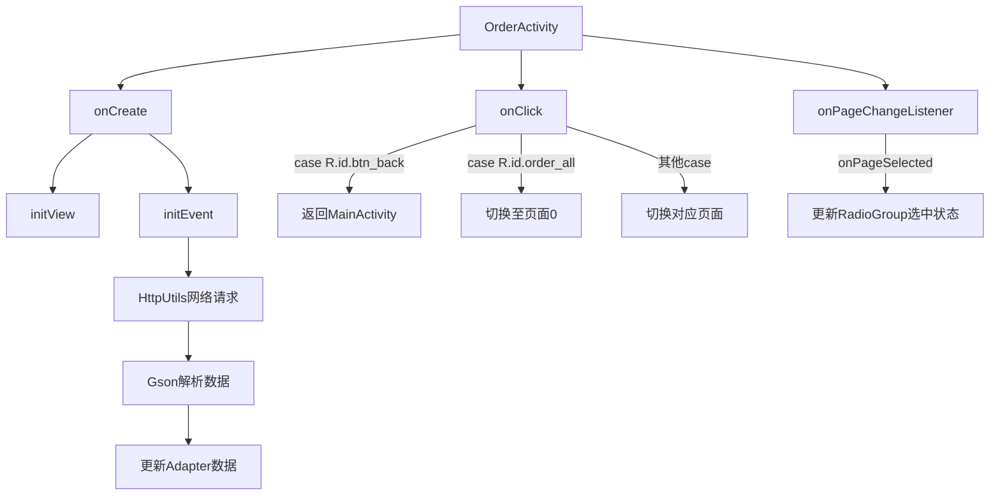

# 基础信息

|      |      |
|------|------|
| 名称 | OrderActivity |
| 编码语言 | .java |
| 代码路径 | happycat/src/com/happycat/OrderActivity.java |
| 包名 | com.happycat |
| 依赖项 | ['java.lang.reflect.Type', 'java.util.ArrayList', 'java.util.List', 'com.example.happucat.R', 'com.google.gson.Gson', 'com.google.gson.reflect.TypeToken', 'com.happycat.Bean.MyOrderBean', 'com.happycat.adapter.MyOrderadapter', 'com.happycat.global.GlobalContacts', 'com.happycat.util.ActivitiyUtils', 'com.happycat.util.MyApplication', 'com.happycat.util.StringUtils', 'com.lidroid.xutils.HttpUtils', 'com.lidroid.xutils.exception.HttpException', 'com.lidroid.xutils.http.RequestParams', 'com.lidroid.xutils.http.ResponseInfo', 'com.lidroid.xutils.http.callback.RequestCallBack', 'com.lidroid.xutils.http.client.HttpRequest.HttpMethod', 'android.app.Activity', 'android.content.Intent', 'android.os.Bundle', 'android.support.v4.view.PagerAdapter', 'android.support.v4.view.ViewPager', 'android.support.v4.view.ViewPager.OnPageChangeListener', 'android.util.Log', 'android.view.LayoutInflater', 'android.view.View', 'android.view.ViewGroup', 'android.view.View.OnClickListener', 'android.widget.AdapterView', 'android.widget.AdapterView.OnItemClickListener', 'android.widget.ListView', 'android.widget.RadioGroup', 'android.widget.TextView', 'android.widget.RadioGroup.OnCheckedChangeListener'] |
| 概述说明 | 订单管理Activity，包含全部、待支付、待消费、待评价四个标签页，使用ViewPager切换，通过HttpUtils获取订单数据并展示，支持点击跳转评价页。 |

# 说明

OrderActivity是一个Android订单管理页面，继承Activity并实现点击监听。主要功能包括：初始化视图组件如ViewPager、四个订单分类标签（全部/未付款/未消费/待评价）及对应ListView；通过HttpUtils发送POST请求获取不同类别订单数据，使用Gson解析JSON并更新适配器；实现页面滑动与标签联动，点击标签切换对应页面；包含返回按钮跳转至MainActivity。页面暂停时设置全局标志位。

# 类列表 Class Summary

| 名称   | 类型  | 说明 |
|-------|------|-------------|
| OrderActivity | class | 订单管理Activity，包含全部、待支付、待消费、待评价四个标签页，使用ViewPager和ListView展示订单数据，通过HTTP请求获取数据并解析，支持页面切换和点击事件处理。 |


## 类 OrderActivity

|      |      |
|------|------|
| 访问范围 | public |
| 类型 | class |
| 名称 | OrderActivity |
| 说明 | 订单管理Activity，包含全部、待支付、待消费、待评价四个标签页，使用ViewPager和ListView展示订单数据，通过HTTP请求获取数据并解析，支持页面切换和点击事件处理。 |


### UML类图

```mermaid
classDiagram
    class Activity {
        <<Android Framework>>
    }
    
    class OnClickListener {
        <<Interface>>
        +onClick(View v) void
    }
    
    class OrderActivity {
        -ViewPager orderViewPager
        -PagerAdapter pagerAdapter
        -MyOrderadapter adapter
        -MyOrderadapter wfkadapter
        -MyOrderadapter wxfadapter
        -MyOrderadapter dpjadapter
        -List~View~ listviews
        -TextView allTabView
        -TextView noFukuanTabView
        -TextView noXiaofeiTabView
        -TextView daiPingjiaTabView
        -ListView alllisListView
        -ListView wfklListView
        -ListView wxfListView
        -ListView dpjListView
        -HttpUtils httpUtils
        -String uid
        -String url
        -List~MyOrderBean~ list
        -List~MyOrderBean~ list1
        -List~MyOrderBean~ wxfList
        -List~MyOrderBean~ dpjList
        -View allView
        -View noFukuanView
        -View noXiaofeiView
        -View daipingjiaView
        -RadioGroup radioGroup
        +onCreate(Bundle savedInstanceState) void
        -initView() void
        -initEvent() void
        +onClick(View v) void
        +onPause() void
    }
    
    class ViewPager {
        <<Android Framework>>
        +setAdapter(PagerAdapter adapter) void
        +setCurrentItem(int item) void
        +setOnPageChangeListener(OnPageChangeListener listener) void
    }
    
    class PagerAdapter {
        <<Abstract>>
        +destroyItem(ViewGroup container, int position, Object object) void
        +instantiateItem(ViewGroup container, int position) Object
        +isViewFromObject(View view, Object object) boolean
        +getCount() int
    }
    
    class MyOrderadapter {
        +MyOrderadapter(List~MyOrderBean~ list, Context context)
        +setList(List~MyOrderBean~ list) void
        +notifyDataSetChanged() void
    }
    
    class HttpUtils {
        +send(HttpMethod method, String url, RequestParams params, RequestCallBack~String~ callback) void
    }
    
    class RequestCallBack~T~ {
        <<Interface>>
        +onSuccess(ResponseInfo~T~ responseInfo) void
        +onFailure(HttpException error, String msg) void
    }
    
    class MyOrderBean {
        -int mid
        +getMid() int
    }
    
    class Gson {
        +fromJson(String json, Type typeOfT) Object
    }
    
    class TypeToken~T~ {
        +getType() Type
    }
    
    OrderActivity --|> Activity
    OrderActivity ..|> OnClickListener
    OrderActivity --> ViewPager
    OrderActivity --> PagerAdapter
    OrderActivity --> MyOrderadapter
    OrderActivity --> HttpUtils
    OrderActivity --> MyOrderBean
    OrderActivity --> Gson
    OrderActivity --> TypeToken~MyOrderBean~
    HttpUtils --> RequestCallBack~String~
    PagerAdapter <|-- OrderActivity$1
    RequestCallBack~String~ <|-- OrderActivity$1
    RequestCallBack~String~ <|-- OrderActivity$2
    RequestCallBack~String~ <|-- OrderActivity$3
    RequestCallBack~String~ <|-- OrderActivity$4
```

类图描述：该图展示了订单管理Activity的类结构，OrderActivity继承自Android的Activity类并实现了点击监听接口，包含多个订单列表视图和适配器，使用HttpUtils进行网络请求并通过Gson解析返回数据。图中清晰地显示了类之间的继承、实现和依赖关系，包括与Android框架组件的交互、网络请求回调处理以及数据解析流程。


### 内部方法调用关系图



这段代码是Android平台下的订单管理Activity实现，主要功能包括：1) 初始化四个订单分类页面(ViewPager+ListView布局)；2) 通过HttpUtils向服务器请求不同状态的订单数据；3) 使用Gson解析JSON数据并更新对应Adapter；4) 处理页面切换事件和按钮点击事件。流程图展示了从Activity创建到数据加载的完整流程，包括视图初始化、网络请求、数据解析和界面更新等关键环节，以及用户交互事件的处理路径。

### 字段列表 Field List

| 名称  | 类型  | 说明 |
|-------|-------|------|
| url = "http://" + MyApplication.getIp() + ":8080/happycat/myServlet" | String | 代码拼接URL，使用应用IP加8080端口和路径/happycat/myServlet。 |
| allView | View | 私有视图对象allView。 |
| pagerAdapter | PagerAdapter | PagerAdapter是Android中用于管理页面切换的适配器基类。 |
| noXiaofeiTabView | TextView | 定义TextView变量noXiaofeiTabView |
| noFukuanView | View | 私有视图变量noFukuanView，用于表示未付款界面。 |
| listviews = new ArrayList<View>() | List<View> | 创建名为listviews的ArrayList，存储View类型元素。 |
| dpjListView | ListView | 定义了四个ListView变量：alllisListView、wfklListView、wxfListView、dpjListView。 |
| httpUtils | HttpUtils | HttpUtils工具类实例声明。 |
| noFukuanTabView | TextView | 定义TextView控件变量noFukuanTabView。 |
| noXiaofeiView | View | 私有视图变量noXiaofeiView |
| orderViewPager | ViewPager | ViewPager组件orderViewPager用于实现页面滑动效果。 |
| uid=MyApplication.SP_user_id+"" | String | 代码片段将应用存储的用户ID转为字符串并赋值给变量uid。 |
| daiPingjiaTabView | TextView | 定义TextView控件变量daiPingjiaTabView。 |
| dpjList | List<MyOrderBean> | 定义了四个订单列表变量：list、list1、wxfList、dpjList，类型为List<MyOrderBean>。 |
| daipingjiaView | View | 私有视图控件daipingjiaView |
| dpjadapter | MyOrderadapter | MyOrderadapter、wfkadapter、wxfadapter、dpjadapter四个适配器实例。 |
| allTabView | TextView | 定义TextView类型变量allTabView。 |
| radioGroup | RadioGroup | 定义单选按钮组控件变量radioGroup。 |

### 方法列表

| 名称  | 类型  | 说明 |
|-------|-------|------|
| initView | void | 初始化视图，设置返回按钮点击事件，绑定ViewPager和四个TabView，加载四个布局到列表，创建自定义PagerAdapter并设置给ViewPager。 |
| onCreate | void | Android Activity的onCreate方法，调用父类方法并设置布局，初始化视图和事件。 |
| initEvent | void | 初始化订单页面事件，设置四个订单标签点击监听，使用XUtils框架从服务器获取订单数据并解析，通过适配器显示不同状态的订单列表，监听页面滑动切换对应标签。 |
| onClick | void | 点击事件处理：返回按钮跳转至MainActivity并结束当前页；其他按钮切换orderViewPager至对应标签页（0-3）。 |
| onPause | void | 重写onPause方法，调用父类方法后设置MyApplication.myflag为"1"。 |


