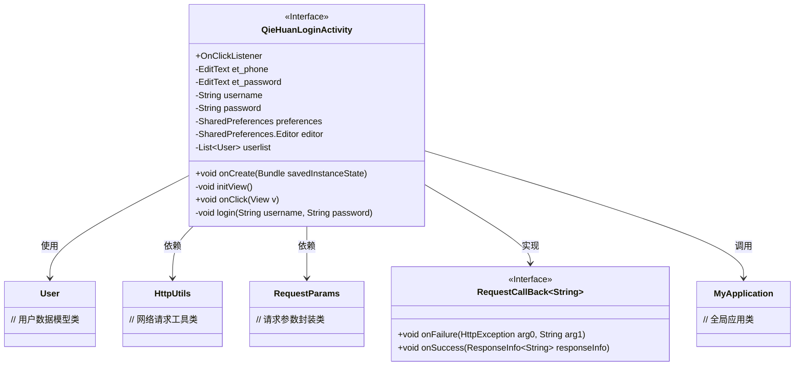
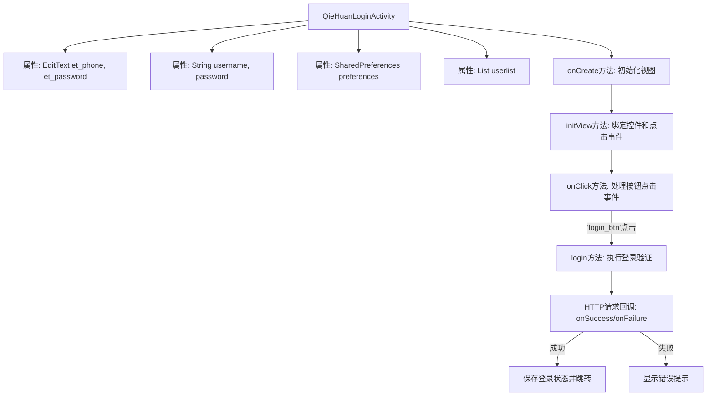
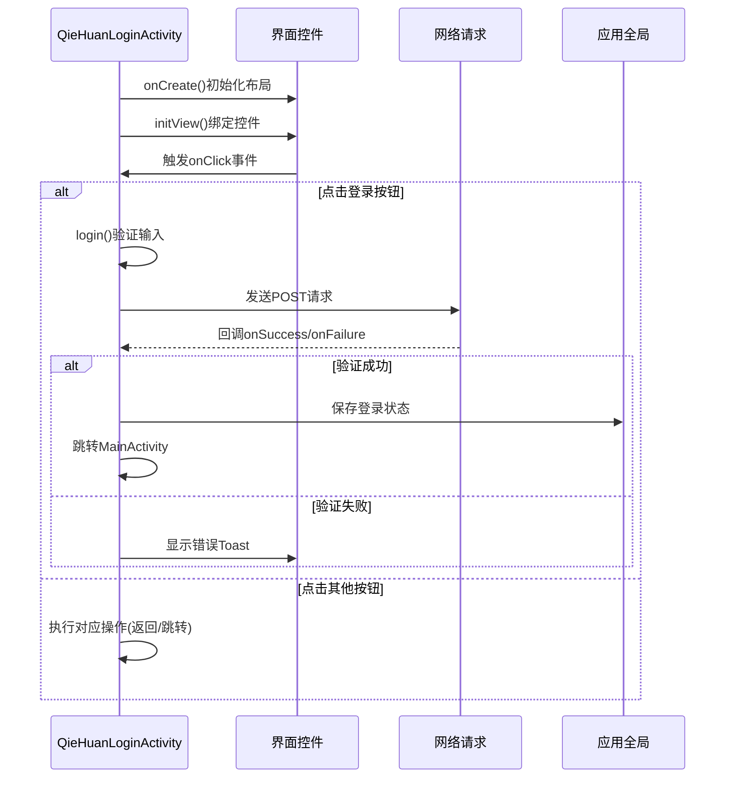

# 基础信息

|      |      |
|------|------|
| 名称 | QieHuanLoginActivity |
| 编码语言 | .java |
| 代码路径 | happycat/src/com/happycat/QieHuanLoginActivity.java |
| 包名 | com.happycat |
| 依赖项 | ['java.lang.reflect.Type', 'java.util.ArrayList', 'java.util.List', 'android.R.string', 'android.app.Activity', 'android.content.Intent', 'android.content.SharedPreferences', 'android.os.Bundle', 'android.util.Log', 'android.view.View', 'android.view.View.OnClickListener', 'android.widget.Button', 'android.widget.EditText', 'android.widget.Toast', 'com.example.happucat.R', 'com.google.gson.Gson', 'com.google.gson.reflect.TypeToken', 'com.happycat.Bean.User', 'com.happycat.Bean.goodsclassify', 'com.happycat.global.GlobalContacts', 'com.happycat.util.ActivitiyUtils', 'com.happycat.util.MyApplication', 'com.happycat.util.StringUtils', 'com.lidroid.xutils.HttpUtils', 'com.lidroid.xutils.exception.HttpException', 'com.lidroid.xutils.http.RequestParams', 'com.lidroid.xutils.http.ResponseInfo', 'com.lidroid.xutils.http.callback.RequestCallBack', 'com.lidroid.xutils.http.client.HttpRequest.HttpMethod'] |
| 概述说明 | 这是一个登录活动类，包含用户输入验证、登录请求处理和界面跳转功能。通过HTTP POST请求验证用户信息，成功登录后保存用户状态并跳转至主界面，失败则提示错误。支持返回、注册、忘记密码等按钮点击事件。 |

# 说明

该代码描述了一个登录活动类QieHuanLoginActivity，继承自Activity并实现点击监听接口。类中包含手机号和密码输入框控件，用户列表及SharedPreferences存储对象。在onCreate方法中初始化视图并设置标题栏布局。initView方法初始化各控件并绑定点击事件。点击事件处理包括返回、注册、忘记密码和登录功能。登录时验证输入有效性，通过HttpUtils发送POST请求验证用户信息，成功后将用户数据保存至MyApplication并跳转至主界面，失败则提示错误。登录成功时保存用户ID、手机号、密码及地址信息至全局变量。

# 类列表 Class Summary

| 名称   | 类型  | 说明 |
|-------|------|-------------|
| QieHuanLoginActivity | class | 这是一个Android登录活动类，包含手机号和密码输入框，处理返回、注册、忘记密码和登录按钮点击事件。登录时验证用户信息，成功后跳转主界面并保存用户状态。 |

## 类 QieHuanLoginActivity

|      |      |
|------|------|
| 访问范围 | public |
| 类型 | class |
| 名称 | QieHuanLoginActivity |
| 说明 | 这是一个Android登录活动类，包含手机号和密码输入框，处理返回、注册、忘记密码和登录按钮点击事件。登录时验证用户信息，成功后跳转主界面并保存用户状态。 |

### UML类图

这段代码描述了一个Android登录活动类(QieHuanLoginActivity)，它实现了OnClickListener接口来处理各种按钮点击事件。该类包含用户界面元素(EditText)、用户数据存储(SharedPreferences)和网络登录功能(HttpUtils)。通过流程图可以看到，该类主要负责：1)初始化视图组件；2)处理返回、注册、忘记密码和登录等按钮点击；3)执行用户名密码验证；4)通过HTTP POST请求与服务器交互；5)处理登录成功/失败的回调。成功登录后会跳转到MainActivity并保存用户状态到MyApplication中。整个流程展示了从用户输入到服务器验证的完整登录过程。

### 内部方法调用关系图

这段代码实现了一个登录Activity，主要包含界面初始化、点击事件处理和网络登录验证三个核心功能。流程图展示了类结构和主要方法调用关系，时序图详细描述了从界面操作到网络请求的完整交互过程。代码通过SharedPreferences持久化登录状态，使用HttpUtils进行网络请求，并通过Gson解析返回的JSON数据。特别注意处理了登录成功/失败的不同分支，以及各种按钮点击事件的响应逻辑。

### 字段列表 Field List

| 名称  | 类型  | 说明 |
|-------|-------|------|
| username | String | 声明字符串变量username |
| userlist = new ArrayList<User>() | List<User> | 创建存储用户对象的动态数组。 |
| preferences | SharedPreferences | 定义SharedPreferences对象preferences，用于存储轻量级键值对数据。 |
| et_password | EditText | 定义两个EditText控件变量：et_phone和et_password。 |
| editor | SharedPreferences.Editor | SharedPreferences.Editor用于修改SharedPreferences数据，提供键值对存储的编辑接口。 |
| password | String | 声明字符串变量password |

### 方法列表

| 名称  | 类型  | 说明 |
|-------|-------|------|
| initView | void | 初始化视图组件并设置点击监听器，包括手机号、密码输入框及多个按钮。 |
| onClick | void | 点击返回按钮退出当前页；点击注册或忘记密码跳转对应页并关闭当前页；点击登录验证账号密码后执行登录；点击注册仅跳转不关闭当前页。 |
| onCreate | void | Android Activity的onCreate方法，初始化登录界面布局，设置自定义标题栏并调用初始化视图方法。 |
| login | void | 登录方法：获取用户名密码，POST请求验证，成功保存用户信息跳转主页，失败提示用户不存在或失败。 |

