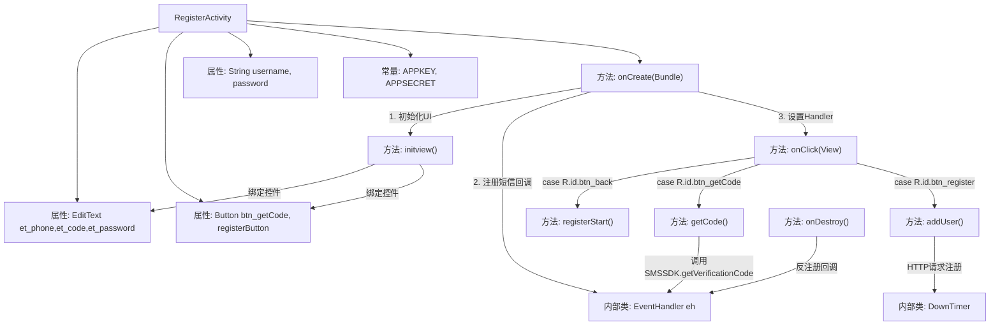

# 基础信息

|      |      |
|------|------|
| 名称 | RegisterActivity |
| 编码语言 | .java |
| 代码路径 | happycat/src/com/happycat/RegisterActivity.java |
| 包名 | com.happycat |
| 依赖项 | ['cn.smssdk.EventHandler', 'cn.smssdk.SMSSDK', 'com.example.happucat.R', 'com.happycat.global.GlobalContacts', 'com.happycat.util.ActivitiyUtils', 'com.happycat.util.StringUtils', 'com.lidroid.xutils.HttpUtils', 'com.lidroid.xutils.exception.HttpException', 'com.lidroid.xutils.http.RequestParams', 'com.lidroid.xutils.http.ResponseInfo', 'com.lidroid.xutils.http.callback.RequestCallBack', 'com.lidroid.xutils.http.client.HttpRequest.HttpMethod', 'android.annotation.SuppressLint', 'android.app.Activity', 'android.content.Intent', 'android.os.Bundle', 'android.os.CountDownTimer', 'android.os.Handler', 'android.os.Message', 'android.util.Log', 'android.view.View', 'android.view.View.OnClickListener', 'android.widget.Button', 'android.widget.EditText', 'android.widget.Toast'] |
| 概述说明 | 注册页面Activity，包含手机号、验证码、密码输入框及获取验证码和注册按钮。使用SMSSDK进行验证码发送与校验，注册成功后提交用户信息至服务器，并处理倒计时和回调事件。 |

# 说明

RegisterActivity是一个安卓注册页面，继承Activity并实现点击监听。包含手机号、验证码、密码输入框，以及获取验证码和注册按钮。初始化时配置短信SDK的APPKEY和APPSECRET，注册短信回调事件。点击获取验证码会校验手机号并调用SDK发送验证码，启动60秒倒计时。点击注册按钮会校验验证码，通过后提交用户名和密码到服务器进行注册。服务器返回成功则跳转主页面，失败提示账号已注册。页面销毁时需注销短信回调防止内存泄漏。整个流程包含短信验证、网络请求、倒计时等功能模块。

# 类列表 Class Summary

| 名称   | 类型  | 说明 |
|-------|------|-------------|
| RegisterActivity | class | 注册页面实现短信验证功能，包含获取验证码、提交验证、用户注册及数据库存储，使用SMSSDK进行验证码发送与校验。 |


## 类 RegisterActivity

|      |      |
|------|------|
| 访问范围 | public |
| 类型 | class |
| 名称 | RegisterActivity |
| 说明 | 注册页面实现短信验证功能，包含获取验证码、提交验证、用户注册及数据库存储，使用SMSSDK进行验证码发送与校验。 |


### UML类图

```mermaid
classDiagram
    class Activity {
        <<android.app.Activity>>
    }
    
    class OnClickListener {
        <<Interface>>
        +onClick(View v) void
    }
    
    class RegisterActivity {
        -EditText et_phone
        -EditText et_code
        -EditText et_password
        -Button btn_getCode
        -Button registerButton
        -String username
        -String password
        -static String APPKEY
        -static String APPSECRET
        -Handler handler
        -EventHandler eh
        +onCreate(Bundle savedInstanceState) void
        -initview() void
        +onClick(View v) void
        -registerStart() void
        -getCode() void
        -addUser() void
        -DownTimer~inner~ : CountDownTimer
    }
    
    class SMSSDK {
        <<static>>
        +initSDK(Context ctx, String appkey, String appsecret) void
        +getVerificationCode(String country, String phone) void
        +registerEventHandler(EventHandler handler) void
        +unregisterAllEventHandler() void
    }
    
    class EventHandler {
        <<abstract>>
        +afterEvent(int event, int result, Object data) void
    }
    
    class Handler {
        <<android.os.Handler>>
        +handleMessage(Message msg) void
    }
    
    class CountDownTimer {
        <<android.os.CountDownTimer>>
        +onTick(long millisUntilFinished) void
        +onFinish() void
    }
    
    class HttpUtils {
        +send(HttpMethod method, String url, RequestParams params, RequestCallBack~String~ callback) void
    }
    
    class RequestParams {
        +addQueryStringParameter(String key, String value) void
        +addBodyParameter(String key, String value) void
    }
    
    class RequestCallBack~T~ {
        <<Interface>>
        +onSuccess(ResponseInfo~T~ responseInfo) void
        +onFailure(HttpException error, String msg) void
    }
    
    Activity <|-- RegisterActivity
    OnClickListener <|.. RegisterActivity
    RegisterActivity --> SMSSDK : 使用
    RegisterActivity --> EventHandler : 包含
    RegisterActivity --> Handler : 包含
    RegisterActivity --> CountDownTimer : 包含
    RegisterActivity --> HttpUtils : 使用
    RegisterActivity --> RequestParams : 使用
    RegisterActivity ..> RequestCallBack~String~ : 实现
    EventHandler <|.. RegisterActivity$1
    CountDownTimer <|-- RegisterActivity$DownTimer
```

这段代码描述了一个Android注册活动(RegisterActivity)，它继承自Activity并实现了OnClickListener接口。主要功能包括：通过SMSSDK获取短信验证码、验证用户输入、注册新用户并通过HTTP请求将用户数据提交到服务器。类图中展示了核心组件及其关系，包括UI控件、短信SDK集成、倒计时功能、网络请求处理等模块。该活动通过事件处理器(EventHandler)处理短信验证结果，使用自定义的DownTimer实现验证码获取倒计时，并通过HttpUtils发送注册请求到服务器。


### 内部方法调用关系图



这段代码实现了一个手机注册功能，主要流程包括：初始化界面控件、短信验证码获取与验证、用户注册信息提交。通过SMSSDK实现短信验证功能，使用Handler处理异步消息，DownTimer实现验证码倒计时，最后通过HTTP请求将用户数据提交到服务器。代码结构清晰，但需要注意内存泄漏防护和网络请求异常处理。

### 字段列表 Field List

| 名称  | 类型  | 说明 |
|-------|-------|------|
| APPKEY="b6f91b24020b" | String | 私有静态字符串变量APPKEY，值为"b6f91b24020b"。 |
| username | String | 声明字符串变量username |
| registerButton | Button | 界面包含两个按钮：获取验证码按钮btn_getCode和注册按钮registerButton。 |
| APPSECRET="b6d3d9b2908868d8e95d8728f45746a9" | String | 代码定义了一个私有静态字符串常量APPSECRET，值为b6d3d9b2908868d8e95d8728f45746a9。 |
| password | String | 私有字符串类型变量password |
| eh=new EventHandler(){	        @Override	        public void afterEvent(int event, int result, Object data) {	            if (result == SMSSDK.RESULT_COMPLETE) {	                //回调完成	                if (event == SMSSDK.EVENT_SUBMIT_VERIFICATION_CODE) {	                    //提交验证码成功	                    Log.e("event", "提交验证码成功");	                    Message message=new Message();	                    message.what=0;	                    message.obj="提交验证码成功";	                    handler.sendMessage(message);	                }else if (event == SMSSDK.EVENT_GET_VERIFICATION_CODE){	                    //获取验证码成功	                    Log.e("event", "获取验证码成功");	                    Message message=new Message();						Bundle bundle=new Bundle();						bundle.putString("msg", "验证码已发送至您的手机,有效时间5分钟，请及时填写！");						message.setData(bundle);						handler.sendMessage(message);	                }else if (event ==SMSSDK.EVENT_GET_SUPPORTED_COUNTRIES){	                    //返回支持发送验证码的国家列表	                }	            }else{	                ((Throwable)data).printStackTrace();	                System.err.println("------获取验证码出错---------");					Message message=new Message();					message.what=0;					Bundle bundle=new Bundle();					bundle.putString("msg", "验证码发送失败，请检查网络稍候重试！");					message.setData(bundle);					handler.sendMessage(message);	            }	        }	    } | EventHandler | 定义事件处理器处理短信验证码操作：提交验证码成功、获取验证码成功、国家列表返回时记录日志并发送消息；出错时打印异常并发送失败消息。 |
| handler | Handler | 私有Handler对象，用于处理消息或任务。 |
| et_password | EditText | 定义了三个EditText控件变量：et_phone（电话）、et_code（验证码）、et_password（密码）。 |

### 方法列表

| 名称  | 类型  | 说明 |
|-------|-------|------|
| addUser | void | 方法addUser获取用户名密码，通过POST请求上传至服务器，成功跳转主页，失败提示账号已注册。 |
| onClick | void | 点击返回按钮显示提示并关闭页面；点击获取验证码按钮执行getCode方法；点击注册按钮执行registerStart和addUser方法。 |
| onCreate | void | 注册Activity初始化：加载布局、启动短信SDK、设置标题栏、初始化视图、处理消息回调。 |
| onDestroy | void | Android生命周期方法onDestroy中调用SMSSDK注销所有事件处理器，确保资源释放。 |
| getCode | void | 方法getCode验证手机号格式，若无效则返回。有效时获取手机号，请求短信验证码，禁用按钮并启动60秒倒计时。 |
| registerStart | void | 方法registerStart检查手机号和验证码非空，若为空则直接返回。注释显示原计划获取输入但未实现。 |
| initview | void | 初始化视图组件：获取手机号、密码、验证码输入框及注册、获取验证码、返回按钮，并设置点击监听器。 |


