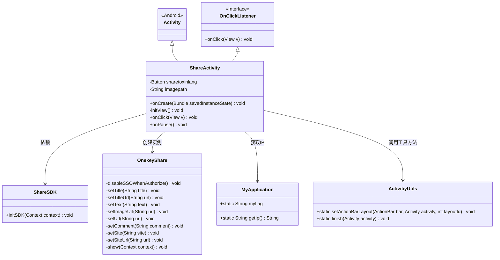
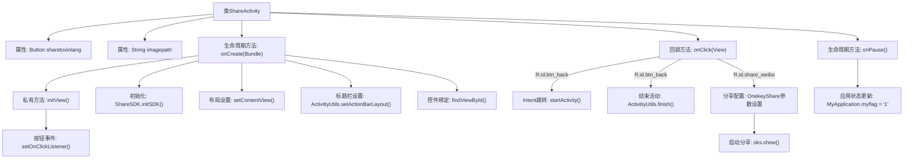

# 基础信息

|      |      |
|------|------|
| 名称 | ShareActivity |
| 编码语言 | .java |
| 代码路径 | happycat/src/com/happycat/ShareActivity.java |
| 包名 | com.happycat |
| 依赖项 | ['cn.sharesdk.framework.ShareSDK', 'cn.sharesdk.onekeyshare.OnekeyShare', 'com.example.happucat.R', 'com.happycat.util.ActivitiyUtils', 'com.happycat.util.MyApplication', 'com.happycat.util.StringUtils', 'android.app.Activity', 'android.content.Intent', 'android.os.Bundle', 'android.view.View', 'android.view.View.OnClickListener', 'android.widget.Button'] |
| 概述说明 | ShareActivity实现点击分享功能，初始化ShareSDK，设置微博分享内容，包括标题、文本、图片链接等，点击按钮可返回主界面或启动分享界面。 |

# 说明

ShareActivity是一个继承Activity的类，实现了点击监听接口。包含分享按钮和图片路径变量。在onCreate中初始化ShareSDK和界面布局，设置标题栏和按钮。initView方法为返回和分享按钮设置点击监听。点击返回按钮跳转至MainActivity并结束当前界面。点击分享按钮时，初始化ShareSDK并配置OnekeyShare参数，包括标题、文本、图片URL、链接等，最后调用show方法启动分享界面。在onPause方法中设置全局标志位为1。

# 类列表 Class Summary

| 名称   | 类型  | 说明 |
|-------|------|-------------|
| ShareActivity | class | ShareActivity实现分享功能，包含返回按钮和微博分享按钮，使用ShareSDK初始化并配置分享内容，支持标题、文本、图片及链接等参数，点击分享按钮调用OnekeyShare进行分享。 |

## 类 ShareActivity

|      |      |
|------|------|
| 访问范围 | public |
| 类型 | class |
| 名称 | ShareActivity |
| 说明 | ShareActivity实现分享功能，包含返回按钮和微博分享按钮，使用ShareSDK初始化并配置分享内容，支持标题、文本、图片及链接等参数，点击分享按钮调用OnekeyShare进行分享。 |

### UML类图

类图描述：
ShareActivity继承自Android的Activity类并实现了OnClickListener接口，主要处理社交分享功能。它通过ShareSDK进行初始化，使用OnekeyShare类配置和展示分享界面，同时依赖MyApplication获取服务器IP地址，调用ActivitiyUtils的工具方法进行界面管理。类图中清晰展示了继承关系、接口实现和关键依赖关系，体现了Android活动中典型的初始化、事件处理和资源管理流程。

### 内部方法调用关系图

这段代码描述了一个社交分享功能的Android活动类，主要包含界面初始化、按钮点击处理和微博分享功能。流程图展示了从活动创建(onCreate)到视图初始化(initView)，再到点击事件处理(onClick)的完整流程，其中包含返回按钮的页面跳转和分享按钮的复杂配置过程。最后在onPause时更新应用状态标志位，整体结构清晰展示了社交分享功能的核心实现路径。

### 字段列表 Field List

| 名称  | 类型  | 说明 |
|-------|-------|------|
| sharetoxinlang | Button | 按钮控件，标识为sharetoxinlang。 |
| imagepath | String | 声明一个私有字符串变量imagepath，用于存储图片路径。 |

### 方法列表

| 名称  | 类型  | 说明 |
|-------|-------|------|
| onPause | void | 重写Android的onPause方法，调用父类方法后设置MyApplication的myflag为"1"。 |
| onClick | void | 点击按钮执行不同操作：返回主页或调用ShareSDK分享到微博，设置标题、文本、图片链接等参数后启动分享界面。 |
| initView | void | 初始化视图，设置返回按钮和微博分享按钮的点击监听器。 |
| onCreate | void | Android Activity初始化代码，包含ShareSDK初始化、布局设置、标题栏配置和微博分享按钮绑定。 |

