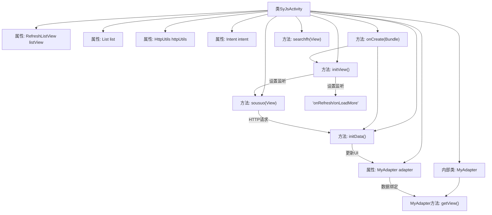

# 基础信息

|      |      |
|------|------|
| 名称 | SyJsActivity |
| 编码语言 | .java |
| 代码路径 | happycat/src/com/happycat/SyJsActivity.java |
| 包名 | com.happycat |
| 依赖项 | ['java.io.UnsupportedEncodingException', 'java.lang.reflect.Type', 'java.net.URLEncoder', 'java.util.ArrayList', 'java.util.List', 'org.json.JSONArray', 'org.json.JSONException', 'org.json.JSONObject', 'com.example.happucat.R', 'com.google.gson.Gson', 'com.google.gson.reflect.TypeToken', 'com.happycat.Bean.SouSuoBean', 'com.happycat.util.MyApplication', 'com.happycat.util.RefreshListView', 'com.happycat.util.RefreshListView.OnRefreshListener', 'com.happycat.util.SearchClearEditText', 'com.lidroid.xutils.HttpUtils', 'com.lidroid.xutils.exception.HttpException', 'com.lidroid.xutils.http.RequestParams', 'com.lidroid.xutils.http.ResponseInfo', 'com.lidroid.xutils.http.callback.RequestCallBack', 'com.lidroid.xutils.http.client.HttpRequest.HttpMethod', 'android.os.Bundle', 'android.R.integer', 'android.app.ActionBar', 'android.app.Activity', 'android.content.Context', 'android.content.Intent', 'android.util.Log', 'android.view.LayoutInflater', 'android.view.View', 'android.view.ViewGroup', 'android.widget.AdapterView', 'android.widget.AdapterView.OnItemClickListener', 'android.widget.BaseAdapter', 'android.widget.ImageView', 'android.widget.ListView', 'android.widget.RadioButton', 'android.widget.TextView', 'android.widget.Toast'] |
| 概述说明 | Android活动类SyJsActivity实现搜索功能，包含列表展示、分页加载、数据请求及适配器处理，使用Gson解析JSON数据，支持点击跳转详情页。 |

# 说明

SyJsActivity是一个Android活动类，主要用于实现搜索功能并展示搜索结果列表。该类包含一个RefreshListView用于显示搜索结果列表，以及一个SearchClearEditText用于输入搜索关键词。通过HttpUtils发送POST请求到指定URL获取搜索结果，使用Gson解析返回的JSON数据并更新列表。列表支持下拉刷新和上拉加载更多功能，点击列表项会跳转到MerchatDataActivity展示详细信息。MyAdapter是自定义适配器，负责列表项的布局和数据绑定，包含商家名称、配送时长、商品信息等字段，并使用图片加载库显示商品图片。

# 类列表 Class Summary

| 名称   | 类型  | 说明 |
|-------|------|-------------|
| SyJsActivity | class | SyJsActivity是一个Android活动类，包含搜索功能、列表展示和分页加载。使用HttpUtils进行网络请求，Gson解析数据，RefreshListView实现下拉刷新和上拉加载。点击列表项跳转至详情页。适配器MyAdapter负责列表项的数据绑定和视图展示。 |


## 类 SyJsActivity

|      |      |
|------|------|
| 访问范围 | public |
| 类型 | class |
| 名称 | SyJsActivity |
| 说明 | SyJsActivity是一个Android活动类，包含搜索功能、列表展示和分页加载。使用HttpUtils进行网络请求，Gson解析数据，RefreshListView实现下拉刷新和上拉加载。点击列表项跳转至详情页。适配器MyAdapter负责列表项的数据绑定和视图展示。 |


### UML类图

```mermaid
classDiagram
    class SyJsActivity {
        -RefreshListView listView
        -MyAdapter adapter
        -List~SouSuoBean~ list
        -HttpUtils httpUtils
        -Intent intent
        -View footer
        -int pageNow
        -SearchClearEditText editText
        -List~SouSuoBean~ beans
        -String url
        +void onCreate(Bundle savedInstanceState)
        +void searchfh(View view)
        +void sousuo(View view)
        -void initView()
        -void initData()
    }

    class MyAdapter {
        -Context context
        -List~SouSuoBean~ lista
        -LayoutInflater minflater
        -TextView textView
        -RadioButton radioButton
        -ViewHolder mHolder
        +MyAdapter(Context context, List~SouSuoBean~ lista)
        +void addAll(List~SouSuoBean~ picture)
        +int getCount()
        +Object getItem(int arg0)
        +long getItemId(int arg0)
        +View getView(int position, View convertView, ViewGroup parent)
    }

    class ViewHolder {
        -TextView textView1
        -TextView textView2
        -TextView textView3
        -TextView textView4
        -TextView textView5
        -ImageView imageView
    }

    class SouSuoBean {
        <<DataClass>>
        // 省略具体属性和方法
    }

    class HttpUtils {
        +void send(HttpMethod method, String url, RequestParams params, RequestCallBack~String~ callBack)
    }

    class RequestParams {
        +void addBodyParameter(String key, String value)
    }

    interface RequestCallBack~T~ {
        <<Interface>>
        +void onSuccess(ResponseInfo~T~ responseInfo)
        +void onFailure(HttpException error, String msg)
    }

    SyJsActivity --> MyAdapter : 使用
    SyJsActivity --> HttpUtils : 依赖
    SyJsActivity --> RequestParams : 依赖
    SyJsActivity --> RequestCallBack : 实现回调
    MyAdapter --> ViewHolder : 使用
    MyAdapter --> SouSuoBean : 操作数据
    HttpUtils --> RequestCallBack : 回调通知
```

该代码实现了一个Android商品搜索功能的活动页面，包含列表展示、网络请求、数据解析和适配器逻辑。SyJsActivity作为主控制器，通过HttpUtils发送POST请求获取商品数据，使用MyAdapter展示SouSuoBean列表数据，并实现下拉刷新和加载更多功能。类图展示了核心组件间的协作关系，包括活动、适配器、网络工具和数据模型等关键类及其交互方式。


### 内部方法调用关系图



这段代码是一个Android活动类，主要实现商品搜索和列表展示功能。流程图展示了类结构关系，包含属性声明、主要方法调用链和内部适配器的工作流程。核心逻辑是通过HTTP请求获取商品数据，使用自定义适配器渲染列表，并实现下拉刷新/上拉加载功能。初始化时加载数据，搜索时重新请求，点击条目跳转详情页，整体采用MVC架构模式。

### 字段列表 Field List

| 名称  | 类型  | 说明 |
|-------|-------|------|
| list = new ArrayList<SouSuoBean>() | List<SouSuoBean> | 创建名为list的ArrayList，存储SouSuoBean类型对象。 |
| httpUtils | HttpUtils | HttpUtils是一个工具类，用于处理HTTP相关操作。 |
| beans | List<SouSuoBean> | 定义了一个名为beans的列表，其元素类型为SouSuoBean。 |
| pageNow = 1 | int | 当前页码为1。 |
| url = "http://" + MyApplication.getIp()			+ ":8080/happycat/GetUpload" | String | 私有字符串url由基础URL、应用IP和路径拼接而成，指向GetUpload服务。 |
| adapter | MyAdapter | 声明一个名为adapter的MyAdapter类型变量。 |
| footer | View | 视图页脚部分。 |
| intent | Intent | 声明一个意图对象。 |
| listView | RefreshListView | 定义了一个名为listView的RefreshListView控件实例。 |
| editText | SearchClearEditText | 定义了一个名为editText的SearchClearEditText类型变量。 |

### 方法列表

| 名称  | 类型  | 说明 |
|-------|-------|------|
| sousuo | void | 方法sousuo处理搜索请求：获取输入文本，编码后通过POST请求发送，参数包括key、pageNow和goodsname。成功返回时解析JSON数据更新列表，失败时刷新列表失败。异常时打印错误。 |
| searchfh | void | 方法searchfh结束当前活动。 |
| onCreate | void | Android Activity的onCreate方法：初始化视图、数据，隐藏ActionBar。 |
| initData | void | 方法initData获取输入文本，编码后通过POST请求发送参数key、pageNow和goodsname到指定URL，成功返回后解析JSON数据更新列表，失败则刷新列表失败。 |
| initView | void | 初始化视图，设置列表适配器和刷新监听，处理搜索和分页加载，点击跳转详情页。 |


