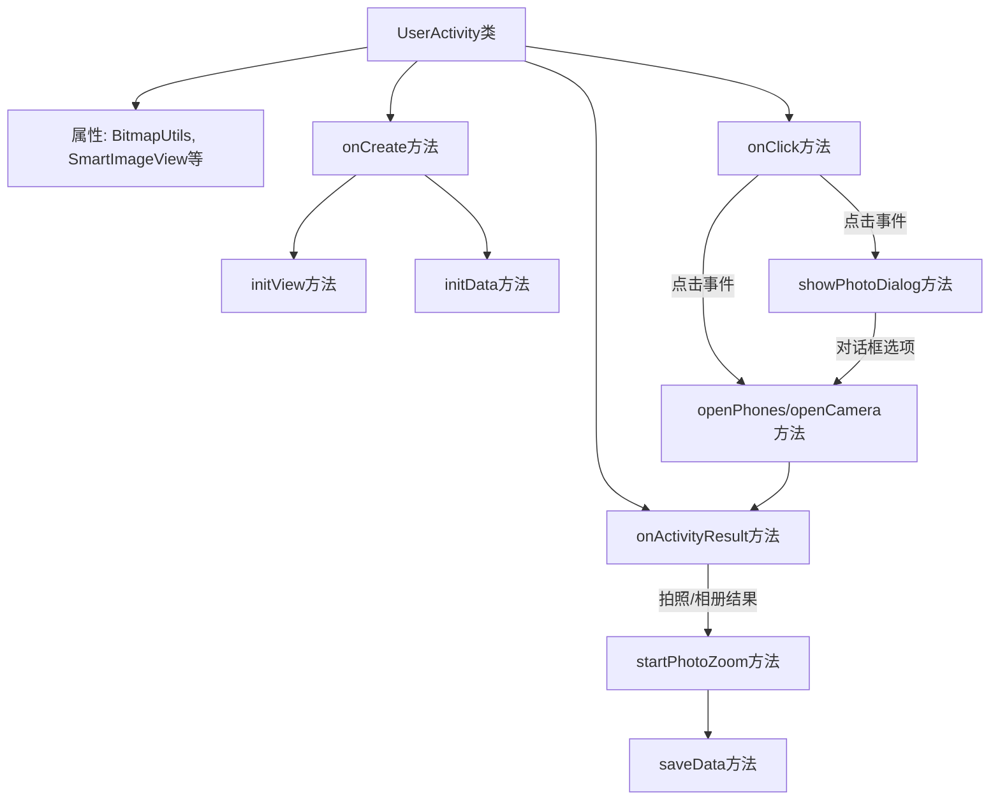
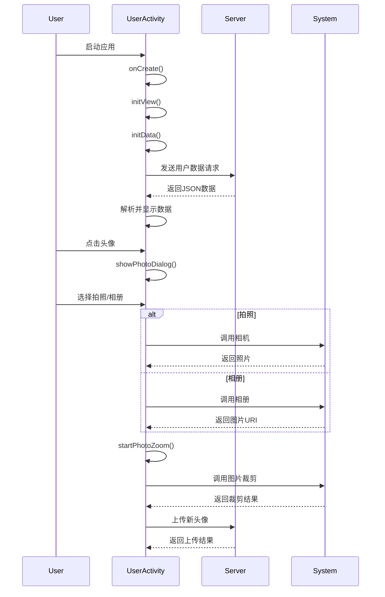

# 基础信息

|      |      |
|------|------|
| 名称 | UserActivity |
| 编码语言 | .java |
| 代码路径 | happycat/src/com/happycat/UserActivity.java |
| 包名 | com.happycat |
| 依赖项 | ['image.SmartImageView', 'java.io.File', 'java.lang.reflect.Type', 'java.util.ArrayList', 'java.util.List', 'com.example.happucat.R', 'com.google.gson.Gson', 'com.google.gson.reflect.TypeToken', 'com.happycat.Bean.User', 'com.happycat.util.ActivitiyUtils', 'com.happycat.util.MyApplication', 'com.happycat.util.StringUtils', 'com.happycat.view.Circleimage', 'com.lidroid.xutils.BitmapUtils', 'com.lidroid.xutils.HttpUtils', 'com.lidroid.xutils.exception.HttpException', 'com.lidroid.xutils.http.RequestParams', 'com.lidroid.xutils.http.ResponseInfo', 'com.lidroid.xutils.http.callback.RequestCallBack', 'com.lidroid.xutils.http.client.HttpRequest.HttpMethod', 'android.annotation.SuppressLint', 'android.app.Activity', 'android.app.Dialog', 'android.content.Intent', 'android.graphics.Bitmap', 'android.graphics.BitmapFactory', 'android.net.Uri', 'android.os.Bundle', 'android.os.Environment', 'android.provider.MediaStore', 'android.util.Log', 'android.view.LayoutInflater', 'android.view.View', 'android.view.ViewGroup', 'android.view.Window', 'android.view.WindowManager', 'android.view.View.OnClickListener', 'android.view.ViewGroup.LayoutParams', 'android.widget.ImageView', 'android.widget.RelativeLayout', 'android.widget.TextView', 'android.widget.Toast'] |
| 概述说明 | Android用户详情页Activity，包含头像上传、个人信息展示、修改密码功能，通过HTTP请求获取用户数据并显示，支持相机和图库选择头像，裁剪后上传至服务器。 |

# 说明

该代码定义了一个名为UserActivity的Android活动类，主要用于管理用户个人资料界面。活动包含用户信息显示、头像修改、资料编辑和密码修改功能。通过HTTP请求从服务器获取用户数据，使用Gson解析JSON响应并填充到界面文本视图。支持相机和图库选择头像图片，提供裁剪功能并将结果上传至服务器。界面包含返回按钮、头像区域、用户名、性别、电话和地址等可点击修改的字段，点击事件通过switch-case处理不同操作。活动还实现了照片选择对话框和结果处理逻辑，确保用户交互流畅。

# 类列表 Class Summary

| 名称   | 类型  | 说明 |
|-------|------|-------------|
| UserActivity | class | UserActivity实现用户资料展示与修改功能，包括头像上传、个人信息更新、密码修改等操作，通过HTTP请求与服务器交互。 |


## 类 UserActivity

|      |      |
|------|------|
| 访问范围 | public |
| 类型 | class |
| 名称 | UserActivity |
| 说明 | UserActivity实现用户资料展示与修改功能，包括头像上传、个人信息更新、密码修改等操作，通过HTTP请求与服务器交互。 |


### UML类图

```mermaid
classDiagram
    class Activity {
        <<Interface>>
    }
    class OnClickListener {
        <<Interface>>
        +onClick(View v) void
    }
    class UserActivity {
        -BitmapUtils bitmapUtils
        -SmartImageView civ_photo
        -LayoutInflater mInflater
        -Dialog dialog
        -String filepath
        -RelativeLayout my_password
        -String filename
        -Uri uri
        -List~User~ userList
        -String imagurl
        -TextView name, phone, sex, address
        -String province, city, district, detail
        +onCreate(Bundle savedInstanceState) void
        -initData() void
        -initView() void
        +onClick(View v) void
        -openPhones() void
        -openCamera() void
        +onActivityResult(int requestCode, int resultCode, Intent data) void
        -startPhotoZoom(Uri uri) void
        -showPhotoDialog() void
        -saveData() void
        +onPause() void
    }
    class BitmapUtils {
        +display(ImageView imageView, String uri) void
    }
    class SmartImageView {
        +setImageBitmap(Bitmap bitmap) void
        +setOnClickListener(OnClickListener listener) void
    }
    class HttpUtils {
        +send(HttpMethod method, String url, RequestParams params, RequestCallBack~String~ callback) void
    }
    class RequestParams {
        +addBodyParameter(String key, String value) void
        +addBodyParameter(String key, File file) void
    }
    class RequestCallBack~T~ {
        <<Interface>>
        +onSuccess(ResponseInfo~T~ responseInfo) void
        +onFailure(HttpException error, String msg) void
    }
    class Gson {
        +fromJson(String json, Type typeOfT) Object
    }
    class TypeToken~T~ {
        +getType() Type
    }
    class User {
        +getUname() String
        +getSex() String
        +getUprovince() String
        +getUcity() String
        +getUcountry() String
        +getUdetail() String
        +getUimg() String
    }
    class MyApplication {
        +static String SP_user_phone
        +static String SP_user_id
        +static String myflag
        +static BitmapUtils bitmapUtils
        +static String getIp() String
    }
    class Circleimage {
        +toRoundBitmap(Bitmap bitmap) Bitmap
    }

    UserActivity --|> Activity
    UserActivity ..|> OnClickListener
    UserActivity --> BitmapUtils : 使用
    UserActivity --> SmartImageView : 包含
    UserActivity --> HttpUtils : 使用
    UserActivity --> RequestParams : 使用
    UserActivity --> Gson : 使用
    UserActivity --> TypeToken~List~User~~ : 使用
    UserActivity --> User : 包含
    UserActivity --> MyApplication : 依赖
    UserActivity --> Circleimage : 使用
    HttpUtils --> RequestCallBack~String~ : 回调
    Gson --> TypeToken~List~User~~ : 依赖
```

这段类图展示了UserActivity的结构及其与其他类的关系。UserActivity继承自Activity并实现了OnClickListener接口，主要负责用户个人资料展示和编辑功能。它包含多个UI组件（如SmartImageView、TextView）和工具类（如BitmapUtils、HttpUtils），通过Gson解析JSON数据并填充用户信息。类图清晰地呈现了数据流（从网络请求到UI展示）和交互逻辑（点击事件处理），体现了Android应用中典型的MVC模式实现。


### 内部方法调用关系图





这段代码实现了一个用户资料管理Activity，主要功能包括：初始化用户界面、从服务器加载用户数据、处理头像修改（支持拍照和相册选择）、用户信息更新等。流程图展示了类内部的方法调用关系，时序图则详细描述了用户交互时的系统协作过程。代码通过HttpUtils进行网络通信，使用Gson解析JSON数据，并实现了完整的图片处理流程，包括拍照、相册选择、图片裁剪和上传功能。

### 字段列表 Field List

| 名称  | 类型  | 说明 |
|-------|-------|------|
| bitmapUtils | BitmapUtils | 私有Bitmap工具类实例。 |
| mInflater | LayoutInflater | 私有布局填充器mInflater。 |
| civ_photo | SmartImageView | 私有成员变量SmartImageView civ_photo，用于图片显示。 |
| detail | String | 定义四个字符串变量：省、市、区、详细地址。 |
| filepath | String | 私有字符串变量filepath，用于存储文件路径。 |
| imagurl = "http://" + MyApplication.getIp() + ":8080/happycat/img/" | String | 代码拼接图片URL，使用应用IP地址和固定路径。 |
| uri | Uri | 私有URI变量uri。 |
| filename = System.currentTimeMillis() + ".jpg" | String | 使用当前时间戳生成JPG文件名。 |
| my_password | RelativeLayout | 私有相对布局控件my_password。 |
| dialog | Dialog | 对话框实例声明。 |
| address | TextView | 文本视图包含姓名、电话、性别、地址字段。 |
| userList = new ArrayList<User>() | List<User> | 创建存储User对象的动态数组userList。 |

### 方法列表

| 名称  | 类型  | 说明 |
|-------|-------|------|
| openCamera | void | 关闭对话框，创建拍照意图，指定存储路径为外部存储目录下的文件名，启动拍照活动并等待结果。 |
| openPhones | void | 关闭对话框后，创建意图选择图片并启动活动，请求码为2。 |
| initView | void | 初始化视图并设置点击事件，包括返回按钮、头像、用户名、性别、地址、修改密码等控件，同时获取相关文本视图的引用。 |
| onClick | void | 点击返回跳转主界面；点击头像显示照片对话框；点击修改资料跳转资料页；点击相机或图库打开对应功能；点击取消关闭对话框；点击修改密码跳转密码页。 |
| onCreate | void | Android Activity初始化代码：设置布局、自定义标题栏、初始化视图和数据。 |
| showPhotoDialog | void | 方法showPhotoDialog创建并显示一个底部弹出的照片选择对话框，包含拍照、相册和取消按钮，设置动画和布局参数，点击外围可关闭。 |
| saveData | void | 方法saveData通过HttpUtils发送POST请求，上传用户头像图片至指定URL，成功或失败时显示相应提示。 |
| onPause | void | Android生命周期方法onPause中设置全局变量myflag为1。 |
| initData | void | 初始化数据方法：创建BitmapUtils和HttpUtils，发送POST请求获取用户信息，解析JSON数据并更新UI显示用户姓名、性别、电话、地址和照片。 |
| startPhotoZoom | void | 启动图片裁剪功能，设置宽高比例1:1，输出尺寸500x500，结果保存至指定文件并返回数据。 |
| onActivityResult | void | 处理不同请求码的返回结果：0更新用户信息，1从相册获取图片，2拍照获取图片，3显示裁剪后图片并保存，4处理特定结果。 |


