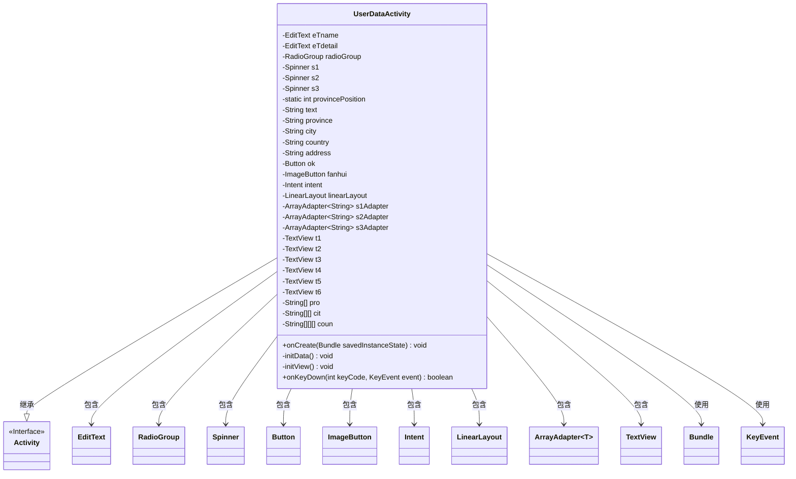
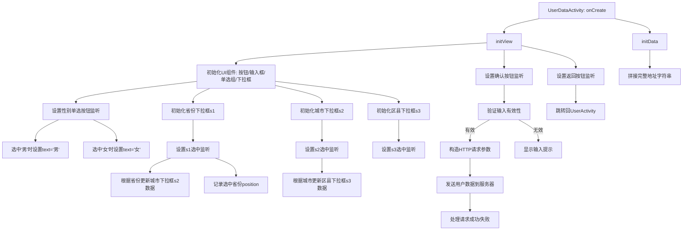

# 基础信息

|      |      |
|------|------|
| 名称 | UserDataActivity |
| 编码语言 | .java |
| 代码路径 | happycat/src/com/happycat/UserDataActivity.java |
| 包名 | com.happycat |
| 依赖项 | ['com.example.happucat.R', 'com.happycat.util.ActivitiyUtils', 'com.happycat.util.MyApplication', 'com.lidroid.xutils.HttpUtils', 'com.lidroid.xutils.exception.HttpException', 'com.lidroid.xutils.http.RequestParams', 'com.lidroid.xutils.http.ResponseInfo', 'com.lidroid.xutils.http.callback.RequestCallBack', 'com.lidroid.xutils.http.client.HttpRequest.HttpMethod', 'android.app.Activity', 'android.content.Intent', 'android.os.Bundle', 'android.util.Log', 'android.view.KeyEvent', 'android.view.View', 'android.view.View.OnClickListener', 'android.widget.AdapterView', 'android.widget.ArrayAdapter', 'android.widget.Button', 'android.widget.EditText', 'android.widget.ImageButton', 'android.widget.LinearLayout', 'android.widget.RadioButton', 'android.widget.RadioGroup', 'android.widget.Spinner', 'android.widget.TextView', 'android.widget.Toast', 'android.widget.AdapterView.OnItemSelectedListener'] |
| 概述说明 | UserDataActivity是一个Android用户数据编辑界面，包含姓名输入、性别选择、省市区三级联动选择及详细地址输入功能，支持数据提交和返回操作。 |

# 说明

该代码描述了一个用户数据编辑活动类UserDataActivity，继承自Activity类。主要功能包括：通过EditText控件获取用户昵称和详细地址，RadioGroup选择性别，三个Spinner控件实现省市区三级联动选择（包含江苏、河南、北京三个省份及其下属市县区数据）。界面包含返回按钮和确认按钮，点击确认时校验输入长度并通过HTTP POST请求提交数据到服务器。用户点击返回或物理返回键时，数据会通过Intent传递回UserActivity。地址由省市区及详细地址拼接而成，默认选中男性、江苏省南京市玄武区。

# 类列表 Class Summary

| 名称   | 类型  | 说明 |
|-------|------|-------------|
| UserDataActivity | class | Android用户数据编辑页面，包含昵称、性别选择、省市区三级联动及详细地址输入，数据验证后提交至服务器，支持返回和保存功能。 |

## 类 UserDataActivity

|      |      |
|------|------|
| 访问范围 | public |
| 类型 | class |
| 名称 | UserDataActivity |
| 说明 | Android用户数据编辑页面，包含昵称、性别选择、省市区三级联动及详细地址输入，数据验证后提交至服务器，支持返回和保存功能。 |

### UML类图

这段类图描述了UserDataActivity的结构和关系。UserDataActivity继承自Activity类，包含多个UI组件如EditText、RadioGroup、Spinner等，用于处理用户数据输入和显示。该类通过initView()初始化视图组件，通过initData()处理数据逻辑，并实现了onCreate()和onKeyDown()等生命周期方法。主要功能包括收集用户信息（昵称、性别、地址等），通过HTTP请求提交数据，并处理返回按钮事件。类中使用了多层嵌套的字符串数组来存储省市区数据，通过Spinner实现级联选择功能。

### 内部方法调用关系图

该流程图描述了Android用户数据编辑页面的完整生命周期控制逻辑。主要包含UI初始化、下拉框级联数据绑定、用户输入验证、网络请求处理三个核心模块。当用户修改个人信息时，系统会通过三级联动选择器收集省市区数据，组合详细地址后发送到服务端，同时处理各种用户交互事件如返回键和取消操作。整个过程严格遵循Android组件生命周期管理规范，确保数据一致性和界面响应性。

### 字段列表 Field List

| 名称  | 类型  | 说明 |
|-------|-------|------|
| ok | Button | 按钮确认。 |
| coun = new String[][][] {			{ { "玄武区", "白下区", "秦淮区", "建邺区", "鼓楼区", "下关区", "浦口区" },					{ "京口区 ", "润州区", "丹徒区" },					{ "武进区", "天宁区", "钟楼区", "新北区", "戚墅堰区" },					{ "崇安区", "南长区", "北塘区", "滨湖区", "无锡新区", "惠山区", "锡山区" },					{ "金阊区", "沧浪区", "平江区", "虎丘区", "吴中区", "相城区" },					{ "新浦区", "连云区", "海州区" }, { "亭湖区", "盐都区" },					{ "崇川区", "港闸区", "通州区" },					{ "云龙区", "鼓楼区", "九里区", "贾汪区", "泉山区" }, { "宿城区", "宿豫区" },					{ "清河区", "清浦区", "楚州区", "淮阴区" }, { "广陵区", "邗江区", "江都区" },					{ "海陵区", "高港区" } },			{					{ "管城回族区", "金水区", "二七区", "上街区", "中原区", "西北高新区", "东南高新区",							"郑东新区", "惠济区（邙山区）" },					{ "龙庭区", "金明区", "顺河区", "鼓楼区", "禹王台区" },					{ "涧西区 ", "西工区", "老城区", "瀍河回族区", "吉利区", "洛龙区" },					{ "新华区卫东区", "新城区", "高新区", "石龙区", "湛河区" },					{ "殷都区 ", "北关区", "文峰区", "龙安区 " },					{ "淇滨区", "山城区", "鹤山区" },					{ "卫滨区", "红旗区", "牧野区", "凤泉区", "高新技术产业开发区", "西工区", "小店工业区" },					{ "山阳区", "解放区", "中站区", "马村区" }, { "华龙区", "高新区" },					{ "郾城区", "源汇区", "召陵区" }, { "魏都区" }, { "湖滨区" },					{ "睢阳区", "梁园区", "开发区" }, { "驿城区" }, { "宛城区", "卧龙区" },					{ "浉河区", "平桥区" },					{ "克井镇", "五龙口镇", "轵城镇", "承留镇", "邵原镇", "坡头镇", "梨林镇", "大峪镇" } },			{ { "东城区", "西城区", "崇文区", "宣武区" }, { "朝阳区", "丰台区", "石景山区", "海淀区" },					{ "门头沟区", "房山区", "通州区", "顺义区" },					{ "昌平区 ", "大兴区", "怀柔区", "平谷区" } } } | String[][][] | 该代码定义了一个三维字符串数组，存储了中国多个城市及其下属的区级行政区名称，包括南京、镇江、常州、无锡、苏州、连云港、盐城、南通、徐州、宿迁、淮安、扬州、泰州、郑州、开封、洛阳、平顶山、安阳、鹤壁、新乡、焦作、濮阳、漯河、许昌、三门峡、商丘、驻马店、南阳、信阳、济源以及北京的各区。 |
| pro = new String[] { "江苏省", "河南省", "北京市" } | String[] | 定义字符串数组pro，包含江苏省、河南省、北京市三个元素。 |
| t6 | TextView | 定义了六个TextView变量：t1、t2、t3、t4、t5、t6。 |
| fanhui | ImageButton | 返回按钮控件 |
| s3Adapter | ArrayAdapter<String> | 定义了三个字符串数组适配器变量：s1Adapter、s2Adapter、s3Adapter。 |
| s3 | Spinner | 声明三个私有Spinner控件变量：s1、s2、s3。 |
| cit = new String[][] {			{ "南京市", "镇江市", "常州市", "无锡市 ", "苏州市 ", "连云港市 ", "盐城市 ", "南通市 ",					"徐州市 ", "宿迁市 ", "淮安市 ", "扬州市 ", "泰州市 " },			{ "郑州市", "开封市", "洛阳市", "平顶山市", "安阳市", "鹤壁市", "新乡市", "焦作市", "濮阳市",					"漯河市", "许昌市", "三门峡市", "商丘市", "驻马店市", "南阳市", "信阳市", "济源市" },			{ "无", "无", "无", "无", "无", "无", "无", "无", "无" } } | String[][] | 定义二维字符串数组cit，包含三组城市列表：第一组江苏13市，第二组河南17市，第三组9个"无"。 |
| linearLayout | LinearLayout | 声明一个LinearLayout类型的变量linearLayout。 |
| provincePosition = 0 | int | 静态整型变量provincePosition初始化为0。 |
| radioGroup | RadioGroup | 私有单选按钮组控件。 |
| address | String | 性别男，江苏省南京市玄武区。 |
| eTdetail | EditText | 定义两个EditText控件变量：eTname和eTdetail。 |
| intent | Intent | 声明一个意图对象intent。 |

### 方法列表

| 名称  | 类型  | 说明 |
|-------|-------|------|
| onCreate | void | Android Activity初始化代码：继承父类onCreate，设置布局文件，自定义标题栏，初始化视图和数据。 |
| initView | void | 初始化用户数据编辑界面，包含返回按钮、文本显示、编辑框、单选按钮、省市区三级联动选择器及提交按钮，实现数据验证和网络提交功能。 |
| onKeyDown | boolean | Android按键事件处理：按下返回键时跳转至UserActivity，传递姓名、性别和地址数据，结束当前活动。 |
| initData | void | 初始化数据方法，将省份、城市、县区和输入框文本拼接为地址字符串。 |

