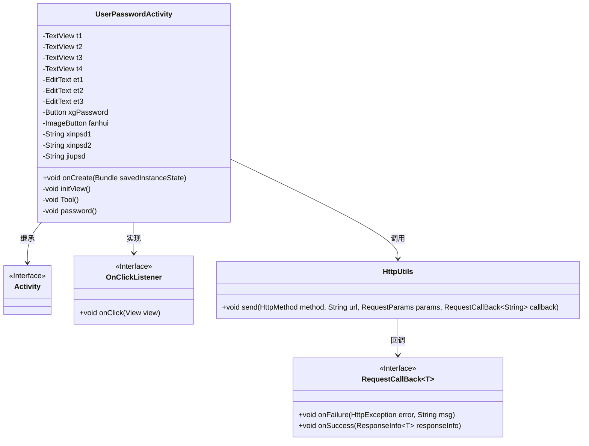
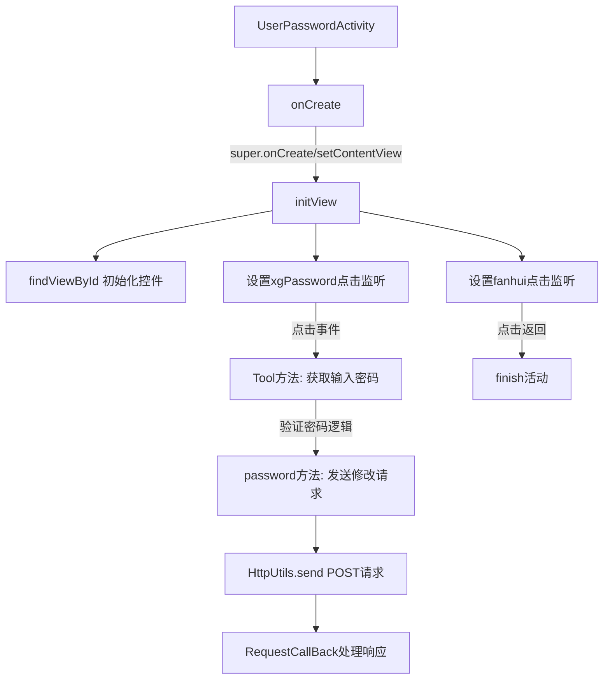
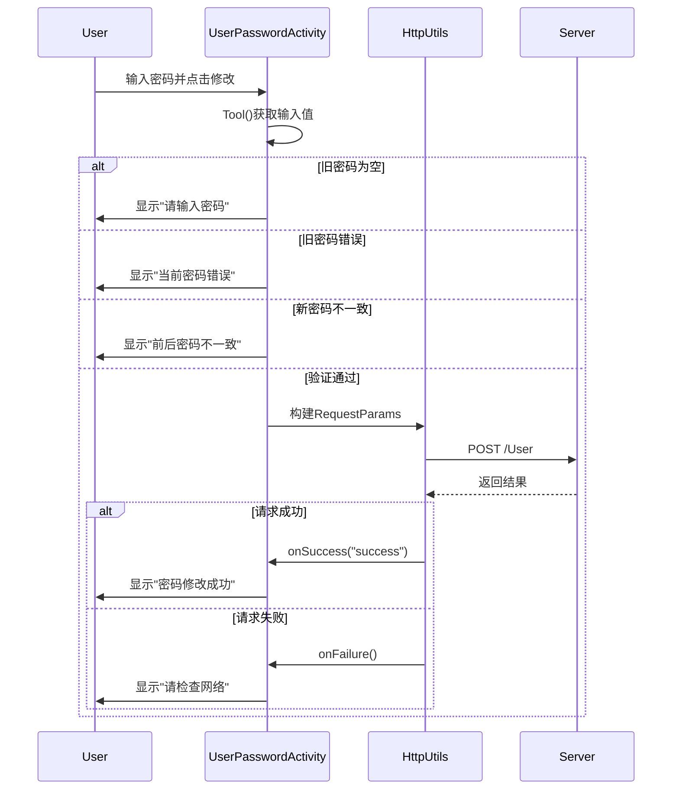

# 基础信息

|      |      |
|------|------|
| 名称 | UserPasswordActivity |
| 编码语言 | .java |
| 代码路径 | happycat/src/com/happycat/UserPasswordActivity.java |
| 包名 | com.happycat |
| 依赖项 | ['com.example.happucat.R', 'com.happycat.util.ActivitiyUtils', 'com.happycat.util.MyApplication', 'com.lidroid.xutils.HttpUtils', 'com.lidroid.xutils.exception.HttpException', 'com.lidroid.xutils.http.RequestParams', 'com.lidroid.xutils.http.ResponseInfo', 'com.lidroid.xutils.http.callback.RequestCallBack', 'com.lidroid.xutils.http.client.HttpRequest.HttpMethod', 'com.lidroid.xutils.http.client.entity.UploadEntity', 'android.app.Activity', 'android.content.Intent', 'android.os.Bundle', 'android.util.Log', 'android.view.View', 'android.view.View.OnClickListener', 'android.widget.Button', 'android.widget.EditText', 'android.widget.ImageButton', 'android.widget.TextView', 'android.widget.Toast'] |
| 概述说明 | 用户密码修改活动类，包含旧密码、新密码输入框及确认按钮，验证密码一致性后提交至服务器修改，处理成功或失败提示。 |

# 说明

UserPasswordActivity是一个用于修改用户密码的Android活动类。界面包含三个文本输入框（旧密码、新密码、确认新密码）、四个文本标签、一个修改密码按钮和一个返回按钮。点击返回按钮会跳转至UserActivity并结束当前活动。修改密码时，会验证旧密码是否正确、新密码是否一致，通过后发送HTTP POST请求到服务器进行密码更新，请求参数包括用户手机号和新密码。操作结果通过Toast提示用户，包括网络错误、密码不一致、修改成功或失败等状态。

# 类列表 Class Summary

| 名称   | 类型  | 说明 |
|-------|------|-------------|
| UserPasswordActivity | class | 用户密码修改活动类，包含界面初始化、密码验证、网络请求功能，处理旧密码校验、新密码一致性检查及修改结果反馈。 |

## 类 UserPasswordActivity

|      |      |
|------|------|
| 访问范围 | public |
| 类型 | class |
| 名称 | UserPasswordActivity |
| 说明 | 用户密码修改活动类，包含界面初始化、密码验证、网络请求功能，处理旧密码校验、新密码一致性检查及修改结果反馈。 |

### UML类图

这段代码展示了一个Android用户密码修改活动（UserPasswordActivity），继承自Activity基类。主要功能包括：初始化视图组件（TextView、EditText、Button等），处理返回按钮点击事件，验证旧密码与新密码一致性，通过HttpUtils发起网络请求修改密码，并使用Toast显示操作结果。类图清晰地反映了其与Activity的继承关系、OnClickListener接口的实现，以及通过HttpUtils进行网络通信的协作流程。密码修改逻辑包含多层验证，确保操作安全性和用户提示完整性。

### 内部方法调用关系图

该流程图描述了Android密码修改功能的完整执行过程，从活动初始化到界面控件绑定，再到密码验证逻辑和网络请求处理。时序图重点展示了用户交互、本地验证和网络通信三个关键阶段，包括输入验证、密码比对、HTTP请求发送以及响应处理的全链路流程，其中包含4种验证分支和2种网络请求结果状态。整个流程涉及7个核心步骤和3个异常处理路径，典型体现了移动端表单提交的数据流控制模式。

### 字段列表 Field List

| 名称  | 类型  | 说明 |
|-------|-------|------|
| xgPassword | Button | 按钮变量xgPassword |
| et3 | EditText | 定义了三个EditText控件变量：et1、et2、et3。 |
| t4 | TextView | 定义了四个TextView变量：t1、t2、t3、t4。 |
| jiupsd | String | 声明三个字符串变量：新密码1、新密码2、旧密码。 |
| fanhui | ImageButton | 返回按钮控件 |

### 方法列表

| 名称  | 类型  | 说明 |
|-------|-------|------|
| Tool | void | 获取三个输入框的文本内容并去除前后空格，分别赋值给新密码1、新密码2和旧密码变量。 |
| password | void | 该方法用于修改用户密码，通过POST请求发送手机号和新密码到服务器，返回成功或失败提示。 |
| initView | void | 初始化视图组件，设置密码修改逻辑：验证旧密码、新密码一致性，错误提示，成功则提交并关闭页面。 |
| onCreate | void | Android Activity的onCreate方法：调用父类方法、设置布局、初始化自定义标题栏和视图。 |

