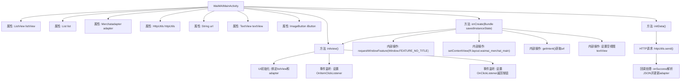

# 基础信息

|      |      |
|------|------|
| 名称 | WaiMAIMainActivity |
| 编码语言 | .java |
| 代码路径 | happycat/src/com/happycat/WaiMAIMainActivity.java |
| 包名 | com.happycat |
| 依赖项 | ['java.lang.reflect.Type', 'java.util.ArrayList', 'java.util.List', 'com.example.happucat.R', 'com.google.gson.Gson', 'com.google.gson.reflect.TypeToken', 'com.happycat.Bean.Goods', 'com.happycat.Bean.MerchatBean', 'com.happycat.adapter.Merchatadapter', 'com.happycat.adapter.Myadapter', 'com.happycat.util.MyApplication', 'com.lidroid.xutils.BitmapUtils', 'com.lidroid.xutils.HttpUtils', 'com.lidroid.xutils.ViewUtils', 'com.lidroid.xutils.bitmap.PauseOnScrollListener', 'com.lidroid.xutils.exception.HttpException', 'com.lidroid.xutils.http.ResponseInfo', 'com.lidroid.xutils.http.callback.RequestCallBack', 'com.lidroid.xutils.http.client.HttpRequest.HttpMethod', 'com.lidroid.xutils.view.annotation.event.OnScrollStateChanged', 'android.app.Activity', 'android.content.Intent', 'android.os.Bundle', 'android.util.Log', 'android.view.Menu', 'android.view.MenuItem', 'android.view.View', 'android.view.View.OnClickListener', 'android.view.Window', 'android.widget.AdapterView', 'android.widget.ImageButton', 'android.widget.TextView', 'android.widget.AdapterView.OnItemClickListener', 'android.widget.ListView', 'android.widget.Toast'] |
| 概述说明 | Android外卖应用主活动类，包含列表显示商家数据、网络请求、JSON解析及点击事件处理。 |

# 说明

WaiMAIMainActivity是一个外卖商家列表展示的Android活动类。它包含一个ListView用于显示商家列表数据，通过HttpUtils从指定URL获取JSON数据并使用Gson解析为MerchatBean对象列表。初始化时设置无标题栏，加载布局并初始化视图组件。列表适配器Merchatadapter管理数据展示，滑动时优化图片加载性能。点击列表项跳转至MerchatDataActivity并传递商家详细信息，包括ID、名称、配送费、评价、起送价、电话、图片和营业时间。顶部导航按钮提供返回功能。网络请求失败时显示错误提示。

# 类列表 Class Summary

| 名称   | 类型  | 说明 |
|-------|------|-------------|
| WaiMAIMainActivity | class | 外卖应用主活动类，包含列表视图初始化、网络请求获取商家数据、JSON解析、列表适配器设置及点击事件处理。 |


## 类 WaiMAIMainActivity

|      |      |
|------|------|
| 访问范围 | public |
| 类型 | class |
| 名称 | WaiMAIMainActivity |
| 说明 | 外卖应用主活动类，包含列表视图初始化、网络请求获取商家数据、JSON解析、列表适配器设置及点击事件处理。 |


### UML类图

```mermaid
classDiagram
    class WaiMAIMainActivity {
        -ListView listView
        -List~MerchatBean~ list
        -Merchatadapter adapter
        -HttpUtils httpUtils
        -String url
        -TextView textView
        -ImageButton iButton
        +onCreate(Bundle savedInstanceState) void
        +initData() void
        +initview() void
    }

    class MerchatBean {
        // 商户数据模型
    }

    class Merchatadapter {
        +setList(List~MerchatBean~ list) void
        +notifyDataSetChanged() void
    }

    class HttpUtils {
        +send(HttpMethod method, String url, RequestCallBack~String~ callback) void
    }

    class RequestCallBack~T~ {
        <<Interface>>
        +onFailure(HttpException e, String msg) void
        +onSuccess(ResponseInfo~T~ response) void
    }

    class Gson {
        +fromJson(String json, Type typeOfT) R~T~
    }

    class TypeToken~T~ {
        +getType() Type
    }

    class PauseOnScrollListener {
        +PauseOnScrollListener(BitmapUtils utils, boolean pauseOnScroll, boolean pauseOnFling)
    }

    WaiMAIMainActivity --> MerchatBean : 包含
    WaiMAIMainActivity --> Merchatadapter : 使用
    WaiMAIMainActivity --> HttpUtils : 使用
    WaiMAIMainActivity --> RequestCallBack~String~ : 实现回调
    WaiMAIMainActivity --> PauseOnScrollListener : 设置监听
    HttpUtils --> RequestCallBack~String~ : 依赖
    Merchatadapter --> MerchatBean : 适配
    Gson --> TypeToken~List~MerchatBean~~ : 解析时使用
```

这段代码描述了一个外卖商家列表的Android Activity实现。WaiMAIMainActivity作为主控类，通过HttpUtils发起网络请求获取商家数据，使用Gson解析JSON响应，并通过Merchatadapter将数据展示在ListView上。该实现包含列表滚动优化（PauseOnScrollListener）、点击事件处理、以及网络请求回调机制，整体采用MVC模式，数据层（MerchatBean）、视图层（ListView）和控制层（Activity）分离清晰。关键流程包括初始化视图、异步数据加载和列表项点击跳转。


### 内部方法调用关系图



该流程图描述了WaiMAIMainActivity的核心结构和执行流程。类包含UI组件初始化、HTTP数据请求、列表适配器管理以及事件监听等关键功能。主要流程从onCreate开始，依次执行视图初始化、数据加载和事件绑定。HTTP异步请求成功后通过Gson解析数据并刷新列表，列表项点击和返回按钮分别触发页面跳转和关闭操作。整个流程体现了Android活动中典型的生命周期管理和异步数据处理模式。

### 字段列表 Field List

| 名称  | 类型  | 说明 |
|-------|-------|------|
| textView | TextView | 定义TextView对象textView。 |
| adapter | Merchatadapter | Merchatadapter类型的适配器实例。 |
| url | String | 声明一个私有字符串变量url。 |
| iButton | ImageButton | 图像按钮控件iButton |
| httpUtils | HttpUtils | HttpUtils工具类实例声明。 |
| list = new ArrayList<MerchatBean>() | List<MerchatBean> | 创建一个MerchatBean类型的ArrayList对象list。 |
| listView | ListView | 声明一个ListView类型的变量listView。 |

### 方法列表

| 名称  | 类型  | 说明 |
|-------|-------|------|
| initData | void | 方法initData通过HTTP GET请求获取数据，使用Gson解析JSON为MerchatBean列表，更新适配器并刷新显示。 |
| onCreate | void | Android Activity初始化代码：隐藏标题栏、加载布局、初始化视图和数据，检查适配器为空时显示错误提示。 |
| initview | void | 初始化视图方法：设置列表视图适配器，滑动时控制图片加载，监听项点击事件传递数据，顶部按钮点击关闭活动。 |


