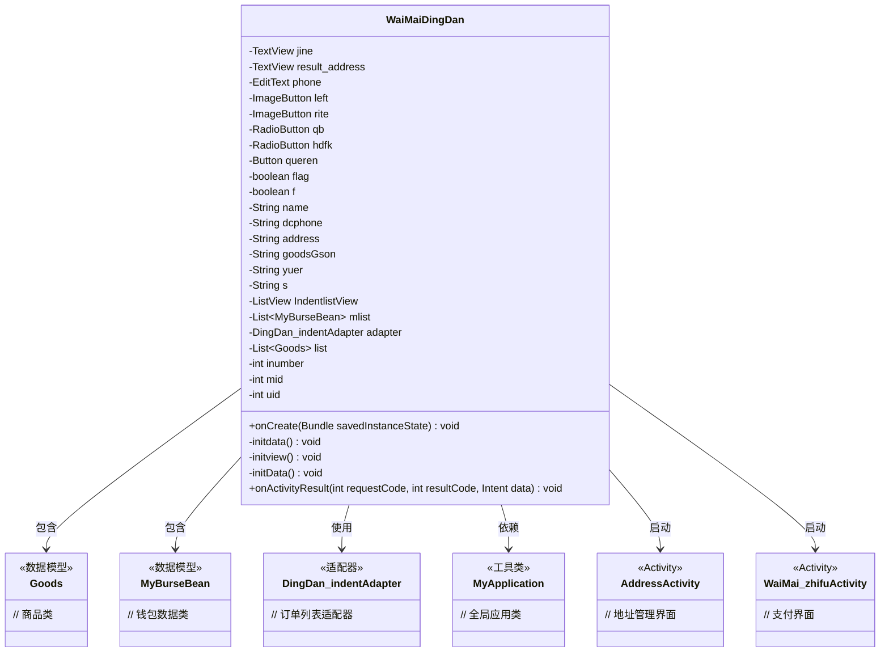
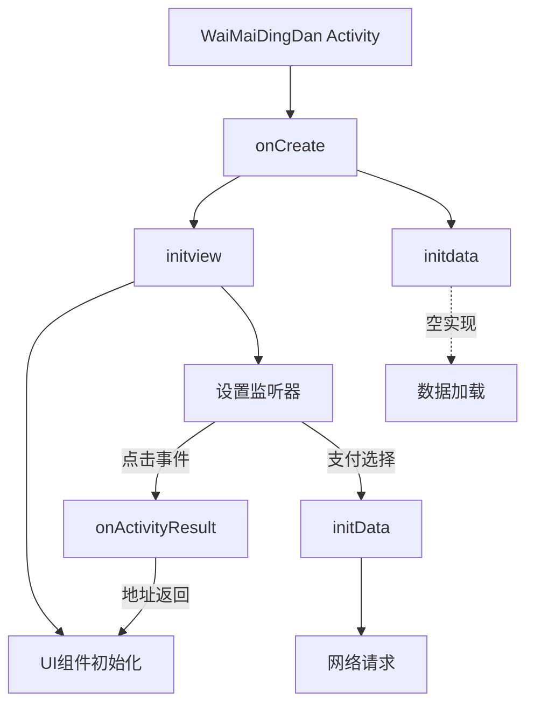
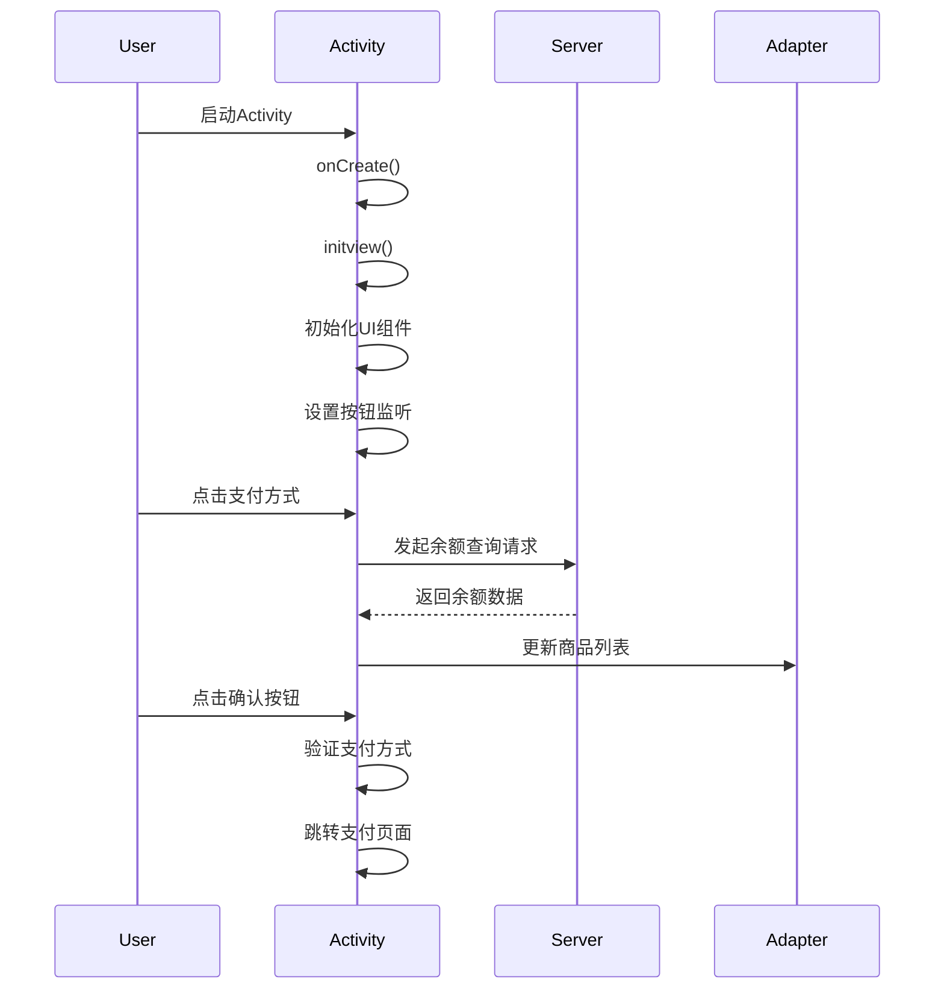

# 基础信息

|      |      |
|------|------|
| 名称 | WaiMaiDingDan |
| 编码语言 | .java |
| 代码路径 | happycat/src/com/happycat/WaiMaiDingDan.java |
| 包名 | com.happycat |
| 依赖项 | ['java.lang.reflect.Type', 'java.util.ArrayList', 'java.util.LinkedList', 'java.util.List', 'com.example.happucat.R', 'com.example.happucat.R.id', 'com.google.gson.Gson', 'com.google.gson.reflect.TypeToken', 'com.happycat.Bean.Goods', 'com.happycat.Bean.MyBurseBean', 'com.happycat.adapter.DingDan_indentAdapter', 'com.happycat.util.MyApplication', 'com.lidroid.xutils.HttpUtils', 'com.lidroid.xutils.exception.HttpException', 'com.lidroid.xutils.http.RequestParams', 'com.lidroid.xutils.http.ResponseInfo', 'com.lidroid.xutils.http.callback.RequestCallBack', 'com.lidroid.xutils.http.client.HttpRequest.HttpMethod', 'android.R.string', 'android.app.Activity', 'android.app.AlertDialog', 'android.content.DialogInterface', 'android.content.Intent', 'android.os.Bundle', 'android.util.Log', 'android.view.LayoutInflater', 'android.view.Menu', 'android.view.MenuItem', 'android.view.View', 'android.view.View.OnClickListener', 'android.view.Window', 'android.widget.Button', 'android.widget.EditText', 'android.widget.ImageButton', 'android.widget.ListView', 'android.widget.RadioButton', 'android.widget.TextView', 'android.widget.Toast'] |
| 概述说明 | 外卖订单Activity类，包含订单信息展示、支付方式选择、地址管理及确认订单功能，使用Gson解析商品数据，支持余额和货到付款支付。 |

# 说明

该代码描述了一个外卖订单Activity类，主要功能包括初始化订单界面、处理用户地址信息、商品列表展示、支付方式选择和订单确认操作。界面包含返回按钮、地址显示、金额计算、商品列表视图和支付选项。用户可选择钱包或货到付款方式，确认订单后跳转至支付页面。代码还涉及网络请求获取用户余额数据，并通过Intent传递订单信息至支付页面。整体实现了外卖订单的核心流程，包括信息展示、交互处理和支付准备。

# 类列表 Class Summary

| 名称   | 类型  | 说明 |
|-------|------|-------------|
| WaiMaiDingDan | class | 外卖订单Activity类，包含地址显示、商品列表、支付方式选择和确认订单功能，支持余额和货到付款两种支付方式，数据通过Gson解析和Intent传递。 |

## 类 WaiMaiDingDan

|      |      |
|------|------|
| 访问范围 | public |
| 类型 | class |
| 名称 | WaiMaiDingDan |
| 说明 | 外卖订单Activity类，包含地址显示、商品列表、支付方式选择和确认订单功能，支持余额和货到付款两种支付方式，数据通过Gson解析和Intent传递。 |

### UML类图

这段代码是一个外卖订单Activity类，主要功能包括：初始化订单界面、显示商品列表、处理支付方式选择、地址管理以及跳转到支付页面。类图中展示了WaiMaiDingDan与多个数据模型（Goods、MyBurseBean）、适配器（DingDan_indentAdapter）和其他Activity（AddressActivity、WaiMai_zhifuActivity）的关系。通过成员变量和方法可以看出，该类负责整合订单数据、处理用户交互，并协调多个功能模块完成外卖订单流程。

### 内部方法调用关系图

这段代码实现了一个外卖订单Activity，主要功能包括：初始化UI组件（地址显示、金额计算、支付方式选择），处理用户交互（返回按钮、地址修改、支付确认），以及通过网络请求获取用户余额数据。流程图展示了从Activity创建到各功能模块的调用关系，时序图则详细描述了用户操作与系统响应的交互过程。代码包含完整的订单信息展示、支付流程控制和数据验证逻辑，典型适用于O2O类应用的外卖下单场景。

### 字段列表 Field List

| 名称  | 类型  | 说明 |
|-------|-------|------|
| result_address | TextView | 定义两个TextView变量：jine和result_address。 |
| adapter | DingDan_indentAdapter | 订单适配器实例化。 |
| s | String | 字符串变量：姓名、电话、地址、商品JSON、余额、通用字符串。 |
| list | List<Goods> | 声明一个Goods类型的列表变量list。 |
| f | boolean | 布尔变量flag和f的声明。 |
| mlist | List<MyBurseBean> | 定义了一个名为mlist的列表变量，存储MyBurseBean类型对象。 |
| rite | ImageButton | 定义了两个ImageButton变量：left和rite。 |
| hdfk | RadioButton | 定义两个单选按钮变量：qb和hdfk。 |
| IndentlistView | ListView | 声明一个名为IndentlistView的ListView控件变量。 |
| uid=0 | int | 定义了三个整型变量：inumber、mid、uid，初始值均为0。 |
| queren | Button | 确认按钮 |
| phone | EditText | 定义了一个名为phone的EditText控件。 |

### 方法列表

| 名称  | 类型  | 说明 |
|-------|-------|------|
| initdata | void | 空方法initdata，无具体实现。 |
| onCreate | void | Android Activity初始化代码：继承onCreate，隐藏标题栏，设置布局文件waimai_dingdan，初始化视图和数据。 |
| initview | void | 初始化订单视图，获取地址、商品信息，设置支付方式，确认订单跳转支付页面。 |
| onActivityResult | void | 重写onActivityResult方法，处理返回结果，若成功则获取地址并显示。 |
| initData | void | 使用XUtils框架发送POST请求获取服务器数据，解析JSON为链表对象并提取余额信息，处理成功或失败情况。 |

