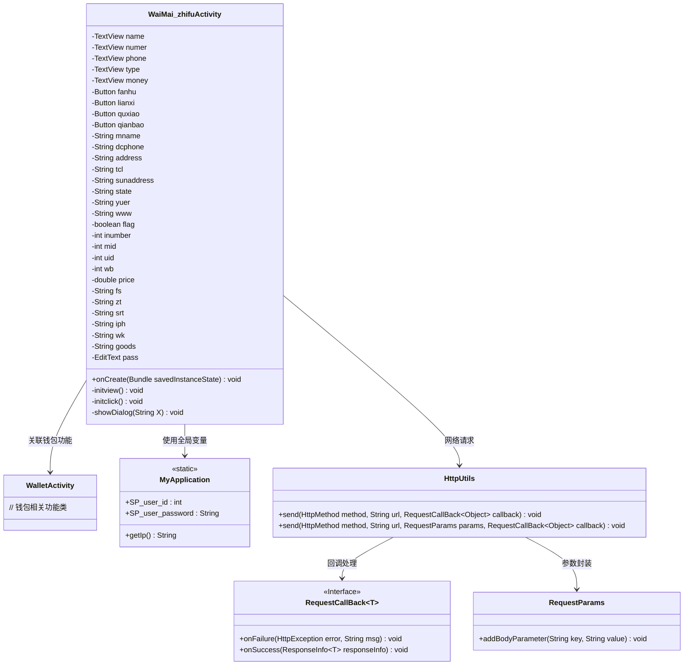
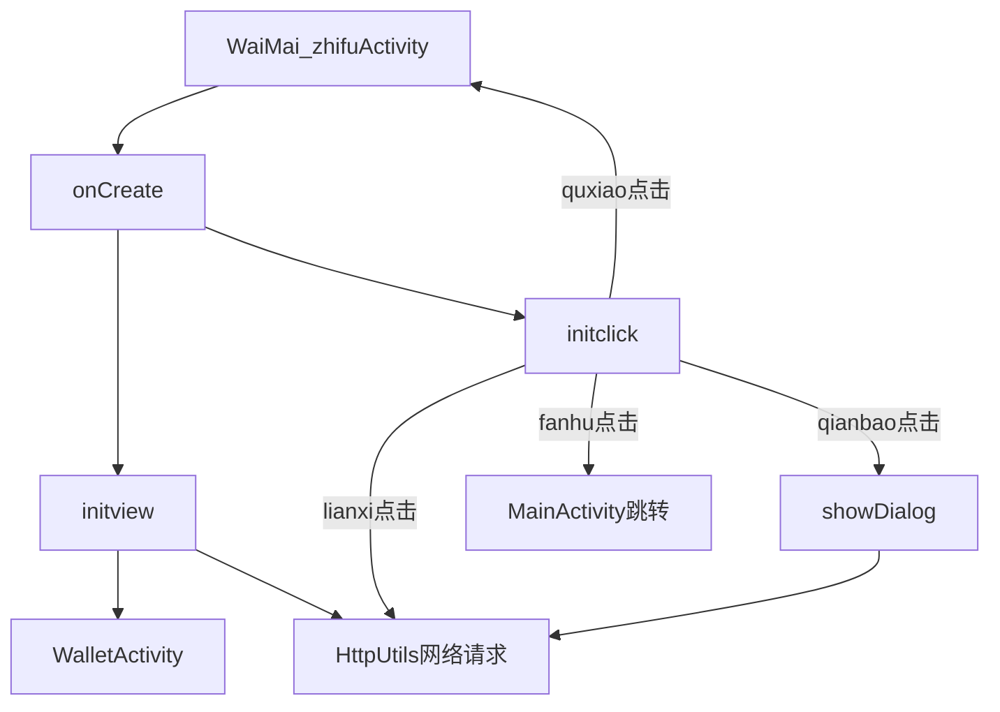
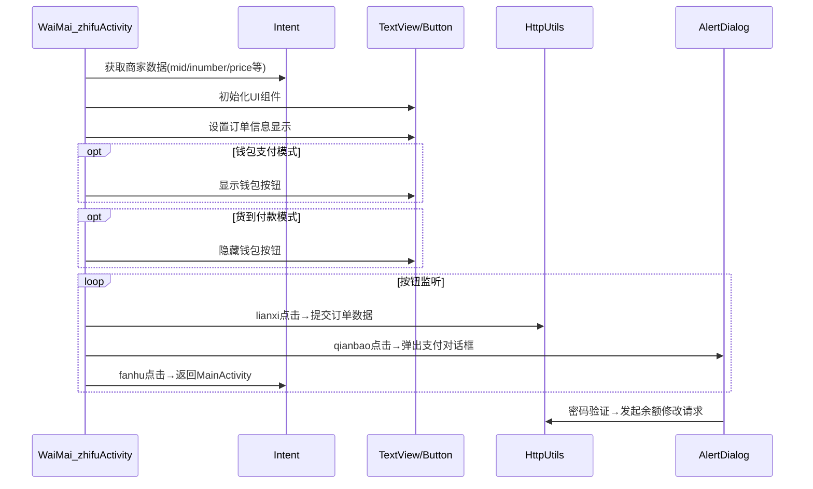

# 基础信息

|      |      |
|------|------|
| 名称 | WaiMai_zhifuActivity |
| 编码语言 | .java |
| 代码路径 | happycat/src/com/happycat/WaiMai_zhifuActivity.java |
| 包名 | com.happycat |
| 依赖项 | ['java.lang.reflect.Type', 'java.text.SimpleDateFormat', 'java.util.Date', 'java.util.LinkedList', 'java.util.List', 'com.example.happucat.R', 'com.google.gson.Gson', 'com.google.gson.reflect.TypeToken', 'com.happycat.Bean.MyBurseBean', 'com.happycat.util.MyApplication', 'com.happycay.fragments.XiaoxiFragment', 'com.lidroid.xutils.HttpUtils', 'com.lidroid.xutils.exception.HttpException', 'com.lidroid.xutils.http.RequestParams', 'com.lidroid.xutils.http.ResponseInfo', 'com.lidroid.xutils.http.callback.RequestCallBack', 'com.lidroid.xutils.http.client.HttpRequest.HttpMethod', 'android.R.integer', 'android.R.string', 'android.app.Activity', 'android.app.AlertDialog', 'android.content.DialogInterface', 'android.content.Intent', 'android.opengl.Visibility', 'android.os.Bundle', 'android.util.Log', 'android.view.LayoutInflater', 'android.view.Menu', 'android.view.MenuItem', 'android.view.View', 'android.view.View.OnClickListener', 'android.view.Window', 'android.widget.Button', 'android.widget.EditText', 'android.widget.TextView', 'android.widget.Toast'] |
| 概述说明 | 外卖支付活动类，包含订单信息展示、支付方式选择（钱包或货到付款）、订单提交及余额支付功能，支持返回、联系商家、取消订单操作。 |

# 说明

该代码描述了一个外卖支付活动的Android类，主要功能包括订单信息展示、支付方式选择和订单提交。类中定义了多个UI组件如TextView、Button和EditText，用于显示订单名称、编号、金额、联系电话等信息。支付方式分为钱包支付和货到付款两种状态，根据flag变量切换。用户可点击按钮返回主页、联系商家、取消订单或使用钱包支付。钱包支付需验证密码，余额不足会提示充值。订单数据通过HTTP请求提交到服务器，包括订单编号、用户ID、商家ID、商品数量、总价、支付方式、状态、时间和地址等信息。支付成功后更新余额并提示用户提交订单。

# 类列表 Class Summary

| 名称   | 类型  | 说明 |
|-------|------|-------------|
| WaiMai_zhifuActivity | class | 外卖支付Activity，包含订单信息展示、支付方式选择（钱包或货到付款）、订单提交及余额支付功能，支持返回、联系商家、取消订单操作。 |

## 类 WaiMai_zhifuActivity

|      |      |
|------|------|
| 访问范围 | public |
| 类型 | class |
| 名称 | WaiMai_zhifuActivity |
| 说明 | 外卖支付Activity，包含订单信息展示、支付方式选择（钱包或货到付款）、订单提交及余额支付功能，支持返回、联系商家、取消订单操作。 |

### UML类图

该代码是一个外卖支付功能的Android Activity实现，主要包含订单信息展示、支付方式选择（钱包支付/货到付款）、网络请求提交订单、余额校验和密码验证等功能。类图中展示了核心组件关系：WaiMai_zhifuActivity通过MyApplication获取用户数据，使用HttpUtils进行网络通信，依赖RequestParams封装参数，通过RequestCallBack处理响应结果，同时与WalletActivity存在关联关系。支付流程涉及金额计算、密码验证和余额更新等业务逻辑。

### 内部方法调用关系图

该流程图展示了外卖支付页面的核心逻辑：1) 通过Intent接收商家数据初始化视图；2) 根据支付模式(钱包/货到付款)动态调整UI；3) 处理四个按钮的交互事件，包括订单提交、支付验证和页面跳转。时序图重点呈现了数据流动路径和组件间的协作关系，特别是网络请求和对话框的触发条件。代码实现了完整的订单处理流程，包含金额计算、支付验证、状态跟踪等关键功能模块。

### 字段列表 Field List

| 名称  | 类型  | 说明 |
|-------|-------|------|
| money | TextView | 文本视图字段：名称、编号、电话、类型、金额。 |
| price=0 | double | 声明双精度浮点变量price并初始化为0。 |
| qianbao | Button | 按钮包括返回、联系、取消、钱包。 |
| goods | String | 定义了六个字符串变量：fs、zt、srt、iph、wk、goods。 |
| www | String | 字符串变量声明：mname、dcphone、address、tcl、sunaddress、state、yuer、www。 |
| flag | boolean | 布尔标志变量flag，用于表示真/假状态。 |
| pass | EditText | 定义密码输入框变量pass。 |
| wb=0 | int | 定义了四个整型变量：inumber、mid、uid、wb，初始值均为0。 |

### 方法列表

| 名称  | 类型  | 说明 |
|-------|-------|------|
| onCreate | void | Android Activity的onCreate方法：调用父类、隐藏标题栏、设置布局、初始化视图和点击事件。 |
| initview | void | 初始化钱包界面，绑定按钮和文本控件，获取订单信息（名称、编号、金额、支付方式、电话等），处理支付状态和方式，记录日志并设置当前时间。 |
| initclick | void | 方法initclick设置四个按钮点击事件：返回跳转主页，联系提交订单（含商品信息），钱包显示余额，取消关闭页面。 |
| showDialog | void | 方法显示支付确认对话框，验证密码并检查余额，余额不足提示充值，支付成功提交订单，失败提示网络错误，可取消支付。 |

