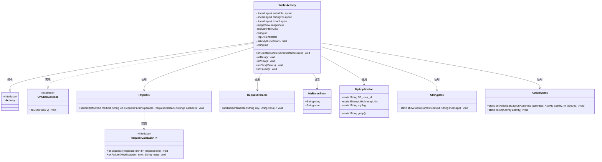
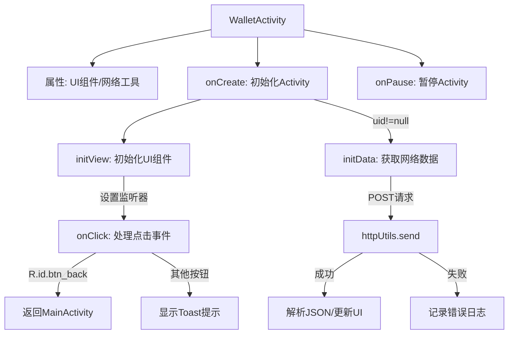
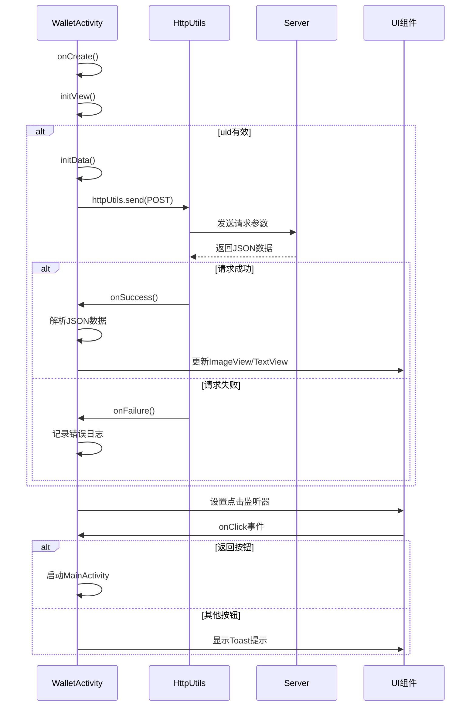

# 基础信息

|      |      |
|------|------|
| 名称 | WalletActivity |
| 编码语言 | .java |
| 代码路径 | happycat/src/com/happycat/WalletActivity.java |
| 包名 | com.happycat |
| 依赖项 | ['java.lang.reflect.Type', 'java.util.LinkedList', 'java.util.List', 'com.example.happucat.R', 'com.google.gson.Gson', 'com.google.gson.reflect.TypeToken', 'com.happycat.Bean.MerchatXqBean', 'com.happycat.Bean.MyBurseBean', 'com.happycat.util.ActivitiyUtils', 'com.happycat.util.MyApplication', 'com.happycat.util.StringUtils', 'com.lidroid.xutils.HttpUtils', 'com.lidroid.xutils.exception.HttpException', 'com.lidroid.xutils.http.RequestParams', 'com.lidroid.xutils.http.ResponseInfo', 'com.lidroid.xutils.http.callback.RequestCallBack', 'com.lidroid.xutils.http.client.HttpRequest.HttpMethod', 'android.app.Activity', 'android.content.Intent', 'android.os.Bundle', 'android.util.Log', 'android.view.View', 'android.view.View.OnClickListener', 'android.widget.ImageView', 'android.widget.LinearLayout', 'android.widget.TextView'] |
| 概述说明 | WalletActivity是一个Android钱包功能页面，包含余额显示、充值和提现操作。通过HTTP请求获取用户余额和头像数据，使用XUtils框架处理网络请求和图片加载，支持点击返回、查看账单、充值和提现功能。 |

# 说明

WalletActivity是一个Android活动类，实现了点击监听接口。主要功能包括初始化视图组件（如LinearLayout、ImageView、TextView），通过HttpUtils发送POST请求到服务器获取用户钱包数据，使用Gson解析返回的JSON数据并显示用户头像和余额。包含三个可点击区域：账单详情、充值和提现，点击后触发相应操作或跳转。活动暂停时设置全局标志位为1。

# 类列表 Class Summary

| 名称   | 类型  | 说明 |
|-------|------|-------------|
| WalletActivity | class | WalletActivity是一个Android钱包功能界面，包含余额显示、充值和提现操作。通过HTTP请求获取用户余额和头像数据，使用XUtils框架处理网络请求和图片加载，支持点击返回、查看账单、充值和提现功能。 |

## 类 WalletActivity

|      |      |
|------|------|
| 访问范围 | public |
| 类型 | class |
| 名称 | WalletActivity |
| 说明 | WalletActivity是一个Android钱包功能界面，包含余额显示、充值和提现操作。通过HTTP请求获取用户余额和头像数据，使用XUtils框架处理网络请求和图片加载，支持点击返回、查看账单、充值和提现功能。 |

### UML类图

这段代码展示了一个Android钱包活动(WalletActivity)的类结构，它继承自Activity并实现了OnClickListener接口。主要功能包括初始化视图、处理用户点击事件、从服务器获取钱包数据并显示。通过HttpUtils进行网络请求，使用Gson解析JSON数据，并依赖多个工具类(MyApplication、StringUtils等)完成功能。类图清晰地展示了各组件间的继承、实现和依赖关系。

### 内部方法调用关系图

这段代码实现了一个钱包功能的Android Activity，主要包含UI初始化、网络数据请求和用户交互处理。流程图展示了从Activity创建到销毁的完整生命周期，重点突出了网络请求分支和点击事件处理流程。时序图详细描述了HttpUtils与服务器的交互过程，以及UI组件的更新机制。代码通过XUtils框架实现网络通信，使用Gson解析JSON数据，并采用MVC模式分离业务逻辑与界面展示。

### 字段列表 Field List

| 名称  | 类型  | 说明 |
|-------|-------|------|
| tixianLayout | LinearLayout | LinearLayout变量tixianLayout用于界面布局。 |
| mlist | List<MyBurseBean> | 变量mlist是MyBurseBean类型的列表。 |
| httpUtils | HttpUtils | HttpUtils工具类实例声明。 |
| uid=MyApplication.SP_user_id+"" | String | 代码定义私有字符串变量uid，值为MyApplication.SP_user_id转换为字符串的结果。 |
| chongzhiLayout | LinearLayout | 线性布局充值界面控件 |
| enterInfoLayout | LinearLayout | 声明一个名为enterInfoLayout的LinearLayout布局变量。 |
| textView | TextView | 声明一个TextView类型的变量textView。 |
| imageView | ImageView | 声明一个ImageView类型的变量imageView。 |
| url | String | 声明一个私有字符串变量url。 |

### 方法列表

| 名称  | 类型  | 说明 |
|-------|-------|------|
| onPause | void | 重写onPause方法，调用父类方法后将MyApplication.myflag设为"1"。 |
| initView | void | 初始化界面控件：设置返回按钮、余额信息、充值、提现布局及图片、文本视图的点击监听。 |
| initData | void | 方法initData使用XUtils框架发送POST请求到服务器，获取JSON数据并解析为MyBurseBean列表，显示图片和金额。失败时记录错误。 |
| onCreate | void | Android Activity初始化：设置布局、标题栏、视图，若uid非空则加载数据。 |
| onClick | void | 重写onClick方法，根据视图ID执行不同操作：返回主界面、显示账单详情、充值或提现提示。 |

